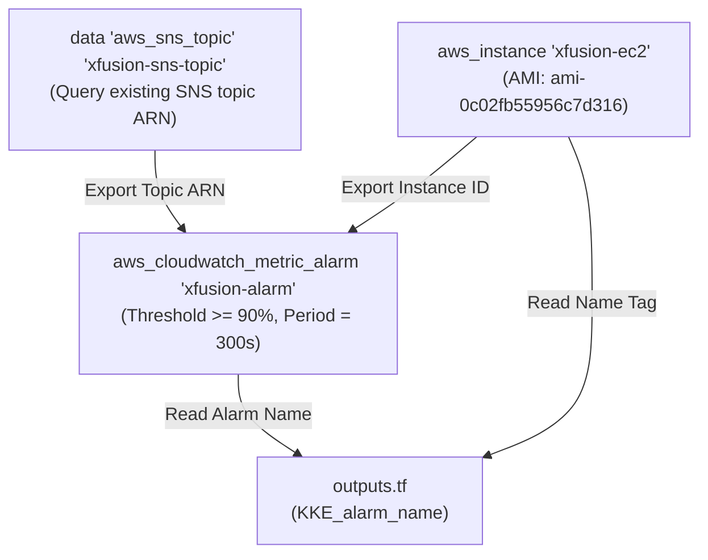
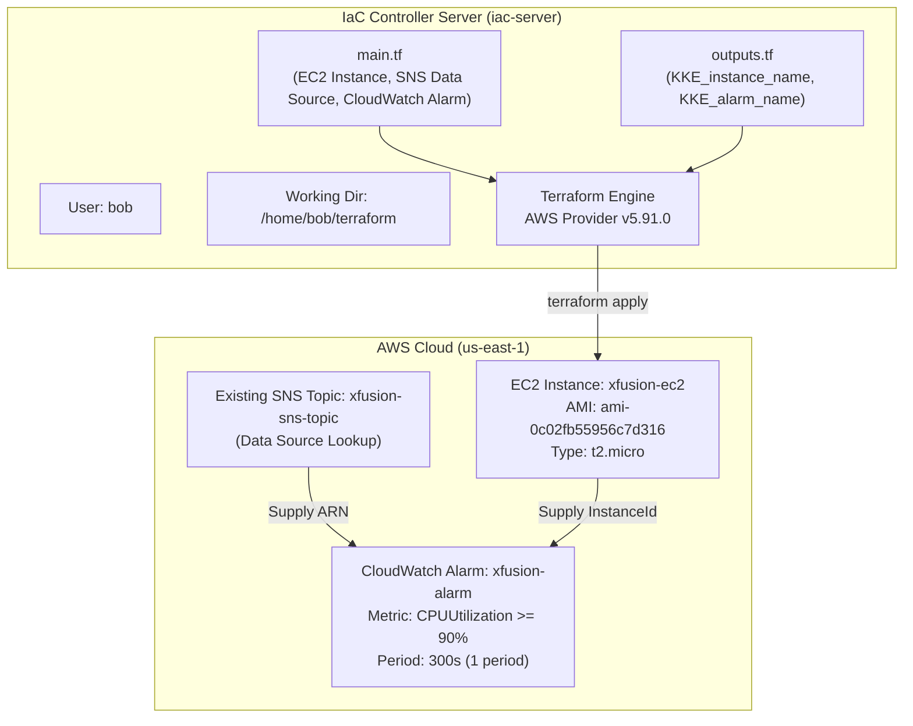

# Create EC2 Instance and CloudWatch Alarm Using Terraform

## Technical Overview

### Infrastructure Monitoring & CloudWatch Alarm Architecture

In cloud management, ensuring compute infrastructure availability and performance requires continuous operational monitoring. **Amazon CloudWatch** provides real-time monitoring and operational data for AWS resources. For compute workloads running on **Amazon EC2**, CloudWatch automatically collects system-level metrics such as `CPUUtilization`, network throughput, and disk I/O.

To proactively respond to performance degradation—such as unexpected CPU spikes caused by runaway application processes—DevOps teams configure **CloudWatch Metric Alarms**. When a monitored metric violates defined thresholds (for example, average CPU utilization exceeding 90% over a 5-minute period), the alarm triggers automated actions, such as publishing notification messages to an **Amazon Simple Notification Service (SNS)** topic.

**Terraform** enables infrastructure engineers to declaratively define both compute resources and their associated monitoring alarms in HashiCorp Configuration Language (HCL).

```
       +-----------------------------------------------------------------------------------------+
       | AWS Cloud Region: us-east-1                                                             |
       |                                                                                         |
       |  +-----------------------------------------------------------------------------------+  |
       |  | Amazon EC2 Instance: xfusion-ec2                                                  |  |
       |  | AMI: ami-0c02fb55956c7d316 (Ubuntu)                                                |  |
       |  | Instance Type: t2.micro                                                           |  |
       |  +-----------------------------------------------------------------------------------+  |
       |                                          |                                              |
       |                                          | Emits System Metric                          |
       |                                          | (AWS/EC2 -> CPUUtilization)                  |
       |                                          v                                              |
       |  +-----------------------------------------------------------------------------------+  |
       |  | CloudWatch Metric Alarm: xfusion-alarm                                            |  |
       |  | Metric: CPUUtilization (Statistic: Average)                                       |  |
       |  | Period: 300s (5 Minutes) | Evaluation Periods: 1                                   |  |
       |  | Threshold: >= 90% | Dimension: InstanceId                                         |  |
       |  +-----------------------------------------------------------------------------------+  |
       |                                          |                                              |
       |                                          | Triggers Alarm Action                        |
       |                                          v                                              |
       |  +-----------------------------------------------------------------------------------+  |
       |  | Pre-existing Amazon SNS Topic: xfusion-sns-topic                                  |  |
       |  | Data Source: data "aws_sns_topic" "xfusion-sns-topic"                             |  |
       |  +-----------------------------------------------------------------------------------+  |
       +-----------------------------------------------------------------------------------------+
```

#### Core Components of CloudWatch Compute Monitoring:

1. **Amazon EC2 Instance (`aws_instance`):** An Ubuntu virtual server identified by `xfusion-ec2` running on AMI `ami-0c02fb55956c7d316` and instance type `t2.micro`.
2. **Existing SNS Topic Data Source (`data "aws_sns_topic"`):** Queries the ARN of an existing Amazon SNS notification channel named `xfusion-sns-topic`.
3. **CloudWatch Metric Alarm (`aws_cloudwatch_metric_alarm`):** Evaluates the average CPU utilization of the EC2 instance every 300 seconds (5 minutes). Triggers when `CPUUtilization` is `GreaterThanOrEqualToThreshold` 90%.
4. **Alarm Actions (`alarm_actions`):** Binds the SNS topic ARN to the alarm notification handler.

---

## Detailed Terraform Documentation

### 1. Resource Dependency Flow

Provisioning an EC2 instance, retrieving an existing SNS topic, and binding a CloudWatch alarm relies on the following HCL execution flow:



---

### 2. Parameter & Argument Reference

#### Resource: `aws_instance`

| Argument | Type | Required? | Default | Description |
| :--- | :--- | :--- | :--- | :--- |
| **`ami`** | `string` | **Yes** | N/A | AMI ID used to launch instance (`"ami-0c02fb55956c7d316"`). |
| **`instance_type`** | `string` | **Yes** | N/A | Compute instance family (e.g., `"t2.micro"`). |
| **`tags`** | `map(string)` | No | `{}` | Key-value tags, e.g., `{ Name = "xfusion-ec2" }`. |

#### Data Source: `data "aws_sns_topic"`

| Argument | Type | Required? | Description |
| :--- | :--- | :--- | :--- |
| **`name`** | `string` | **Yes** | Friendly name of the target existing SNS topic (`"xfusion-sns-topic"`). |

#### Resource: `aws_cloudwatch_metric_alarm`

| Argument | Type | Required? | Default | Description |
| :--- | :--- | :--- | :--- | :--- |
| **`alarm_name`** | `string` | **Yes** | N/A | Name of the CloudWatch alarm (`"xfusion-alarm"`). |
| **`comparison_operator`** | `string` | **Yes** | N/A | Arithmetic comparison (`"GreaterThanOrEqualToThreshold"`). |
| **`evaluation_periods`** | `number` | **Yes** | N/A | Consecutive evaluation intervals required (`1`). |
| **`metric_name`** | `string` | **Yes** | N/A | Monitored CloudWatch metric name (`"CPUUtilization"`). |
| **`namespace`** | `string` | **Yes** | N/A | AWS namespace publishing the metric (`"AWS/EC2"`). |
| **`period`** | `number` | **Yes** | N/A | Interval period in seconds for metric evaluation (`300`). |
| **`statistic`** | `string` | **Yes** | N/A | Metric aggregation type (`"Average"`). |
| **`threshold`** | `number` | **Yes** | N/A | Value boundary triggering alarm status (`90`). |
| **`dimensions`** | `map(string)` | No | `{}` | Key-value dimensions identifying specific resource (`{ InstanceId = aws_instance.xfusion-ec2.id }`). |
| **`alarm_actions`** | `list(string)` | No | `[]` | List of target ARNs triggered when state moves to ALARM (`[data.aws_sns_topic.xfusion-sns-topic.arn]`). |

---

### 3. Output Values (`outputs.tf`)

Output values expose key resource attributes after `terraform apply` executes:

```hcl
output "KKE_instance_name" {
  description = "Name of the EC2 instance"
  value       = aws_instance.xfusion-ec2.tags["Name"]
}

output "KKE_alarm_name" {
  description = "Name of the CloudWatch alarm"
  value       = aws_cloudwatch_metric_alarm.xfusion-alarm.alarm_name
}
```

---

## Challenge Objective

The Nautilus DevOps team needs to provision an EC2 instance and set up an automated CloudWatch alarm to monitor instance CPU utilization. The alarm must notify an existing Amazon SNS topic (`xfusion-sns-topic`) if CPU usage reaches or exceeds 90% for a consecutive 5-minute period.

In this challenge, navigate to `/home/bob/terraform` and implement the configuration in `main.tf` and `outputs.tf`.



---

## Infrastructure & Configuration Requirements

### Server & Resource Specification Matrix

<div style="overflow-x: auto;">

| Host / Role | Working Directory | Target File | Resource Type / Data Source | Name / Label | Required Value / Parameters |
| :--- | :--- | :--- | :--- | :--- | :--- |
| **`iac-server`** | `/home/bob/terraform` | `main.tf` | `aws_instance` | `xfusion-ec2` | AMI: `ami-0c02fb55956c7d316`, Type: `t2.micro`, Tag: `Name = "xfusion-ec2"` |
| **`iac-server`** | `/home/bob/terraform` | `main.tf` | `data "aws_sns_topic"` | `xfusion-sns-topic` | `name = "xfusion-sns-topic"` |
| **`iac-server`** | `/home/bob/terraform` | `main.tf` | `aws_cloudwatch_metric_alarm` | `xfusion-alarm` | `alarm_name = "xfusion-alarm"`<br/>`metric_name = "CPUUtilization"`<br/>`namespace = "AWS/EC2"`<br/>`statistic = "Average"`<br/>`period = 300`<br/>`evaluation_periods = 1`<br/>`threshold = 90`<br/>`comparison_operator = "GreaterThanOrEqualToThreshold"`<br/>`dimensions = { InstanceId = aws_instance.xfusion-ec2.id }`<br/>`alarm_actions = [data.aws_sns_topic.xfusion-sns-topic.arn]` |
| **`iac-server`** | `/home/bob/terraform` | `outputs.tf` | `output` | `KKE_instance_name` | `aws_instance.xfusion-ec2.tags["Name"]` |
| **`iac-server`** | `/home/bob/terraform` | `outputs.tf` | `output` | `KKE_alarm_name` | `aws_cloudwatch_metric_alarm.xfusion-alarm.alarm_name` |

</div>

### Requirements Checklist

* **Working Directory:** `/home/bob/terraform`
* **EC2 Instance:** Named `xfusion-ec2` using Ubuntu AMI `ami-0c02fb55956c7d316` and instance type `t2.micro`.
* **SNS Topic Lookup:** Fetch existing SNS topic `xfusion-sns-topic` via `data "aws_sns_topic"`.
* **CloudWatch Alarm:** Named `xfusion-alarm` with `CPUUtilization` metric, `AWS/EC2` namespace, `Average` statistic, `300` second period, `1` evaluation period, `>= 90` threshold, and notification sent to `xfusion-sns-topic`.
* **Main Configuration:** `main.tf` provisions EC2 instance, queries SNS data source, and provisions CloudWatch alarm (no separate resource `.tf` files).
* **Outputs File:** `outputs.tf` declaring `KKE_instance_name` and `KKE_alarm_name`.
* **Execution Standard:** `terraform plan` must return `No changes. Your infrastructure matches the configuration.` before submitting.

---

## Step-by-Step Implementation

### Step 1: Open Terminal & Navigate to Working Directory

Open the integrated terminal in VS Code and switch to `/home/bob/terraform`:

```bash
cd /home/bob/terraform
```

---

### Step 2: Inspect Existing Workspace Files

Check existing files in `/home/bob/terraform`:

```bash
ls -la
```

*Terminal Output:*
```text
README.MD  provider.tf
```

Inspect `provider.tf`:

```bash
cat provider.tf
```

*Expected Contents:*
```hcl
terraform {
  required_providers {
    aws = {
      source  = "hashicorp/aws"
      version = "~> 5.0"
    }
  }
}

provider "aws" {
  region = "us-east-1"
}
```

---

### Step 3: Create the `main.tf` Configuration File

Create `main.tf` containing the EC2 instance, SNS topic lookup data source, and CloudWatch metric alarm:

```bash
cat << 'EOF' > main.tf
# 1. Lookup existing SNS topic for notifications
data "aws_sns_topic" "xfusion-sns-topic" {
  name = "xfusion-sns-topic"
}

# 2. Launch Ubuntu EC2 Instance
resource "aws_instance" "xfusion-ec2" {
  ami           = "ami-0c02fb55956c7d316"
  instance_type = "t2.micro"

  tags = {
    Name = "xfusion-ec2"
  }
}

# 3. Create CloudWatch Alarm for CPU Utilization >= 90% over 5 minutes
resource "aws_cloudwatch_metric_alarm" "xfusion-alarm" {
  alarm_name          = "xfusion-alarm"
  comparison_operator = "GreaterThanOrEqualToThreshold"
  evaluation_periods  = 1
  metric_name         = "CPUUtilization"
  namespace           = "AWS/EC2"
  period              = 300
  statistic           = "Average"
  threshold           = 90
  alarm_description   = "Alarm when EC2 CPU utilization exceeds 90% for 5 minutes"
  alarm_actions       = [data.aws_sns_topic.xfusion-sns-topic.arn]

  dimensions = {
    InstanceId = aws_instance.xfusion-ec2.id
  }

  tags = {
    Name = "xfusion-alarm"
  }
}
EOF
```

---

### Step 4: Create the `outputs.tf` File

Create `outputs.tf` exporting the instance name and alarm name outputs:

```bash
cat << 'EOF' > outputs.tf
output "KKE_instance_name" {
  description = "Name of the EC2 instance"
  value       = aws_instance.xfusion-ec2.tags["Name"]
}

output "KKE_alarm_name" {
  description = "Name of the CloudWatch alarm"
  value       = aws_cloudwatch_metric_alarm.xfusion-alarm.alarm_name
}
EOF
```

---

### Step 5: Initialize Terraform Working Directory

Initialize the workspace to install provider plugins:

```bash
terraform init
```

*Terminal Output:*
```text
Initializing the backend...
Initializing provider plugins...
- Finding hashicorp/aws versions matching "5.91.0"...
- Installing hashicorp/aws v5.91.0...
- Installed hashicorp/aws v5.91.0 (signed by HashiCorp)

Terraform has been successfully initialized!
```

---

### Step 6: Validate and Format HCL Syntax

Format and check syntax validity:

```bash
terraform fmt
terraform validate
```

*Expected Output:*
```text
Success! The configuration is valid.
```

---

### Step 7: Generate Execution Plan

Preview resource creation:

```bash
terraform plan
```

*Terminal Output:*
```text
data.aws_sns_topic.xfusion-sns-topic: Reading...
data.aws_sns_topic.xfusion-sns-topic: Read complete after 1s [id=arn:aws:sns:us-east-1:123456789012:xfusion-sns-topic]

Terraform used the selected providers to generate the following execution plan. Resource actions are indicated with the following symbols:
  + create

Terraform will perform the following actions:

  # aws_cloudwatch_metric_alarm.xfusion-alarm will be created
  + resource "aws_cloudwatch_metric_alarm" "xfusion-alarm" {
      + alarm_actions             = [
          + "arn:aws:sns:us-east-1:123456789012:xfusion-sns-topic",
        ]
      + alarm_description         = "Alarm when EC2 CPU utilization exceeds 90% for 5 minutes"
      + alarm_name                = "xfusion-alarm"
      + comparison_operator       = "GreaterThanOrEqualToThreshold"
      + dimensions                = (known after apply)
      + evaluation_periods        = 1
      + id                        = (known after apply)
      + metric_name               = "CPUUtilization"
      + namespace                 = "AWS/EC2"
      + period                    = 300
      + statistic                 = "Average"
      + threshold                 = 90
    }

  # aws_instance.xfusion-ec2 will be created
  + resource "aws_instance" "xfusion-ec2" {
      + ami                          = "ami-0c02fb55956c7d316"
      + instance_type                = "t2.micro"
      + tags                         = {
          + "Name" = "xfusion-ec2"
        }
    }

Plan: 2 to add, 0 to change, 0 to destroy.

Changes to Outputs:
  + KKE_alarm_name    = "xfusion-alarm"
  + KKE_instance_name = "xfusion-ec2"
```

---

### Step 8: Provision Infrastructure

Apply the configuration:

```bash
terraform apply -auto-approve
```

*Terminal Output:*
```text
aws_instance.xfusion-ec2: Creating...
aws_instance.xfusion-ec2: Creation complete after 12s [id=i-0a1b2c3d4e5f6g7h8]
aws_cloudwatch_metric_alarm.xfusion-alarm: Creating...
aws_cloudwatch_metric_alarm.xfusion-alarm: Creation complete after 2s [id=xfusion-alarm]

Apply complete! Resources: 2 added, 0 changed, 0 destroyed.

Outputs:

KKE_alarm_name = "xfusion-alarm"
KKE_instance_name = "xfusion-ec2"
```

---

### Step 9: Verify Zero Drift (`No changes`)

Run `terraform plan` to verify state alignment:

```bash
terraform plan
```

*Terminal Output:*
```text
data.aws_sns_topic.xfusion-sns-topic: Reading...
data.aws_sns_topic.xfusion-sns-topic: Read complete after 1s
aws_instance.xfusion-ec2: Refreshing state... [id=i-0a1b2c3d4e5f6g7h8]
aws_cloudwatch_metric_alarm.xfusion-alarm: Refreshing state... [id=xfusion-alarm]

No changes. Your infrastructure matches the configuration.
```

---

## Verification & Troubleshooting Guide

### Verification Commands

| Command | Purpose | Expected Result |
| :--- | :--- | :--- |
| `terraform state list` | List tracked resources | Displays `aws_instance.xfusion-ec2` and `aws_cloudwatch_metric_alarm.xfusion-alarm`. |
| `terraform output` | Display output parameters | Shows `KKE_instance_name` and `KKE_alarm_name`. |
| `terraform plan` | Final drift verification | Returns `No changes. Your infrastructure matches the configuration.` |

---

### Troubleshooting Common Errors

> [!IMPORTANT]
> **1. CloudWatch Period Conversion:**
> CloudWatch alarm periods are specified in seconds. A 5-minute period must be configured as `period = 300` (5 minutes * 60 seconds). Specifying `period = 5` will cause validation failures.

> [!WARNING]
> **2. Comparison Operator String:**
> Use exact CloudWatch comparison operator syntax: `"GreaterThanOrEqualToThreshold"`. Using `"GreaterThanOrEqual"` or `">="` causes invalid attribute errors.

> [!CAUTION]
> **3. Metric & Dimension Binding:**
> The `dimensions` map key for targeting an EC2 instance must be `"InstanceId"` (case-sensitive) referencing `aws_instance.xfusion-ec2.id`.

---

## Best Practices & Production Considerations

1. **Declarative Monitoring:** Coupling compute resources with CloudWatch alarms in IaC guarantees that newly deployed instances are monitored from day one.
2. **SNS Decoupling:** Referencing pre-existing notification channels using `data "aws_sns_topic"` allows infrastructure teams to decouple notification distribution from compute provisioning.
3. **Appropriate Evaluation Windows:** Configuring `period = 300` and `evaluation_periods = 1` prevents false-positive alerts triggered by brief, momentary CPU spikes.
