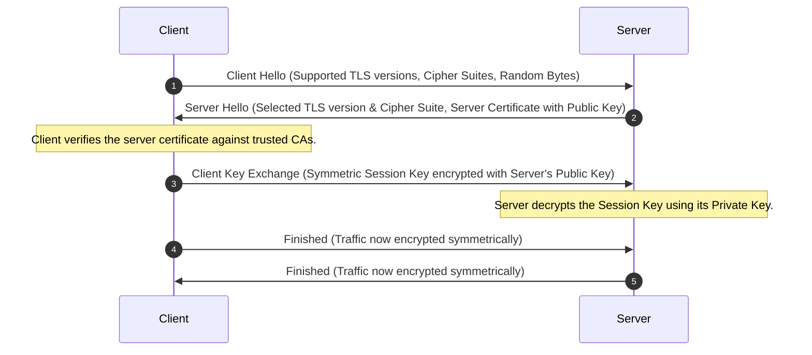

# Setup SSL for Nginx

## Technical Overview

### What is SSL/TLS?
**Secure Sockets Layer (SSL)** and its modern, more secure successor, **Transport Layer Security (TLS)**, are cryptographic protocols designed to provide communications security over a computer network. When a web server is configured with SSL/TLS (HTTPS), it establishes an encrypted link between the web server and the client's browser, ensuring that all data passed between them remains private, integral, and secure from eavesdropping or tampering.

---

### How the SSL/TLS Handshake Works
Before any encrypted application data is sent, the client and server negotiate the encryption parameters using a multi-step **handshake**:



1. **Client Hello:** The client sends its supported TLS versions, supported cipher suites, and a string of random bytes.
2. **Server Hello:** The server responds with the chosen TLS version, selected cipher suite, server random bytes, and the **Server Digital Certificate**.
3. **Verification:** The client verifies the server certificate against its pre-installed list of trusted **Certificate Authorities (CAs)** to confirm the server's identity.
4. **Key Exchange (Asymmetric):** The client generates a random symmetric **Session Key**, encrypts it using the server's public key (found in the certificate), and sends it to the server.
5. **Decryption:** The server uses its matching private key to decrypt the session key. Now, both client and server possess the same shared secret session key.
6. **Encrypted Communication (Symmetric):** The handshake concludes, and all subsequent data payloads are encrypted and decrypted using the symmetric session key (which is much faster than asymmetric operations).

---

### What is an SSL/TLS Certificate?
An **SSL/TLS Certificate** is a digital file issued by a trusted third party—a Certificate Authority (CA)—that binds a cryptographic public key to an organization's details (such as domain name, company name, and location).

* **Certificate Authority (CA):** Publicly trusted entities (like Let's Encrypt, DigiCert, Sectigo) that verify identities and sign digital certificates.
* **Self-Signed Certificates:** Certificates signed by the same entity that created them rather than a public CA. Browsers flag these with security warnings because there is no external entity verifying the server's identity. However, they are widely used in testing, staging, and local environments because they still establish a fully encrypted tunnel.

This guide details the steps to install Nginx on a Nautilus Application Server, position a provided self-signed certificate and private key, configure a secure virtual host listening on port `443`, and deploy a default welcome page.

---

## Infrastructure & Configuration Requirements
* **Target Host:** Nautilus App Server 1 (`stapp01`) (or designated application server)
* **SSH User:** `tony` (or designated sudo user)
* **SSL Certificate Source:** `/tmp/nautilus.crt`
* **SSL Private Key Source:** `/tmp/nautilus.key`
* **Target SSL Directory:** `/etc/nginx/ssl`
* **Nginx Document Root:** `/usr/share/nginx/html/`
* **Static Page Content:** `Welcome!`

---

## Step-by-Step Implementation

### Step 1: Connect to the Application Server
SSH into App Server 1 from the Jump Host:
```bash
ssh tony@stapp01
```

---

### Step 2: Install Nginx
Install the Nginx web server using the package manager:
```bash
sudo yum install -y epel-release
sudo yum install -y nginx
```

---

### Step 3: Securely Position the SSL Files
Create a secure directory within the Nginx configuration structure to store the certificate and private key:
```bash
# 1. Create the ssl directory
sudo mkdir -p /etc/nginx/ssl

# 2. Move the certificate and key from staging /tmp/
sudo mv /tmp/nautilus.crt /etc/nginx/ssl/
sudo mv /tmp/nautilus.key /etc/nginx/ssl/

# 3. Secure file permissions (Private key should only be read by root/service owner)
sudo chmod 600 /etc/nginx/ssl/nautilus.key
sudo chmod 644 /etc/nginx/ssl/nautilus.crt
```

---

### Step 4: Configure the Nginx Server Block
Open the main Nginx configuration file:
```bash
sudo vi /etc/nginx/nginx.conf
```

Locate the default HTTP server block (listening on port 80). You can comment it out, modify it, or add a dedicated HTTPS server block inside the `http {}` context. Add the following SSL-enabled server block:

```nginx
server {
    listen       443 ssl default_server;
    listen       [::]:443 ssl default_server;
    server_name  _;
    root         /usr/share/nginx/html;

    # SSL File Locations
    ssl_certificate      "/etc/nginx/ssl/nautilus.crt";
    ssl_certificate_key  "/etc/nginx/ssl/nautilus.key";

    # Secure SSL Protocols and Ciphers
    ssl_session_cache shared:SSL:1m;
    ssl_session_timeout  10m;
    ssl_protocols TLSv1.2 TLSv1.3;
    ssl_ciphers HIGH:!aNULL:!MD5;
    ssl_prefer_server_ciphers on;

    location / {
        index index.html;
    }

    error_page 404 /404.html;
        location = /40x.html {
    }

    error_page 500 502 503 504 /50x.html;
        location = /50x.html {
    }
}
```

Save and exit the editor (in `vi`, press `Esc`, type `:wq`, and press `Enter`).

---

### Step 5: Create the Web Content
Deploy the requested static welcome page inside the default document root directory:
```bash
# 1. Ensure the root path exists
sudo mkdir -p /usr/share/nginx/html

# 2. Write the welcome content
echo "Welcome!" | sudo tee /usr/share/nginx/html/index.html
```

---

### Step 6: Verify Configuration and Restart Nginx
1. Run Nginx configuration validation to catch syntax errors or incorrect paths:
   ```bash
   sudo nginx -t
   ```
   *Expected output:*
   ```text
   nginx: the configuration file /etc/nginx/nginx.conf syntax is ok
   nginx: configuration file /etc/nginx/nginx.conf test is successful
   ```
2. Start and enable the Nginx daemon:
   ```bash
   sudo systemctl enable --now nginx
   ```
3. Check service status:
   ```bash
   sudo systemctl status nginx
   ```

---

## Post-Deployment Verification

### 1. Check Port Bindings
Verify that Nginx is actively listening on HTTPS port `443`:
```bash
sudo ss -tulpn | grep :443
```
*Expected output:*
```text
tcp   LISTEN 0      128          0.0.0.0:443        0.0.0.0:*      users:(("nginx",pid=1234,fd=6))
```

### 2. Query over HTTPS (Client Check)
From the Jump Host, query the application server over HTTPS using `curl`. Because the certificate is self-signed, pass the `-k` (or `--insecure`) flag to bypass SSL chain trust errors:
```bash
curl -Ik https://stapp01
```
*Expected HTTP response headers:*
```text
HTTP/1.1 200 OK
Server: nginx/1.20.1
Content-Type: text/html
Connection: keep-alive
...
```

Verify that the payload contains the expected content:
```bash
curl -k https://stapp01
```
*Expected output:*
```text
Welcome!
```

Log out of the Application Server:
```bash
exit
```
