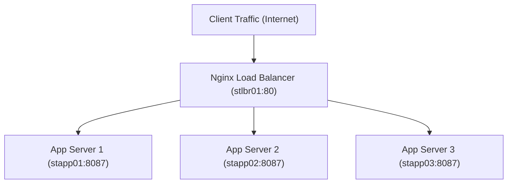

# Install and Configure Nginx as a Load Balancer

## Technical Overview

### What is a Load Balancer?
A **Load Balancer (LBR)** is a critical infrastructure component that sits between clients and a cluster of backend servers. Its primary purpose is to distribute incoming network or application traffic efficiently across multiple servers.



#### Why use a Load Balancer?
* **High Availability (HA):** Prevents service outages by detecting failed servers (via health checks) and immediately redirecting traffic to healthy nodes.
* **Scalability:** Allows you to scale application capacity horizontally by adding more backend servers without modifying the public IP address.
* **Performance:** Distributes request volumes so that no single server becomes a performance bottleneck.
* **Security:** Acts as a reverse proxy, hiding the internal IP addresses and configurations of backend application servers from the public internet.

#### Layer 4 vs. Layer 7 Load Balancing
* **Layer 4 (L4) Load Balancing:** Operates at the Transport level of the OSI model (TCP/UDP). It makes routing decisions purely based on network variables such as source/destination IP addresses and ports, without inspecting the content of the data packets. It is extremely fast and requires minimal CPU overhead.
* **Layer 7 (L7) Load Balancing:** Operates at the Application level (HTTP/HTTPS). It inspects the contents of the application payload (e.g., HTTP headers, cookies, URL paths, SSL session variables) to make routing decisions. This enables advanced features like path-based routing (e.g., sending `/api` traffic to one pool and `/static` to another) and sticky sessions.

---

### What is Nginx?
**NGINX** is a high-performance web server, reverse proxy, load balancer, mail proxy, and HTTP cache. Unlike traditional thread-per-connection servers, Nginx uses an asynchronous, event-driven architecture, enabling it to handle tens of thousands of concurrent connections with a very low memory footprint.

As a **Reverse Proxy**, Nginx receives public incoming client requests and forwards them to internal upstream servers. It then intercepts the responses from the backend and returns them to the client.

#### Nginx Load Balancing Algorithms
Nginx supports several algorithms to distribute traffic:
1. **Round Robin (Default):** Requests are distributed sequentially and evenly across the backend servers.
2. **Least Connections (`least_conn`):** Directs new requests to the backend server with the lowest number of active connections. This is useful when requests take varying amounts of time to complete.
3. **IP Hash (`ip_hash`):** Uses the client's IP address to generate a hash key, mapping it to a specific backend server. This guarantees session persistence (sticky sessions), ensuring that a client always talks to the same backend server.
4. **Weighted Round Robin:** Allows you to assign weights to servers (e.g., `weight=3`). A server with higher weight receives a proportionally larger share of traffic (ideal for mixed-spec hardware).

This guide details the steps to install Nginx on the Nautilus Load Balancer host, define backend upstream groups, and configure HTTP proxy passing.

---

## Infrastructure & Configuration Requirements
* **Target Host:** Nautilus Load Balancer Server (`stlbr01`)
* **SSH User:** Standard administrative user (e.g., `lsa` or designated sudo user)
* **Backend Application Hosts:**
  * App Server 1: `stapp01:8087`
  * App Server 2: `stapp02:8087`
  * App Server 3: `stapp03:8087`
* **LBR Port:** `80` (public HTTP port)
* **Nginx Configuration File:** `/etc/nginx/nginx.conf`

---

## Step-by-Step Implementation

### Step 1: Connect to the Load Balancer Server
SSH into the Load Balancer host from the Jump Host:
```bash
ssh lsa@stlbr01
```

---

### Step 2: Install Nginx
Install the Nginx web server on the Load Balancer server:
```bash
sudo yum install -y epel-release
sudo yum install -y nginx
```

---

### Step 3: Configure Upstreams and Server Proxy
Open the main Nginx configuration file:
```bash
sudo vi /etc/nginx/nginx.conf
```

Locate the `http` context block. Add an `upstream` block to define your group of backend servers, and modify the default `server` block to proxy traffic to this group:

```nginx
http {
    # 1. Define the upstream backend group
    upstream backend_servers {
        server stapp01:8087;
        server stapp02:8087;
        server stapp03:8087;
    }

    # ... existing configuration parameters ...

    server {
        listen       80 default_server;
        listen       [::]:80 default_server;
        server_name  _;
        root         /usr/share/nginx/html;

        # 2. Redirect root traffic to the upstream group
        location / {
            proxy_pass http://backend_servers;
            proxy_set_header Host $host;
            proxy_set_header X-Real-IP $remote_addr;
            proxy_set_header X-Forwarded-For $proxy_add_x_forwarded_for;
            proxy_set_header X-Forwarded-Proto $scheme;
        }

        # ... existing error configurations ...
    }
}
```

Save and exit the file (in `vi`, press `Esc`, type `:wq`, and press `Enter`).

---

### Step 4: Verify and Start Nginx
1. Validate the configuration file syntax to catch typos:
   ```bash
   sudo nginx -t
   ```
   *Expected output:*
   ```text
   nginx: the configuration file /etc/nginx/nginx.conf syntax is ok
   nginx: configuration file /etc/nginx/nginx.conf test is successful
   ```
2. Start and enable the Nginx service:
   ```bash
   sudo systemctl enable --now nginx
   ```
3. Check the status:
   ```bash
   sudo systemctl status nginx
   ```

---

## Post-Deployment Verification

### 1. Test Load Balancer Functionality
From the Jump Host, run multiple `curl` commands to query the Load Balancer IP (or hostname `stlbr01`) and verify that it returns content successfully:
```bash
curl http://stlbr01
```

If the backend application servers display different index markers (e.g., printing their server names in the HTML body), running the query sequentially should output responses from `stapp01`, `stapp02`, and `stapp03` in a round-robin rotation, indicating load distribution is functioning correctly.

Log out of the Load Balancer Server:
```bash
exit
```
