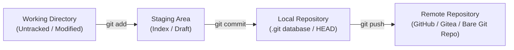

# Git Manage Remotes

## Technical Overview

### Git Workspace Architecture
Git manages project files using a three-stage architecture that governs how code transitions from local changes to committed history:



1. **Working Directory (Workspace):** The local directory on your filesystem where you actively edit, delete, or create code files. Git monitors this directory for any file modifications, marking files as *untracked*, *modified*, or *deleted*.
2. **Staging Area (Index):** A staging database that caches the changes you plan to include in your next commit. Staging files using `git add` allows you to build clean, modular commits instead of committing all file modifications at once.
3. **Local Repository (`.git` directory):** The database where Git stores the metadata and object database containing the committed snapshots of your project's history. Commits in this area are permanent and local to your system.

---

### Remote Repositories and Upstreams
A **remote repository** is a version of your project hosted on a separate server, a local network share, or even a different directory path on the same local server. Linking a local repository to remotes allows team collaboration and code backup.

* **`origin`:** The default name Git assigns to the remote server from which the local repository was originally cloned.
* **`upstream`:** By convention, the name given to the parent repository that you *forked* from. In open-source or forks-based workflows, developers configure `upstream` to fetch commits and stay in sync with the primary project.
* **Tracking Branches:** Remote-tracking branches (e.g., `origin/master`) are read-only references that show the state of branches on remote servers at the time of your last connection (`git fetch` or `git pull`).

---

### Common Remote Management Commands
* **`git remote add <name> <url-or-path>`:** Links a local repository to a remote path.
* **`git remote -v`:** Lists all configured remote connections along with their fetch and push URLs.
* **`git remote show <name>`:** Inspects a remote repository in detail, displaying tracking status for branches.
* **`git remote rename <old> <new>`:** Renames a remote link.
* **`git remote remove <name>`:** Removes a remote link and deletes all corresponding tracking branches.

This guide details the steps to log in to the **Nautilus Storage Server**, link a local repository to a new bare Git remote (`dev_media`), commit a staging file, and push changes to the remote.

---

## Infrastructure & Configuration Requirements
* **Target Host:** Nautilus Storage Server (`ststor01`)
* **SSH User:** `natasha` (or designated sudo user)
* **Local Repo Path:** `/usr/src/kodekloudrepos/media` (or your designated repository name)
* **Target Remote Name:** `dev_media`
* **Target Remote Path:** `/opt/xfusioncorp_media.git`
* **Target File to Commit:** `/tmp/index.html`

---

## Step-by-Step Implementation

### Step 1: Connect to the Storage Server
From the Jump Host, SSH into the storage server:
```bash
ssh natasha@ststor01
```

---

### Step 2: Navigate to the Repository
Change directory to the designated local git repository:
```bash
cd /usr/src/kodekloudrepos/media
```

---

### Step 3: Inspect Current Remotes
List the active remote connections configured for this repository:
```bash
git remote -v
```
*Expected output showing only the default origin:*
```text
origin  /opt/media.git (fetch)
origin  /opt/media.git (push)
```

---

### Step 4: Add the New Remote
Link the repository to the new development bare repository using `git remote add`:
```bash
sudo git remote add dev_media /opt/xfusioncorp_media.git
```

Confirm that the new remote has been registered correctly:
```bash
git remote -v
```
*Expected output:*
```text
dev_media       /opt/xfusioncorp_media.git (fetch)
dev_media       /opt/xfusioncorp_media.git (push)
origin  /opt/media.git (fetch)
origin  /opt/media.git (push)
```

---

### Step 5: Copy and Commit the Staging File
Copy the temporary static HTML file into the working directory, stage it, and commit it to the local repository:
```bash
# 1. Copy the file into the current directory
sudo cp /tmp/index.html .

# 2. Stage the file
sudo git add index.html

# 3. Commit the changes locally
sudo git commit -m "Add index.html to media repository"
```

---

### Step 6: Push Changes to the New Remote
Push the local `master` branch commits to the newly added `dev_media` remote repository:
```bash
sudo git push dev_media master
```

*Expected output snippet:*
```text
Counting objects: 3, done.
Writing objects: 100% (3/3), 290 bytes | 290.00 KiB/s, done.
Total 3 (delta 0), reused 0 (delta 0)
To /opt/xfusioncorp_media.git
 * [new branch]      master -> master
```

---

## Post-Deployment Verification

Verify that the remote `dev_media` tracking branch is synchronized with your local `master` branch:
```bash
git branch -a
```
*Expected output:*
```text
* master
  remotes/dev_media/master
  remotes/origin/master
```

Log out of the Storage Server:
```bash
exit
```
