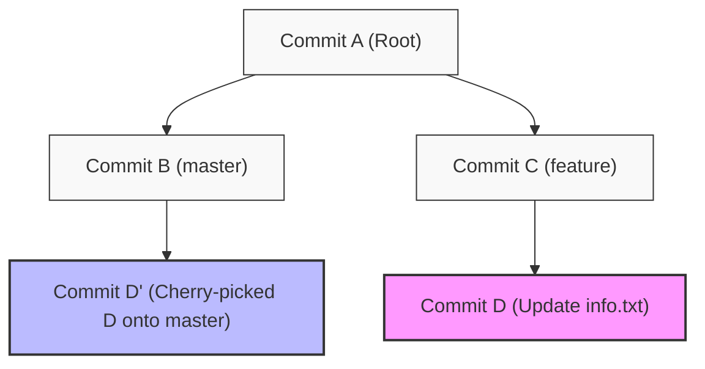

# Git Cherry Pick

## Technical Overview

In a collaborative Git workflow, developers often work on feature branches. Occasionally, you may need to apply a single, specific commit from one branch to another (e.g., a hotfix or an isolated feature update) without merging the entire branch and its accompanying changes. This is where `git cherry-pick` is used.

### What is Git Cherry-Pick and Why is it Needed?

`git cherry-pick` is a command that allows you to select a specific commit by its hash and append it as a new commit to your current branch (`HEAD`). 

#### Common Use Cases:
1. **Applying Hotfixes**: If a critical bug is discovered and fixed on a development or staging branch, you can cherry-pick that single bug-fix commit directly onto the production (`master`/`main`) branch without bringing in other, unverified development code.
2. **Accidental Commits**: If you accidentally commit a change to the wrong branch, you can cherry-pick that commit onto the correct branch and then revert/reset it on the original branch.
3. **Collaborative Sharing**: Pulling a specific change made by another developer on their branch before their complete feature branch is ready for merge.

---

### How Git Cherry-Pick Works Under the Hood

When you execute `git cherry-pick <commit-hash>`, Git performs the following sequence:

1. **Finds the Diff**: Git locates the target commit and computes the difference (diff) between that commit and its immediate parent.
2. **Applies the Patch**: Git attempts to apply that exact diff/patch to the working directory and index of your current branch.
3. **Creates a Commit**:
   - If the patch applies cleanly, Git automatically creates a new commit on the target branch with the same commit message, authorship, and date as the original commit, but with a **new commit hash**.
   - If there are overlapping changes, a **merge conflict** occurs. Git pauses the process, allowing you to resolve the conflicts, stage the resolved files using `git add`, and resume with `git cherry-pick --continue`.



---

### Git Cherry-Pick vs. Git Merge vs. Git Rebase

| Feature | `git cherry-pick` | `git merge` | `git rebase` |
| :--- | :--- | :--- | :--- |
| **Scope of Changes** | Applies **one specific commit** to the active branch. | Integrates **all commits** from a source branch into the active branch. | Re-applies **all commits** of the active branch on top of a new base tip. |
| **History Effect** | Creates a new commit representing the selected changes. Preserves parent branches. | Creates a dedicated **merge commit** (unless fast-forwarded) linking both branch histories. | **Rewrites history** by moving the entire branch base, creating new hashes for all commits in that branch. |
| **Primary Use Case** | Porting hotfixes, restoring misplaced commits, or selective feature sharing. | Combining completed features or integrating main branch changes into a feature branch. | Maintaining a clean, linear commit history by avoiding merge commits. |
| **Conflict Scope** | Conflicts are limited strictly to the diff introduced by the single target commit. | Conflicts can span any changes introduced across the entire lifetime of the source branch. | Conflicts may occur step-by-step for each individual commit being replayed. |

---

## Infrastructure & Configuration Requirements

* **Target Host:** Nautilus Storage Server (`ststor01`)
* **SSH User:** `natasha`
* **Local Repo Path:** `/usr/src/kodekloudrepos/blog`
* **Source Branch:** `feature`
* **Target Branch:** `master`
* **Target Commit Message:** `Update info.txt`

---

## Step-by-Step Implementation

### Step 1: Connect to the Storage Server
From the Jump Host, SSH into the storage server as the designated user:
```bash
ssh natasha@ststor01
```

---

### Step 2: Navigate to the Repository
Change directory to the designated local Git repository:
```bash
cd /usr/src/kodekloudrepos/blog
```

---

### Step 3: Identify the Source Commit Hash
List the commit history of the `feature` branch to find the hash of the commit with the message "Update info.txt":
```bash
git log feature --oneline -n 10
```

*Example output:*
```text
7c8e9fa (feature) Update info.txt
3b5a1c2 Add initial blog drafts
1d2f3e4 Initial commit
```
*Note down the commit hash (e.g., `7c8e9fa` in this example).*

---

### Step 4: Switch to the Target Branch
Check out the destination branch where the commit needs to be applied (`master`):
```bash
git checkout master
```

---

### Step 5: Cherry-Pick the Target Commit
Apply the specific commit to the `master` branch using `git cherry-pick`:
```bash
git cherry-pick <commit-hash>
```
*Replace `<commit-hash>` with the hash identified in Step 3 (e.g., `git cherry-pick 7c8e9fa`).*

*Expected output on success:*
```text
[master a5d6e7f] Update info.txt
 Author: devuser <devuser@nautilus.com>
 1 file changed, 1 insertion(+)
 create mode 100644 info.txt
```

---

### Step 6: Push the Changes to the Remote
Push the updated `master` branch to the remote repository (usually `origin`):
```bash
git push origin master
```

---

## Post-Deployment Verification

### 1. Inspect the Destination Branch Commit History
Verify that the cherry-picked commit is present at the top of the `master` branch history:
```bash
git log --oneline -n 5
```
*Expected output:*
```text
a5d6e7f (HEAD -> master, origin/master) Update info.txt
1d2f3e4 Initial commit
```
*(Notice that the commit hash `a5d6e7f` is different from the original feature branch commit hash `7c8e9fa`, but the author and commit message are identical).*

### 2. Verify File State
Check the contents of the workspace to confirm the changes from the commit (e.g., the creation/modification of `info.txt`) are present:
```bash
cat info.txt
```

Log out of the Storage Server:
```bash
exit
```
