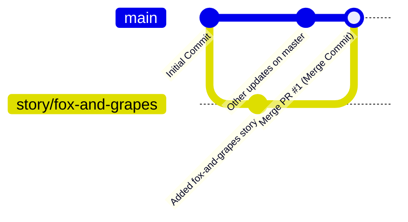

# Manage Git Pull Requests

## Technical Overview

In team-based software engineering workflows, merging code directly into primary branches like `master` or `main` is generally discouraged. To maintain code quality, ensure automated testing passes, and prevent breaking changes from reaching production, teams utilize **Pull Requests (PRs)** (also known as Merge Requests).

---

### What is Git Merge and How Does it Work?

At the core of any Pull Request is the `git merge` operation. Merging is Git's way of combining the histories and changes of two branches together. When you run `git merge <source-branch>` while active on a `<target-branch>`, Git locates a common ancestor commit between the two branches and integrates the changes.

Depending on how the commit histories of the two branches have progressed, Git performs one of two main types of merges:

#### 1. Fast-Forward Merge
A **fast-forward merge** occurs when the history of the target branch has not diverged since the source branch was created. Since no new commits have been added to the target branch in the interim, Git merges the branches by simply moving the target branch's pointer forward to the tip commit of the source branch. 
- No actual "merge commit" is generated.
- The history remains linear.

#### 2. Three-Way Merge (Non-Fast-Forward)
A **three-way merge** occurs when both the source and target branches have diverged (meaning new commits have been made on both branches since they split). Git uses three commits to generate the merged state:
- The common ancestor commit (the base).
- The latest commit on the target branch.
- The latest commit on the source branch.

Git combines the diffs and automatically creates a new commit—a **merge commit**—which has two parent commits. If changes overlap in conflicting ways, Git halts the merge and prompts the developer to resolve conflicts manually.

---

### Pull Requests: The Collaboration Wrapper

A Pull Request is not a native Git command, but a server-side feature provided by collaborative platforms (such as Gitea, GitHub, and GitLab). It acts as a wrapper around `git merge` to facilitate code review and control:
* **Code Auditing & Discussion**: Team members can inspect the diff line-by-line, leave comments, and suggest changes.
* **Review Gatekeeping**: Maintainers can configure branch protection rules requiring a designated reviewer (e.g., senior developers) to approve the PR before the merge button becomes active.
* **CI/CD Integration**: PRs can trigger automated pipelines to compile code, run test suites, and audit security vulnerabilities before merging.



---

## Infrastructure & Configuration Requirements

* **Repository Owner:** `sarah`
* **Repository Name:** `story-blog`
* **Local Repo / Author User:** `max` (credentials: `max` / `Max_pass123`)
* **Reviewer / Approver User:** `tom` (credentials: `tom` / `Tom_pass123`)
* **Source Branch:** `story/fox-and-grapes`
* **Target / Destination Branch:** `master`
* **Pull Request Title:** `Added fox-and-grapes story`
* **Branch Policy:** Do NOT delete the source branch after merging.

---

## Step-by-Step Implementation

### Step 1: Access Gitea and Inspect Max's Pushed Branch
Access Gitea via the browser and log in as `max`. In the dashboard feed, verify that Max's recent commit (`d4ec5da821`) on the `story/fox-and-grapes` branch has been successfully pushed.


---

### Step 2: Open the Sarah/Story-Blog Repository
Navigate to the repository page at `/sarah/story-blog`. Gitea will display a green banner indicating that `story/fox-and-grapes` was recently pushed. Click on the **New Pull Request** button on the right side of this banner.


---

### Step 3: Configure the Pull Request Details
Ensure the branch targets are correctly configured:
- **merge into:** `master`
- **pull from:** `story/fox-and-grapes`

Enter the title `Added fox-and-grapes story` in the title field.


---

### Step 4: Request Review from Tom
Before clicking Create, or from the newly created PR page:
1. Locate the **Reviewers** section on the right side menu.
2. Click the gear icon next to **Reviewers**.
3. Select `tom` from the dropdown list to request his approval.
4. Click the blue **Create Pull Request** button at the bottom of the form to submit.


---

### Step 5: Log in as Tom and Review the Changes
1. Log out of Gitea as `max` and log in with Tom's credentials (`tom` / `Tom_pass123`).
2. Navigate to the Pull Requests tab of `/sarah/story-blog` and open the PR.
3. Switch to the **Files Changed** tab to audit Max's code.
4. Click the blue **Review** button in the top right, choose **Approve**, and click **Submit review**.


---

### Step 6: Merge the Pull Request
1. Once approved, return to the PR's **Conversation** page.
2. Verify that Gitea shows `tom approved these changes`.
3. Locate the merge section and click the **Create merge commit** button.


---

### Step 7: Verify Merge State (Do Not Delete Branch)
Once the pull request merges successfully, Gitea will display a purple **Merged** status. 
* **CRITICAL:** Gitea will present a button to **Delete Branch**. **DO NOT click this button.** As per the branch policy, the source branch `story/fox-and-grapes` must remain intact.


---

## Post-Deployment Verification

### 1. Verify master Branch Files
Under the `/sarah/story-blog` repository homepage, switch the branch dropdown to `master`. Verify that the file `fox-and-grapes.txt` is now present in the file explorer.

### 2. Inspect Commit Log in Gitea
Go to the **Commits** tab of the `master` branch. Check that the merge commit has been created at the top of the history:
```text
Merge pull request 'Added fox-and-grapes story' (#1) from story/fox-and-grapes into master
```
Verify that the author is `tom` and the original commit author was `max`.
