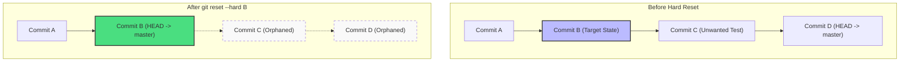

# Git Hard Reset

## Technical Overview

During software development, it is common to create commits that are later deemed unnecessary, buggy, or part of a failed experiment. When you want to discard unwanted local changes or roll back a branch history completely to a previous stable state, Git provides the `git reset` command.

---

### What is Git Reset and Why is it Needed?

`git reset` is a powerful Git command used to undo changes by moving the current branch pointer (`HEAD`) to a specific historical commit. Unlike `git revert`, which creates a new commit that applies the inverse of changes, `git reset` rewrites history by moving the tip of the branch backwards.

#### When is it Needed?
1. **Discarding Test/Experiment Commits**: Safely wiping out trial commits that should not be merged into stable branches.
2. **Undoing local commits**: Cleaning up your local branch before sharing it with team members.
3. **Aligning local with remote**: Resetting a local branch that has diverged or has unwanted commits to match the authoritative state of a remote tracking branch.

---

### The Three Modes of Git Reset

Depending on the flag used, `git reset` modifies the three trees of Git (Working Directory, Staging Area, and Commit History) in different ways:

| Reset Mode | Moves `HEAD` / Branch pointer? | Resets Staging Area (Index)? | Resets Working Directory? | Safety Level |
| :--- | :--- | :--- | :--- | :--- |
| **`--soft`** | **Yes** (moves to target commit) | **No** (changes remain staged) | **No** (local files remain intact) | **Safe**: No work is lost. Changes since the target commit are staged and ready to be recommitted. |
| **`--mixed`** *(Default)* | **Yes** (moves to target commit) | **Yes** (unstages all changes) | **No** (local files remain intact) | **Safe**: Changes since the target commit are preserved in your working directory but need to be restaged (`git add`). |
| **`--hard`** | **Yes** (moves to target commit) | **Yes** (clears index changes) | **Yes** (wipes working directory) | **Dangerous**: Any uncommitted changes and all commits after the target hash are **permanently discarded** from the working directory. |



---

### Git Reset vs. Git Revert

* **`git reset`** is best for **local branches** where commits have not yet been shared with others. Since it rewrites history, pushing a reset branch requires a force push (`git push --force`), which can disrupt other developers if done on a public, shared branch.
* **`git revert`** is best for **shared public branches** (like `master`/`main`). It preserves history by appending a new "revert" commit to undo changes, making it safe for other team members to pull.

---

## Infrastructure & Configuration Requirements

* **Target Host:** Nautilus Storage Server (`ststor01`)
* **SSH User:** `natasha`
* **Local Repo Path:** `/usr/src/kodekloudrepos/news`
* **Target Branch:** `master`
* **Target State:** Revert history so only the "initial commit" and the "add data.txt file" commit remain.

---

## Step-by-Step Implementation

### Step 1: Connect to the Storage Server
From the Jump Host, SSH into the Nautilus storage server as `natasha`:
```bash
ssh natasha@ststor01
```

---

### Step 2: Navigate to the Repository
Switch directory to the designated local Git repository:
```bash
cd /usr/src/kodekloudrepos/news
```

---

### Step 3: Inspect the Commit History
Display the list of commits in the repository to locate the target commit hash:
```bash
git log --oneline -n 10
```

*Example commit log showing unwanted commits on top:*
```text
f8e9d2c (HEAD -> master, origin/master) Remove temporary test logs
a1b2c3d Add buggy script to news
7d8e9fa Add data.txt file
1d2f3e4 Initial commit
```
*The target commit we want to keep is **`7d8e9fa`** ("Add data.txt file"). We want to discard all commits above it (`a1b2c3d` and `f8e9d2c`).*

---

### Step 4: Perform the Hard Reset
Execute the hard reset command targeting the commit hash identified in Step 3:
```bash
git reset --hard 7d8e9fa
```
*(Replace `7d8e9fa` with your actual target commit hash from `git log`).*

*Expected output:*
```text
HEAD is now at 7d8e9fa Add data.txt file
```

---

### Step 5: Force Push Changes to the Remote
Because the local branch's commit history has changed, a normal `git push` will be rejected by the remote repository. Enforce the update using the `--force` (or `-f`) flag:
```bash
git push origin master --force
```

*Expected output:*
```text
Counting objects: 3, done.
Delta compression using up to 4 threads.
Compressing objects: 100% (2/2), done.
Writing objects: 100% (3/3), 282 bytes | 282.00 KiB/s, done.
Total 3 (delta 0), reused 0 (delta 0)
To /opt/news.git
 + f8e9d2c...7d8e9fa master -> master (forced update)
```

---

## Post-Deployment Verification

### 1. Verify Clean Commit History
Verify that the branch tip is now pointing at the target commit and that all unwanted commits have been removed:
```bash
git log --oneline
```
*Expected output:*
```text
7d8e9fa (HEAD -> master, origin/master) Add data.txt file
1d2f3e4 Initial commit
```

### 2. Check the Working Directory State
Ensure the working directory is clean and files introduced by the deleted commits (if any) are discarded:
```bash
git status
```
*Expected output:*
```text
On branch master
Your branch is up to date with 'origin/master'.

nothing to commit, working tree clean
```

Log out of the Storage Server:
```bash
exit
```
