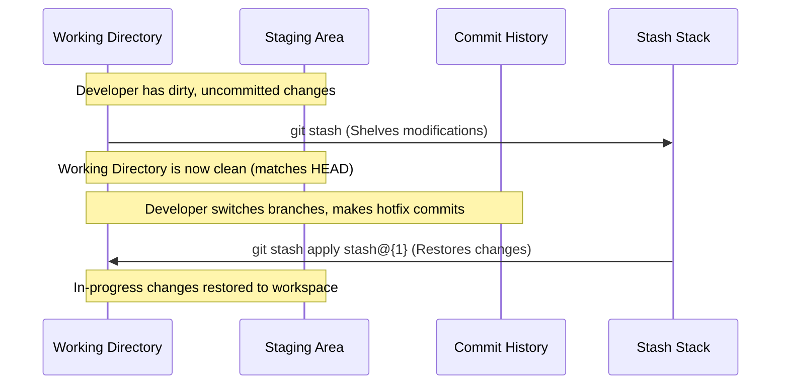

# Git Stash

## Technical Overview

During the software development lifecycle, engineers frequently need to switch tasks quickly—for example, to resolve a critical bug in production while working on a half-finished local feature. Committing half-baked, broken code to a branch just to switch branches is bad practice. Git provides the `git stash` command to solve this exact problem.

---

### What is Git Stash and Why is it Needed?

`git stash` takes the dirty state of your working directory (your modified tracked files and staged changes) and saves it on a stack of unfinished changes that you can reapply at any time.

#### When is it Needed?
1. **Context Switching:** Quickly moving to another branch to work on a hotfix without losing your current, incomplete changes.
2. **Pulling Remote Updates:** Stashing local changes to perform a clean `git pull` from remote tracking branches, preventing local conflicts.
3. **Experimenting Safely:** Saving a working state before trying a risky code change, allowing a quick rollback if the experiment fails.

---

### How Does Git Stash Work?

Under the hood, Git Stash saves your changes on a stack structure. Each stash is saved as a commit object in your local repository but is not attached to any active branch tip. 

* Stashes are indexed as `stash@{0}`, `stash@{1}`, `stash@{2}`, etc.
* `stash@{0}` is always the most recently created stash (Last-In, First-Out stack order).
* Stashing reverts your working directory back to a clean `HEAD` state.



---

### Key Git Stash Commands

* **`git stash` / `git stash save "message"`**: Shelves staged and unstaged changes (excluding untracked files by default).
* **`git stash -u` / `git stash --include-untracked`**: Shelves changes including untracked files (new files that haven't been staged).
* **`git stash list`**: Displays all stashed changes in the stack with their indexes and descriptions.
* **`git stash apply stash@{n}`**: Restores the stashed changes at index `n` into the working directory but **keeps** the entry in the stash stack.
* **`git stash pop stash@{n}`**: Restores the changes at index `n` and **removes** the entry from the stash stack.
* **`git stash drop stash@{n}`**: Deletes the specified stash entry from the stack without applying it.
* **`git stash clear`**: Deletes all stashed changes from the stack.

---

## Infrastructure & Configuration Requirements

* **Target Host:** Nautilus Storage Server (`ststor01`)
* **SSH User:** `natasha`
* **Local Repo Path:** `/usr/src/kodekloudrepos/demo`
* **Target Branch:** `master`
* **Target Operation:** Identify and restore the stash entry `stash@{1}`, then commit and push it.

---

## Step-by-Step Implementation

### Step 1: Connect to the Storage Server
From the Jump Host, SSH into the Nautilus storage server as `natasha`:
```bash
ssh natasha@ststor01
```

---

### Step 2: Navigate to the Repository
Switch directory to the designated local Git repository:
```bash
cd /usr/src/kodekloudrepos/demo
```

---

### Step 3: Inspect the Stash Stack
Display the list of currently stashed changes to identify the target index (`stash@{1}`):
```bash
git stash list
```

*Example output:*
```text
stash@{0}: WIP on master: a2b3c4d Update landing page text
stash@{1}: WIP on master: f8e9d2c Add dynamic routing configurations
stash@{2}: WIP on master: 1d2f3e4 Initial documentation layout
```
*We need to restore the stash at index **`1`** (`stash@{1}`).*

---

### Step 4: Apply the Target Stash
Restore the changes of `stash@{1}` to the active working directory:
```bash
git stash apply stash@{1}
```

*Expected output:*
```text
On branch master
Changes not staged for commit:
  (use "git add <file>..." to update what will be committed)
  (use "git restore <file>..." to discard changes in working directory)
	modified:   routing.js
	modified:   server.js

no changes added to commit (use "git add" and/or "git commit -a")
```

---

### Step 5: Stage and Commit the Restored Changes
Stage all modified files and commit them with a descriptive message:
```bash
git add .
git commit -m "Apply routing configuration changes from stash@{1}"
```

---

### Step 6: Push the Changes to Remote Origin
Push the new commit to the origin master branch:
```bash
git push origin master
```

*Expected output:*
```text
Counting objects: 4, done.
Delta compression using up to 4 threads.
Compressing objects: 100% (3/3), done.
Writing objects: 100% (4/4), 415 bytes | 415.00 KiB/s, done.
Total 4 (delta 1), reused 0 (delta 0)
To /opt/demo.git
   a2b3c4d..4e8f9a2  master -> master
```

---

## Post-Deployment Verification

### 1. Verify Remote Synchronization
Confirm that the commit was successfully pushed and the remote branch is in sync:
```bash
git log --oneline -n 3
```
*Expected output showing the applied stash on top:*
```text
4e8f9a2 (HEAD -> master, origin/master) Apply routing configuration changes from stash@{1}
a2b3c4d Update landing page text
f8e9d2c Add dynamic routing configurations
```

### 2. Verify Working Directory Status
Ensure the working directory is clean:
```bash
git status
```
*Expected output:*
```text
On branch master
Your branch is up to date with 'origin/master'.

nothing to commit, working tree clean
```

Log out of the Storage Server:
```bash
exit
```
