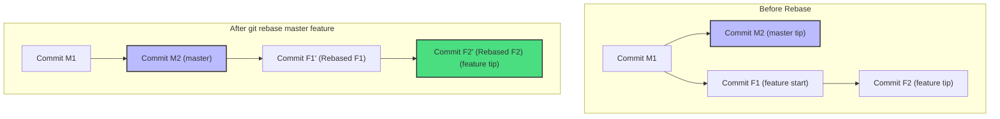

# Git Rebase

## Technical Overview

When working in collaborative environments with feature branches, branches inevitably diverge. To integrate upstream updates from a main branch (like `master`) into a feature branch, Git offers two primary strategies: `git merge` and `git rebase`. While `git merge` preserves histories exactly as they happened, it can clutter log files with non-functional "merge commits". Git Rebase resolves this by moving the base of a branch, keeping history clean and linear.

---

### What is Git Rebase and Why is it Required?

`git rebase` is the process of moving or combining a sequence of commits to a new base commit. Internally, Git temporarily shelves your branch's commits, resets the branch head to the target base branch, and then reapplies your commits one-by-one in the same order.

#### Why is it Required?
1. **Clean Project History:** By removing intermediate merge commits, developers can read project logs as a linear sequence of events.
2. **Easier Code Review:** Rebasing your feature branch against the latest upstream branch tip ensures your review diffs contain only your changes.
3. **Linear Bug Tracking:** Debugging utilities like `git bisect` work significantly faster and more reliably when the commit log is linear.

---

### How Does Git Rebase Work?

Let's visualize the commit graph before and after rebasing a `feature` branch onto `master`:



---

### Git Merge vs. Git Rebase

| Feature / Criteria | **`git merge`** | **`git rebase`** |
| :--- | :--- | :--- |
| **Mechanics** | Joins branch tips, creating a new "Merge Commit" | Replays feature commits on top of the target branch tip |
| **Commit Log** | Preserves original branch architecture (non-linear) | Rewrites branch history into a clean, single line (linear) |
| **Traceability** | Keeps exact historical context of branch timelines | Simplifies logs; commits look like they were written sequentially |
| **Conflict Resolution** | Resolved once during the merge commit creation | Resolved commit-by-commit during the replay process |
| **History Rewriting** | Safe; does not alter existing commits | Rewrites history; changes commit hashes of replayed commits |

---

### The Golden Rule of Git Rebase

> [!CAUTION]
> **Never rebase public, shared branches.**
> Because rebasing rewrites commit hashes, rebasing a branch that other developers have pulled and worked on will desynchronize their commit trees, creating massive conflict headaches. Only rebase private feature branches before they are merged.

---

## Infrastructure & Configuration Requirements

* **Target Host:** Nautilus Storage Server (`ststor01`)
* **SSH User:** `natasha`
* **Local Repo Path:** `/usr/src/kodekloudrepos/media`
* **Target Branch:** `feature` (rebase onto `master`)
* **Remote Repository:** origin

---

## Step-by-Step Implementation

### Step 1: Connect to the Storage Server
From the Jump Host, SSH into the Nautilus storage server as `natasha`:
```bash
ssh natasha@ststor01
```

---

### Step 2: Navigate to the Repository
Switch directory to the designated local Git repository:
```bash
cd /usr/src/kodekloudrepos/media
```

---

### Step 3: Inspect Branch and History Status
Verify the active branch and review the current commit logs:
```bash
git branch
git log --oneline --graph --all
```
*(Confirms that the `feature` branch is diverged from the `master` branch tip).*

---

### Step 4: Perform the Rebase
Rebase the `feature` branch onto `master`. This command automatically checkouts the `feature` branch and replays its commits on top of `master`:
```bash
git rebase master feature
```

*Expected output:*
```text
First, rewinding head to replay your work on top of it...
Applying: Add design templates for media layouts
Applying: Configure media assets processor pipeline
```

#### Handling Conflicts (If they occur)
If a conflict is encountered during commit application, Git will pause the rebase. You must:
1. Open the conflicted files and resolve marked sections.
2. Stage the resolved files: `git add <conflicted-file>`
3. Continue the rebase:
   ```bash
   git rebase --continue
   ```
*(Do not run `git commit` to resolve conflicts during a rebase).*

---

### Step 5: Force Push the Rebased Branch to Remote
Because rebasing rewrites the commit hashes, the local branch history diverges from the remote branch tip. Update the remote repository by force pushing:
```bash
git push origin feature --force
```

*Expected output:*
```text
Counting objects: 5, done.
Delta compression using up to 4 threads.
Compressing objects: 100% (3/3), done.
Writing objects: 100% (5/5), 482 bytes | 482.00 KiB/s, done.
Total 5 (delta 1), reused 0 (delta 0)
To /opt/media.git
 + f8e9d2c...4e8f9a2 feature -> feature (forced update)
```

---

## Post-Deployment Verification

### 1. Verify Linear Commit Tree
Confirm that the `feature` branch commits are now positioned directly on top of the `master` branch tip without any merge commits:
```bash
git log --oneline --graph --all
```
*Expected output showing a linear history:*
```text
* 4e8f9a2 (HEAD -> feature, origin/feature) Configure media assets processor pipeline
* 7f8e9fa Add design templates for media layouts
* a2b3c4d (master, origin/master) Update upstream production styles
* 1d2f3e4 Initial commit
```

### 2. Verify Repository State
Ensure your workspace is clean and matching the remote:
```bash
git status
```
*Expected output:*
```text
On branch feature
Your branch is up to date with 'origin/feature'.

nothing to commit, working tree clean
```

Log out of the Storage Server:
```bash
exit
```
