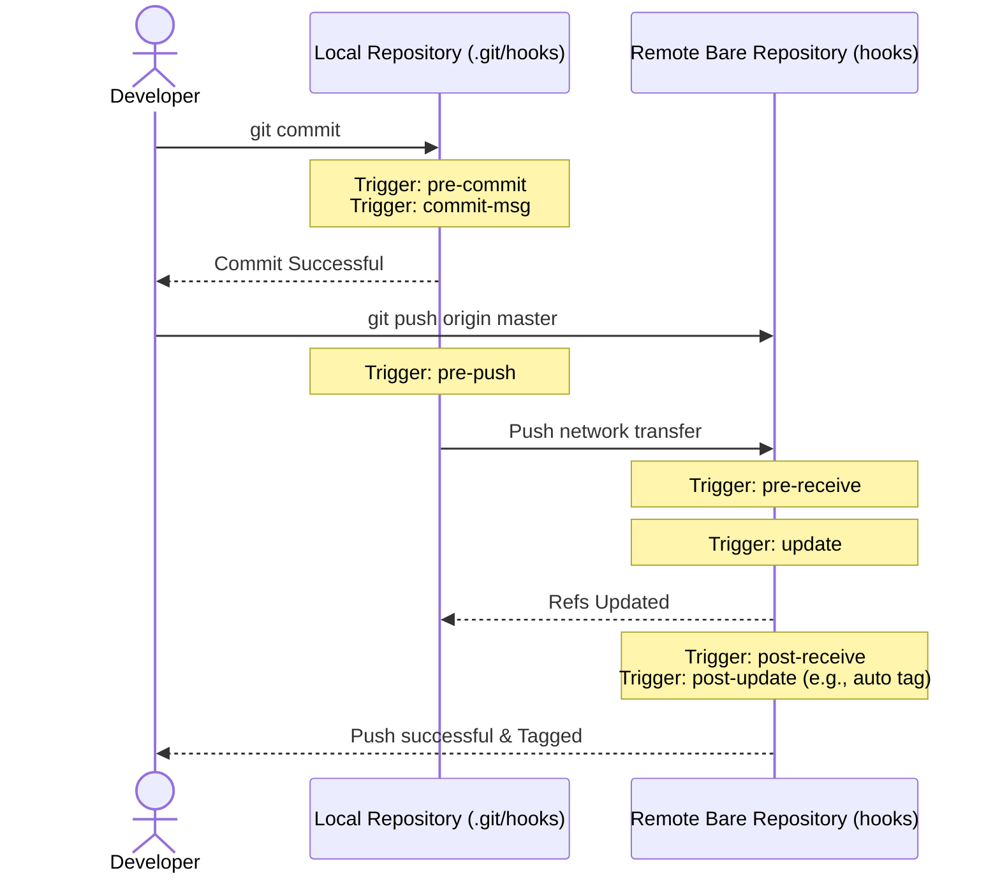

# Git Hook

## Technical Overview

Modern DevOps practices rely heavily on automation. When changes are made to a repository, we often want to run test pipelines, enforce style guides, compile files, or update release logs automatically. Rather than doing this manually, Git offers **Git Hooks**—custom scripts that run in response to lifecycle events inside a repository.

---

### What is a Git Hook?

Git hooks are executable scripts placed in the `hooks` directory of a repository (either `.git/hooks` in a standard local workspace, or `hooks` in a bare remote repository). Git detects these scripts based on their file names and runs them at specific execution points.

---

### Client-Side Hooks vs. Server-Side Hooks

Git hooks operate in two distinct contexts depending on where they are executed:

1. **Client-Side Hooks:** Run on a developer's local machine. They are primarily used to inspect files before commits or pushes occur.
   * *Example:* Running a linter before saving a commit (`pre-commit`) to block styling violations.
2. **Server-Side Hooks:** Run on the central Git server (like Gitea, GitHub, or a self-hosted bare repository). They respond to incoming network transfers.
   * *Example:* Creating a release tag automatically after code is successfully pushed (`post-update`).

---

### Core Hook Types and Flow



#### Core Client-Side Hooks:
* **`pre-commit`**: Runs first, before a commit message is written. Returning a non-zero status aborts the commit. Useful for linting and unit testing.
* **`commit-msg`**: Runs after the commit message is created. Can validate the message format against standards (e.g., matching Jira issue references).
* **`pre-push`**: Runs before pushing local changes to a remote. Useful for running integration tests.

#### Core Server-Side Hooks:
* **`pre-receive`**: Runs when a push is received on the server, before any refs are updated. Returning non-zero rejects the entire push.
* **`update`**: Runs once for each branch being updated. Allows fine-grained access control (e.g. locking the `master` branch).
* **`post-receive`**: Runs after all refs are updated. Commonly used to trigger CI/CD pipelines or notify slack channels.
* **`post-update`**: Similar to `post-receive`, but takes arguments representing changed refs. Used for cleanups or automating tags.

---

### Key Scripting Requirements

To ensure Git executes your hook script correctly:
1. **Naming:** The file name must match the hook event exactly (e.g., `post-update`, with **no file extension** like `.sh` or `.py`).
2. **Shebang:** The first line must contain a shebang directive (e.g., `#!/bin/bash` or `#!/usr/bin/env python`) to specify the interpreter.
3. **Permissions:** The script file must be granted executable permissions (`chmod +x`). Git ignores hooks that aren't marked as executable.

---

## Infrastructure & Configuration Requirements

* **Target Host:** Nautilus Storage Server (`ststor01`)
* **SSH User:** `natasha`
* **Target Bare Repo Path:** `/opt/apps.git`
* **Target Hook:** `post-update`
* **Automation Rule:** Generate a release tag formatted as `release-YYYY-MM-DD` whenever updates are pushed to the `master` branch.

---

## Step-by-Step Implementation

### Step 1: Connect to the Storage Server
From the Jump Host, SSH into the Nautilus storage server as `natasha`:
```bash
ssh natasha@ststor01
```

---

### Step 2: Navigate to the Hooks Directory
Change directory to the `hooks` folder inside the bare repository `/opt/apps.git`:
```bash
cd /opt/apps.git/hooks
```

---

### Step 3: Create the `post-update` Hook Script
Create the hook file using a text editor (e.g. `vi` or `nano`):
```bash
vi post-update
```

*Insert the following script content:*
```bash
#!/bin/bash

# Navigate to the bare repository directory
cd /opt/apps.git

# Generate the tag name with current date (format: release-YYYY-MM-DD)
TAG_NAME="release-$(date +%F)"

# Verify if master branch ref is being updated
for ref in "$@"; do
    if [ "$ref" = "refs/heads/master" ]; then
        echo "Master branch updated. Automating release tag: $TAG_NAME"
        git tag "$TAG_NAME"
    fi
done
```
*Save and close the file.*

---

### Step 4: Grant Executable Permissions
Make the hook script executable so Git can run it:
```bash
chmod +x post-update
```

---

### Step 5: Test the Hook
To test the hook, clone the repository locally on the storage server or jump host, commit a dummy change, and push to `master`:
```bash
# Example local test cloning
git clone /opt/apps.git /tmp/apps_test
cd /tmp/apps_test

# Create a dummy edit
echo "Release testing" >> README.md
git add README.md
git commit -m "Testing release update hook"

# Push to trigger post-update hook
git push origin master
```

*Expected push output confirming hook execution:*
```text
Counting objects: 3, done.
Writing objects: 100% (3/3), 284 bytes | 284.00 KiB/s, done.
Total 3 (delta 0), reused 0 (delta 0)
remote: Master branch updated. Automating release tag: release-2026-07-06
To /opt/apps.git
   d8c7b6a..4e9f8a1  master -> master
```

---

## Post-Deployment Verification

### 1. Verify Auto-Tag Creation
Check the tag lists inside the repository to confirm the hook successfully generated the release tag:
```bash
git tag
```
*Expected output showing the date-based tag:*
```text
release-2026-07-06
```

### 2. Inspect Tag Commit Details
Verify that the tag points to your latest push commit:
```bash
git show release-2026-07-06
```

Log out of the Storage Server:
```bash
exit
```
