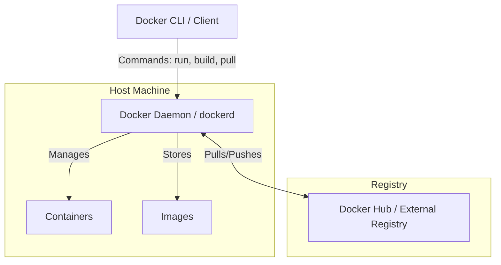

# Install Docker Packages and Start Docker Service

## Technical Overview

### What is Docker?
**Docker** is an open-source platform designed to automate the deployment, scaling, and management of applications using containerization. Instead of running applications on traditional Virtual Machines (VMs) that bundle an entire operating system, Docker runs applications in lightweight, isolated environments called **containers**.

---

### Key Concepts & Docker Architecture

Docker uses a client-server architecture consisting of the following key components:



1. **Docker Client:** The primary way users interact with Docker. When you run `docker run`, the client sends the command to `dockerd` (the Docker daemon), which executes it.
2. **Docker Daemon (`dockerd`):** A persistent background service running on the host OS. It listens for Docker API requests and manages Docker objects such as images, containers, networks, and volumes.
3. **Docker Images:** Read-only templates used to build containers. Images are structured as stackable layers, making them highly reusable and caching-friendly.
4. **Docker Containers:** Runnable instances of Docker images. They run as isolated processes on the host operating system's kernel, sharing resources efficiently.
5. **Docker Registry:** A repository where Docker images are stored (e.g., Docker Hub).

---

### Docker vs. Virtual Machines

Traditional virtual machines require a hypervisor and a full guest operating system for each VM, consuming substantial CPU, RAM, and disk space. In contrast, Docker containers share the host operating system's kernel, resulting in near-instant startup times and minimal resource overhead.

| Feature | Docker Containers | Virtual Machines |
| :--- | :--- | :--- |
| **Architecture** | Share host OS kernel; isolated user space. | Complete guest OS running on a hypervisor. |
| **Startup Time** | Milliseconds | Minutes |
| **Storage Footprint** | Extremely small (typically MBs) | Large (typically GBs) |
| **Performance** | Native system performance | Virtualization overhead |

---

## Infrastructure & Configuration Requirements

* **Target Host:** Nautilus App Server 1 (`stapp01`)
* **SSH User:** `tony`
* **OS Distribution:** CentOS / RHEL-based
* **Packages Required:** `docker-ce`, `docker-ce-cli`, `containerd.io`, `docker-compose-plugin`

---

## Step-by-Step Implementation

### Step 1: Connect to the Application Server
Establish an SSH connection to App Server 1:
```bash
ssh tony@stapp01
```
*Provide the server password when prompted.*

---

### Step 2: Configure the Docker Repository
Before installing Docker, configure the official Docker CE repository on CentOS/RHEL using `yum-utils`:
```bash
# Install yum-utils helper utility
sudo yum install -y yum-utils

# Add the official stable Docker repository
sudo yum-config-manager --add-repo https://download.docker.com/linux/centos/docker-ce.repo
```

---

### Step 3: Install Docker CE and Component Packages
Install the core Docker engine, command-line interface, container runtime (containerd), and the Docker Compose plugin:
```bash
sudo yum install -y docker-ce docker-ce-cli containerd.io docker-compose-plugin
```

---

### Step 4: Start and Enable the Docker Daemon
Initiate the Docker background service (`dockerd`) and configure it to boot automatically when the server starts up:
```bash
# Start Docker daemon
sudo systemctl start docker

# Enable Docker service at boot
sudo systemctl enable docker
```

---

## Post-Deployment Verification

### 1. Verify Docker Service Status
Check the status of the Docker systemd unit to verify it is active and running:
```bash
systemctl status docker
```
*Expected Output snippet:*
```text
● docker.service - Docker Application Container Engine
   Loaded: loaded (/usr/lib/systemd/system/docker.service; enabled; vendor preset: disabled)
   Active: active (running) since Sat 2026-07-11 08:00:00 UTC; 10s ago
```

### 2. Verify Component Versions
Confirm that Docker Engine and Docker Compose are correctly installed and reporting versions:
```bash
# Check Docker Engine version
docker --version

# Check Docker Compose version
docker compose version
```

### 3. Run a Test Container
Ensure that the Docker daemon can successfully pull images and execute containers:
```bash
sudo docker run hello-world
```

Log out of the Application Server:
```bash
exit
```
