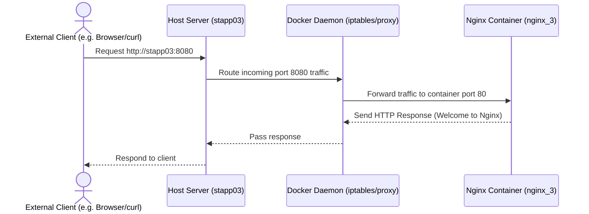

# Deploy Nginx Container on Application Server

## Technical Overview

Modern cloud-native and DevOps workflows rely heavily on **containerization** to package applications along with all their dependencies, configurations, and libraries. This ensures consistency across development, staging, and production environments. **Docker** is the industry-standard containerization platform used to build, run, and manage containerized software.

### Why Containerize Nginx?

Running Nginx in a container offers several key benefits:
1. **Isolation:** The web server runs in a sandbox, preventing conflicts with other packages or configurations on the host system.
2. **Speed & Efficiency:** Using a lightweight Alpine-based container image minimizes disk space and memory footprint while accelerating startup times.
3. **Portability:** The identical configuration runs the exact same way on a local developer laptop, a staging virtual machine, or a Kubernetes cluster.

---

### Docker Port Exposure and Binding

By default, Docker containers are isolated from the host machine's external network. They are assigned an internal IP address accessible only from the host or other containers on the same Docker network.

To allow external clients to access Nginx (which listens on port `80` by default inside the container), we must map the container's port to a port on the host machine. This is done using the `-p` (or `--publish`) flag.



When a port is published, Docker sets up iptables rules or starts a `docker-proxy` process on the host to forward incoming connections to the container's internal network interface.

---

## Infrastructure & Configuration Requirements

* **Target Host:** Nautilus App Server 3 (`stapp03`)
* **SSH User:** `banner`
* **Container Name:** `nginx_3`
* **Container Image:** `nginx:alpine`
* **Port Mapping:** Expose container port `80` to host port `8080` (or `80`)

---

## Step-by-Step Implementation

### Step 1: Connect to the Application Server
Establish an SSH connection from the Jump Host to App Server 3:
```bash
ssh banner@stapp03
```
*Provide the server password when prompted.*

---

### Step 2: Verify Docker Daemon Status
Verify if Docker is installed and running on the target application server:
```bash
# Check service status
sudo systemctl status docker
```
If Docker is stopped, start it and optionally enable it to start on boot:
```bash
# Start Docker service
sudo systemctl start docker

# Enable Docker on boot
sudo systemctl enable docker
```

---

### Step 3: Run the Nginx Container

To deploy the Nginx container as specified in the challenge, use the standard `docker run` command.

#### Standard Run Command (Minimal):
```bash
docker run -d --name nginx_3 nginx:alpine
```

#### Run Command with Port Exposure:
To expose the web server to the host network so external clients can access it on port `8080`:
```bash
docker run -d --name nginx_3 -p 8080:80 nginx:alpine
```

---

### Understanding the `docker run` Options

| Flag | Option | Description |
| :--- | :--- | :--- |
| **`-d`** | Detached Mode | Runs the container in the background and prints the container ID. The terminal remains free for further commands. |
| **`--name nginx_3`** | Container Name | Assigns a custom name (`nginx_3`) to the container. If omitted, Docker assigns a random string name. |
| **`-p 8080:80`** | Port Publishing | Maps `<host_port>:<container_port>`. Any traffic coming to port `8080` on the host will be forwarded to port `80` inside the container. |
| **`nginx:alpine`** | Image | Specifies the image to run. The `:alpine` tag indicates that the container uses a lightweight Alpine Linux distribution as its base. |

---

### Step 4: Verify Container Execution
Ensure that the container was launched successfully and is in the `Up` state:
```bash
docker ps -a
```
*Expected Output:*
```text
CONTAINER ID   IMAGE          COMMAND                  CREATED         STATUS         PORTS                  NAMES
c2b8c9d0e1f2   nginx:alpine   "/docker-entrypoint.…"   5 seconds ago   Up 5 seconds   0.0.0.0:8080->80/tcp   nginx_3
```

---

## Post-Deployment Verification

### 1. Test Web Server Accessibility
Use `curl` on the host machine to make an HTTP request to the exposed port:
```bash
curl http://localhost:8080
```
*Expected Output (Nginx Welcome Page HTML):*
```html
<!DOCTYPE html>
<html>
<head>
<title>Welcome to nginx!</title>
...
```

### 2. Inspect Container Logs
If the container fails to start, or to view access requests, inspect the container logs:
```bash
docker logs nginx_3
```

### 3. Retrieve Detailed Container Metadata
To inspect environment variables, IP address configuration, and port bindings:
```bash
docker inspect nginx_3
```

Log out of the Application Server:
```bash
exit
```
