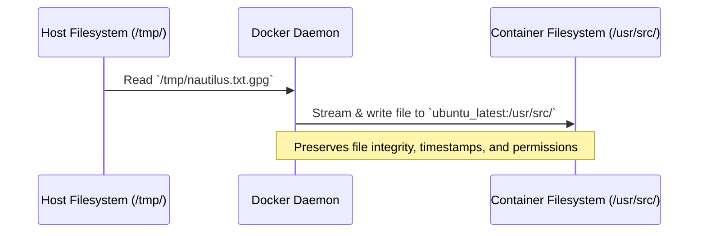

# Copy File to Docker Container

## Technical Overview

Managing files between a Docker host and running containers is a fundamental operation in containerized environments. In production or test environments, you frequently need to copy configuration files, certificates, logs, or encrypted data packages into or out of a running container.

Rather than installing SSH daemons, using network protocols (`scp`, `rsync`), or relying on temporary volume mounts, Docker provides a native, secure, and efficient command-line tool: `docker cp`.

### How `docker cp` Works

The `docker cp` command copies files or directories between a container and the local host filesystem. It interacts directly with the Docker Daemon, which packages the source files as a tar archive stream and extracts them into the target destination.



### Key Advantages of `docker cp`:
1. **No Container SSH Required:** You don't need to run an SSH server inside the container, keeping the container image lightweight and secure.
2. **Preserves File Integrity:** Since the file is streamed as a tarball binary archive, it is copied byte-for-byte. This is critical for binary, compressed, or encrypted files (like GPG-encrypted files) where text-mode copies or redirection could corrupt the data.
3. **Privilege Independence:** You do not need to configure network routing or container port exposures to transfer files.

---

## Infrastructure & Configuration Requirements

* **Target Host:** Nautilus App Server 2 (`stapp02`) *(can vary in labs, e.g., `stapp01`, `stapp02`, `stapp03`)*
* **SSH User:** `steve` *(associated with `stapp02`; `tony` for `stapp01`, `banner` for `stapp03`)*
* **Container Name:** `ubuntu_latest`
* **Source Path (Host):** `/tmp/nautilus.txt.gpg`
* **Destination Path (Container):** `/usr/src/`

---

## Step-by-Step Implementation

### Step 1: Connect to the Application Server
Establish an SSH connection from the Jump Host to the designated App Server (in this example, App Server 2):
```bash
ssh steve@stapp02
```
*Provide the server password when prompted.*

---

### Step 2: Verify the Target Container is Running
Verify if the target container (`ubuntu_latest`) is currently active and running on the server:
```bash
# List running containers
docker ps
```
*Expected Output:*
```text
CONTAINER ID   IMAGE     COMMAND                  CREATED          STATUS          PORTS     NAMES
8e7e1f40a1b2   ubuntu    "tail -f /dev/null"      10 minutes ago   Up 10 minutes             ubuntu_latest
```

---

### Step 3: Verify the Source File on the Host
Confirm that the source file `/tmp/nautilus.txt.gpg` exists on the host filesystem:
```bash
ls -l /tmp/nautilus.txt.gpg
```

---

### Step 4: Copy the File into the Container
Use `docker cp` to copy the encrypted file from the host's `/tmp` directory to the `/usr/src/` directory inside the `ubuntu_latest` container:
```bash
docker cp /tmp/nautilus.txt.gpg ubuntu_latest:/usr/src/
```
*Note: If your user is not in the `docker` group, you may need to prepend `sudo` to the command:*
```bash
sudo docker cp /tmp/nautilus.txt.gpg ubuntu_latest:/usr/src/
```

---

## Post-Deployment Verification

### 1. Verify File Presence and Size
Execute a command inside the container to list the destination directory and check if the file exists:
```bash
docker exec ubuntu_latest ls -l /usr/src/nautilus.txt.gpg
```
*Expected Output:*
```text
-rw-r--r-- 1 root root 352 Jul 11 22:45 /usr/src/nautilus.txt.gpg
```

### 2. Verify File Integrity (Checksum Comparison)
To ensure the file was not modified or corrupted during transfer, compare the MD5 checksum of the file on the host with the checksum of the file inside the container:

**On the Docker Host:**
```bash
md5sum /tmp/nautilus.txt.gpg
```

**Inside the Container:**
```bash
docker exec ubuntu_latest md5sum /usr/src/nautilus.txt.gpg
```
*The output hashes from both commands must match exactly.*

Log out of the Application Server:
```bash
exit
```
