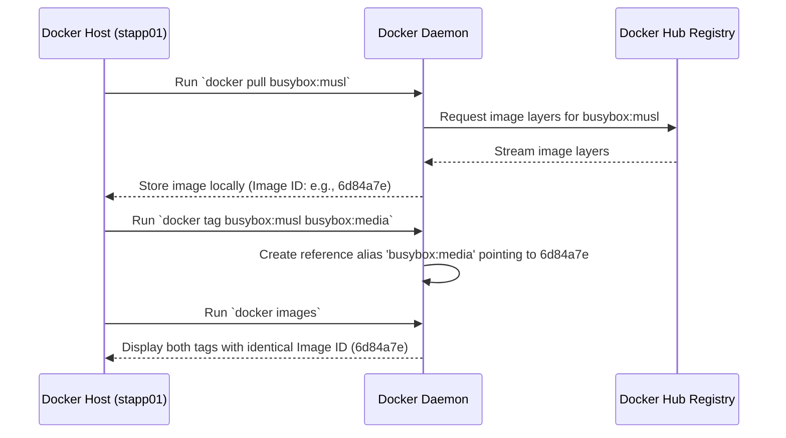

# Pull Docker Image

## Technical Overview

In Docker and containerized workflows, **images** are the read-only templates used to spin up container instances. They contain the application code, runtime libraries, dependencies, and environment configurations. Docker images are composed of multiple layers stacked on top of each other, where each layer represents an instruction in the image's `Dockerfile`.

### Docker Image Registries & Pulling

By default, the Docker Daemon is configured to pull images from **Docker Hub**, the industry-standard public container registry. When you issue a `docker pull` command, the Docker Daemon downloads each layer of the specified image tag asynchronously and stores them in the host's local image cache.

### Image Tagging and Aliasing

Docker tags are used to distinguish different versions, configurations, or builds of the same image (e.g., `alpine`, `latest`, `musl`). 

Using the `docker tag` command, you can create an alias/new name pointing to an existing local image. This does **not** duplicate the image files or download new layers. Instead, it creates a new reference pointer pointing to the exact same **Image ID** (cryptographic hash of the image configuration).



---

## Infrastructure & Configuration Requirements

* **Target Host:** Nautilus App Server 1 (`stapp01`) *(can vary in labs, e.g., `stapp01`, `stapp02`, `stapp03`)*
* **SSH User:** `tony` *(associated with `stapp01`; `steve` for `stapp02`, `banner` for `stapp03`)*
* **Source Image to Pull:** `busybox:musl`
* **Target Tag/Repository Name:** `busybox:media`

---

## Step-by-Step Implementation

### Step 1: Connect to the Application Server
SSH from the Jump Host to App Server 1:
```bash
ssh tony@stapp01
```
*Provide the server password when prompted.*

---

### Step 2: Pull the Busybox Image
Pull the `busybox` image with the specific `musl` tag from Docker Hub:
```bash
docker pull busybox:musl
```
*Note: If permissions require, prepend with `sudo`:*
```bash
sudo docker pull busybox:musl
```

---

### Step 3: Verify the Image was Pulled
Confirm the image is cached locally and view its Image ID:
```bash
docker images
```
*Expected Output:*
```text
REPOSITORY   TAG       IMAGE ID       CREATED        SIZE
busybox      musl      6d84a7e9e51c   2 weeks ago    1.45MB
```

---

### Step 4: Retag the Image
Create an alias for the pulled image, tagging it as `busybox:media`:
```bash
docker tag busybox:musl busybox:media
```
*Or with sudo if necessary:*
```bash
sudo docker tag busybox:musl busybox:media
```

---

## Post-Deployment Verification

### 1. Verify Both Tags Point to the Same Image ID
Run the list command again to verify that both tags exist and display the exact same **IMAGE ID**:
```bash
docker images
```
*Expected Output:*
```text
REPOSITORY   TAG       IMAGE ID       CREATED        SIZE
busybox      media     6d84a7e9e51c   2 weeks ago    1.45MB
busybox      musl      6d84a7e9e51c   2 weeks ago    1.45MB
```
*Note that the size and creation date are identical because they refer to the same physical layers on the host disk.*

### 2. Inspect Image Details
To double-check the local repository metadata, run a `docker inspect` check:
```bash
docker inspect busybox:media
```

Log out of the Application Server:
```bash
exit
```
