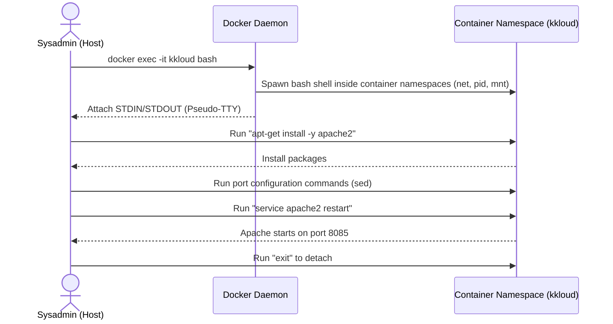

# Docker EXEC Operations

## Technical Overview

When working with containerized systems, debugging, administration, and runtime operations require executing commands directly inside the namespace of a running container. 

While `docker run` starts a *new* container from an image to run a task, the `docker exec` command allows you to run new processes inside an *already running* container.

### How `docker exec` Works

`docker exec` works by invoking the Docker Daemon to spawn a child process inside the specific namespaces (namespaces for PID, network, mount, IPC, etc.) of a target running container. This means the executed command runs within the container's environment, inheriting its filesystem, network interfaces, and environment variables.



### Options Breakdown: `-i` vs `-t`
To run commands interactively (like entering a shell), you combine two options:
* **`-i` (or `--interactive`):** Keeps standard input (`STDIN`) open, allowing you to type commands.
* **`-t` (or `--tty`):** Allocates a pseudo-TTY (terminal), enabling interactive terminal elements like text coloring, command prompt styling, and tab auto-completion.

---

## Infrastructure & Configuration Requirements

* **Target Host:** Nautilus App Server 1 (`stapp01`) *(can vary in labs, e.g., `stapp01`, `stapp02`, `stapp03`)*
* **SSH User:** `tony` *(associated with `stapp01`; `steve` for `stapp02`, `banner` for `stapp03`)*
* **Target Running Container:** `kkloud`
* **Package to Install:** `apache2`
* **Target Listen Port:** `8085` (instead of default port `80`)

---

## Step-by-Step Implementation

### Step 1: Connect to the Application Server
Establish an SSH connection from the Jump Host to App Server 1:
```bash
ssh tony@stapp01
```
*Provide the server password when prompted.*

---

### Step 2: Verify the Target Container is Running
List the running Docker containers to verify that the container `kkloud` is active:
```bash
docker ps
```
*Expected Output:*
```text
CONTAINER ID   IMAGE     COMMAND                  CREATED          STATUS          PORTS     NAMES
3a5b6c7d8e9f   ubuntu    "tail -f /dev/null"      12 minutes ago   Up 12 minutes             kkloud
```

---

### Step 3: Install Apache inside the Container
Run the package updater and installer inside the container using `docker exec`. You can do this by executing the commands non-interactively from the host terminal:

```bash
# Update repository lists inside kkloud
docker exec -it kkloud apt-get update

# Install apache2 without interactive prompts
docker exec -it kkloud env DEBIAN_FRONTEND=noninteractive apt-get install -y apache2
```
*Note: If your host user requires root privileges, prepend the docker command with `sudo`.*

---

### Step 4: Configure Apache Listen Port
Access the container shell interactively to adjust Apache configuration files:
```bash
docker exec -it kkloud bash
```
*You are now inside the container filesystem. Run the following configurations:*

```bash
# 1. Update the ports.conf file to change Listen 80 to Listen 8085
sed -i 's/Listen 80/Listen 8085/g' /etc/apache2/ports.conf

# 2. Update the default VirtualHost site configuration file to use port 8085
sed -i 's/:80/:8085/g' /etc/apache2/sites-available/000-default.conf
sed -i 's/:80/:8085/g' /etc/apache2/sites-enabled/000-default.conf
```

---

### Step 5: Start Apache Web Server
Restart the Apache service inside the container to apply the port changes:
```bash
service apache2 restart
```
Exit the container shell:
```bash
exit
```

---

## Post-Deployment Verification

### 1. Verify Listen Ports inside Container
Check if the Apache process is listening on the modified port `8085` inside the container:
```bash
docker exec kkloud ss -tuln
# or
docker exec kkloud netstat -tuln
```
*Expected Output:*
```text
Active Internet connections (only servers)
Proto Recv-Q Send-Q Local Address           Foreign Address         State      
tcp6       0      0 :::8085                 :::*                    LISTEN     
```

### 2. Verify Web Server Response
Perform a local HTTP request using `curl` inside the container's network context to confirm the default page is serving correctly on port `8085`:
```bash
docker exec kkloud curl -I http://localhost:8085
```
*Expected Output:*
```text
HTTP/1.1 200 OK
Date: Sat, 11 Jul 2026 22:52:00 GMT
Server: Apache/2.4.41 (Ubuntu)
...
```

Log out of the Application Server:
```bash
exit
```
