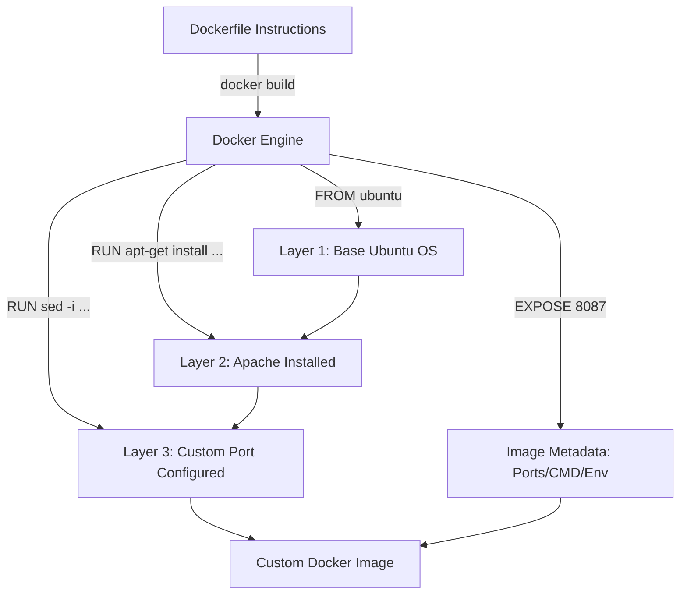

# Write a Dockerfile

## Technical Overview

In containerized environments, building custom images systematically is achieved using a **Dockerfile**. A Dockerfile is a text document that contains a sequential list of instructions and commands that the Docker daemon executes to assemble an image. 

Rather than modifying running containers interactively and saving them (as done in `docker commit`), writing a Dockerfile provides a transparent, reproducible, and version-controlled approach to image building.

### Dockerfile Build Pipeline & Layers

Every instruction in a Dockerfile creates a new read-only layer in the resulting image. Docker caches these layers during the build process. If an instruction has not changed, Docker reuses the cached layer, significantly accelerating subsequent builds.



---

## Detailed Dockerfile Reference

Below are the core directives used to construct a standard Dockerfile:

### 1. `FROM`
Sets the base image for subsequent instructions. A valid Dockerfile **must** begin with a `FROM` instruction (e.g., `FROM ubuntu:latest`).

### 2. `ENV`
Defines environment variables that persist during the build process and when the container is run.
* *Example:* `ENV DEBIAN_FRONTEND=noninteractive` prevents interactive prompts during package installs.

### 3. `RUN`
Executes shell commands during the image build process. Each `RUN` instruction creates a new image layer. To minimize the layer count, combine commands using `&&` and run cleanup steps in the same directive.
* *Example:* `RUN apt-get update && apt-get install -y apache2`

### 4. `COPY` & `ADD`
Copies files or directories from the Docker host's build context into the container filesystem.
* **`COPY`:** The preferred instruction for simple file transfers.
* **`ADD`:** Has advanced capabilities, such as extracting local tar archives or downloading files from remote URLs.

### 5. `EXPOSE`
Informs Docker that the container listens on the specified network ports at runtime. This directive acts as **metadata documentation**; it does not actually publish or map ports on the host.

### 6. `CMD` & `ENTRYPOINT`
Define the process that runs when the container is started.
* **`CMD`:** Sets default commands or parameters that can be easily overridden by appending arguments to `docker run`.
* **`ENTRYPOINT`:** Configures the container to run as a command-line executable. Arguments passed to `docker run` append to the entrypoint command rather than overriding it.
* *Production Tip:* Keep your service running in the **foreground** (e.g., `apache2ctl -D FOREGROUND`) to prevent the container from instantly exiting.

---

## Infrastructure & Configuration Requirements

* **Target Host:** Nautilus App Server 1 (`stapp01`) *(can vary in labs, e.g., `stapp01`, `stapp02`, `stapp03`)*
* **SSH User:** `tony` *(associated with `stapp01`; `steve` for `stapp02`, `banner` for `stapp03`)*
* **Dockerfile Location (Host):** `/opt/docker/Dockerfile`
* **Base Image:** `ubuntu` (or `ubuntu:latest`)
* **Service to Configure:** `apache2`
* **Custom Port:** `8087` (Apache default port `80` must be updated to `8087`)

---

## Step-by-Step Implementation

### Step 1: Connect to the Application Server
Establish an SSH connection from the Jump Host to App Server 1:
```bash
ssh tony@stapp01
```
*Provide the server password when prompted.*

---

### Step 2: Create the Build Directory
Create the target build directory where the Dockerfile will reside:
```bash
sudo mkdir -p /opt/docker
```

---

### Step 3: Write the Dockerfile
Create and edit the Dockerfile at `/opt/docker/Dockerfile`:
```bash
sudo vi /opt/docker/Dockerfile
```

Add the following configuration:
```dockerfile
# Use ubuntu as the base image
FROM ubuntu:latest

# Prevent interactive prompts during package installation
ENV DEBIAN_FRONTEND=noninteractive

# Update, install apache2, configure the custom port, and clean cache
RUN apt-get update && \
    apt-get install -y apache2 && \
    sed -i 's/Listen 80/Listen 8087/' /etc/apache2/ports.conf && \
    sed -i 's/:80/:8087/g' /etc/apache2/sites-available/000-default.conf && \
    apt-get clean && \
    rm -rf /var/lib/apt/lists/*

# Expose the custom port for documentation
EXPOSE 8087

# Start Apache in the foreground to keep the container active
CMD ["/usr/sbin/apache2ctl", "-D", "FOREGROUND"]
```
*Save and exit the text editor (`:wq`).*

---

### Step 4: Build the Custom Docker Image
Build the Docker image locally from the context of `/opt/docker` and tag it as `custom-apache:v1`:
```bash
sudo docker build -t custom-apache:v1 /opt/docker
```

---

## Post-Deployment Verification

### 1. Verify Local Image
Check if the custom image `custom-apache:v1` was built successfully:
```bash
docker images
```
*Expected Output:*
```text
REPOSITORY      TAG       IMAGE ID       CREATED          SIZE
custom-apache   v1        d1e2f3a4b5c6   10 seconds ago   185MB
ubuntu          latest    2d84a7e9e51c   2 weeks ago      72.8MB
```

### 2. Run Container and Verify Listening Port
Start a detached container using the new custom image, mapping host port `8087` to container port `8087`:
```bash
docker run -d --name test_apache -p 8087:8087 custom-apache:v1
```

Confirm that the application is running and listening on port `8087`:
```bash
curl -I http://localhost:8087
```
*Expected Output:*
```text
HTTP/1.1 200 OK
Server: Apache/2.4.52 (Ubuntu)
...
```

### 3. Cleanup Test Container
Once verified, stop and remove the test container:
```bash
docker stop test_apache
docker rm test_apache
```

Log out of the Application Server:
```bash
exit
```
