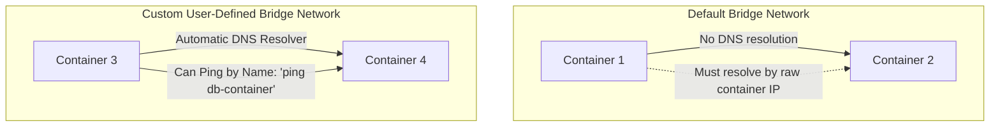

# Create a Docker Network

## Technical Overview

In containerized environments, container communication, isolation, and security are managed via the **Docker Networking** subsystem. By default, Docker containers are isolated from the host and other containers. To enable secure, reliable communication between applications, Docker uses the **Container Network Model (CNM)** to configure virtual network interfaces.

### Core Docker Network Drivers

Docker provides several built-in network drivers to support different architectural requirements:

1. **`bridge` (Default):**
   A private virtual network created on the host. Containers connected to the same bridge network can communicate with each other. Custom bridge networks provide automatic **Service Discovery (DNS)**, allowing containers to resolve each other by name (e.g., `ping mysql-container`).
   
2. **`host`:**
   Removes the network isolation between the container and the Docker host. The container shares the host’s networking namespace directly (e.g., a containerized web server running on port 80 binds directly to port 80 of the host's IP).
   
3. **`none`:**
   Disables all networking for the container. The container only has a loopback interface (`lo`), isolating it completely from external networks and other containers.
   
4. **`overlay`:**
   Enables multi-host networking. It creates a distributed network across multiple physical Docker hosts (daemons) running in **Docker Swarm** mode, allowing containers on different physical machines to communicate securely.
   
5. **`macvlan`:**
   Assigns a unique, physical MAC address to each container, making the container appear as a distinct physical device directly connected to your local network. The host's physical network card is sliced into sub-interfaces to route traffic.



---

## Technical Options: Subnet vs. IP Range

When creating a custom network, you can configure IP allocation parameters manually:
* **`--subnet`:** Specifies the network segment in CIDR format (e.g., `172.28.0.0/16`).
* **`--ip-range`:** Specifies a sub-segment of IPs that Docker will allocate to containers (e.g., `172.28.5.0/24`). This ensures Docker only assigns IPs within this subset, leaving the rest of the subnet available for static IP assignments.

---

## Infrastructure & Configuration Requirements

* **Target Host:** Nautilus App Server 3 (`stapp03`) *(can vary in labs, e.g., `stapp01`, `stapp02`, `stapp03`)*
* **SSH User:** `banner` *(associated with `stapp03`; `tony` for `stapp01`, `steve` for `stapp02`)*
* **Network Driver:** `bridge` *(or `macvlan` depending on task parameters)*
* **Network Name:** `ecommerce`
* **Subnet:** `172.28.0.0/16`
* **IP Range:** `172.28.5.0/24`

---

## Step-by-Step Implementation

### Step 1: Connect to the Application Server
Establish an SSH connection from the Jump Host to App Server 3:
```bash
ssh banner@stapp03
```
*Provide the server password when prompted.*

---

### Step 2: List Current Networks
View the existing Docker networks on the host server before making changes:
```bash
docker network ls
```
*Expected Output:*
```text
NETWORK ID     NAME      DRIVER    SCOPE
1a2b3c4d5e6f   bridge    bridge    local
2b3c4d5e6f7a   host      host      local
3c4d5e6f7a8b   none      null      local
```

---

### Step 3: Create the Custom Docker Network

Execute the network creation command. In this scenario, we use the `bridge` driver and apply our specific subnet and IP range parameters:

```bash
docker network create \
  --driver bridge \
  --subnet 172.28.0.0/16 \
  --ip-range 172.28.5.0/24 \
  ecommerce
```
*Note: If your user requires root privileges, prepend the command with `sudo`:*
```bash
sudo docker network create --driver bridge --subnet 172.28.0.0/16 --ip-range 172.28.5.0/24 ecommerce
```

---

### Alternative Scenario: Creating a Macvlan Network
If your task parameters require a `macvlan` network to expose containers directly to a host network interface (e.g., parent interface `eth0`):
```bash
docker network create \
  --driver macvlan \
  --subnet 10.10.1.0/24 \
  --ip-range 10.10.1.3/24 \
  -o parent=eth0 \
  ecommerce
```

---

## Post-Deployment Verification

### 1. Verify Network Listing
List the networks to confirm that the new network `ecommerce` exists on the host:
```bash
docker network ls
```
*Expected Output:*
```text
NETWORK ID     NAME        DRIVER    SCOPE
1a2b3c4d5e6f   bridge      bridge    local
8e7e6d5c4b3a   ecommerce   bridge    local
2b3c4d5e6f7a   host        host      local
3c4d5e6f7a8b   none        null      local
```

### 2. Inspect Network Configuration
Inspect the newly created network to verify that the subnet, IP range, and driver options were correctly applied:
```bash
docker network inspect ecommerce
```
*Expected Output:*
```json
[
    {
        "Name": "ecommerce",
        "Id": "8e7e6d5c4b3a...",
        "Scope": "local",
        "Driver": "bridge",
        "IPAM": {
            "Driver": "default",
            "Config": [
                {
                    "Subnet": "172.28.0.0/16",
                    "IPRange": "172.28.5.0/24"
                }
            ]
        },
        "Containers": {},
        "Options": {}
    }
]
```

Log out of the Application Server:
```bash
exit
```
