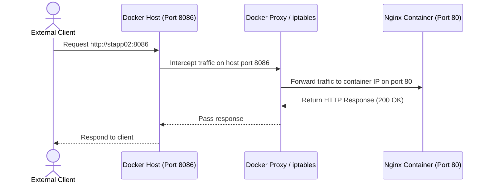

# Docker Ports Mapping

## Technical Overview

By default, Docker containers run in isolated network environments. They are assigned an internal IP address that is only accessible from the Docker host itself or other containers connected to the same virtual network. 

To allow external clients (e.g., users on the internet or systems in the corporate network) to access services running inside a container, you must use **Port Mapping** (also known as port publishing).

### How Docker Port Mapping Works

When you start a container with the `-p` (or `--publish`) flag, you define a binding between a port on the host machine and a port inside the container. 

Under the hood, when a port is mapped:
1. The Docker daemon starts a userland proxy process (**`docker-proxy`**) on the host that listens on the specified host port.
2. It configures host-level packet routing rules (**`iptables`** rules in the `DOCKER` NAT chain) to intercept incoming traffic on that host port and forward it directly to the container's internal IP address and port.



---

## Port Mapping Command Reference

### Standard Port Mapping Syntax
```bash
docker run -p <host_port>:<container_port> <image>
```
* *Example:* `-p 8086:80` routes incoming host traffic on port `8086` to port `80` inside the container.

---

### Port Mapping Variations

#### 1. IP-Specific Binding
By default, Docker binds the host port to all network interfaces (`0.0.0.0` - any IP). You can restrict access by binding to a specific host IP address:
```bash
docker run -p 127.0.0.1:8086:80 <image>
```
*This ensures the container is only reachable locally from the host itself, preventing external access.*

#### 2. Protocol Specification (TCP/UDP)
By default, Docker publishes TCP ports. To map UDP ports (such as for DNS or VPN containers), append `/udp` to the port argument:
```bash
docker run -p 53:53/udp -p 53:53/tcp <image>
```

#### 3. Random Ephemeral Port Mapping
If you omit the host port, Docker will automatically map the container port to a random, unused ephemeral port on the host (typically in the range `32768` to `60999`):
```bash
docker run -p 80 <image>
```

#### 4. Publish All Exposed Ports
You can map all ports defined in the image's `EXPOSE` metadata instructions to random host ports automatically using the uppercase `-P` flag:
```bash
docker run -d -P nginx:alpine
```

---

## Infrastructure & Configuration Requirements

* **Target Host:** Nautilus App Server 2 (`stapp02`) *(can vary in labs, e.g., `stapp01`, `stapp02`, `stapp03`)*
* **SSH User:** `steve` *(associated with `stapp02`; `tony` for `stapp01`, `banner` for `stapp03`)*
* **Container Name:** `ports_map` *(or custom container name)*
* **Base Image:** `nginx:alpine`
* **Host Port:** `8086`
* **Container Port:** `80`

---

## Step-by-Step Implementation

### Step 1: Connect to the Application Server
Establish an SSH connection from the Jump Host to App Server 2:
```bash
ssh steve@stapp02
```
*Provide the server password when prompted.*

---

### Step 2: Verify Port Availability
Before launching the container, verify that host port `8086` is not already bound by another service on the host:
```bash
ss -tuln | grep 8086
# or
netstat -tuln | grep 8086
```
*If this command returns no output, the port is available.*

---

### Step 3: Run the Container with Port Mapping
Run the `nginx:alpine` container in detached mode (`-d`), name it `ports_map`, and map host port `8086` to container port `80`:
```bash
docker run -d --name ports_map -p 8086:80 nginx:alpine
```
*Note: Prepend `sudo` if your user is not in the `docker` group:*
```bash
sudo docker run -d --name ports_map -p 8086:80 nginx:alpine
```

---

## Post-Deployment Verification

### 1. Verify Container Execution
Ensure that the container was launched successfully and is in the `Up` state:
```bash
docker ps
```
*Expected Output:*
```text
CONTAINER ID   IMAGE          COMMAND                  CREATED         STATUS         PORTS                  NAMES
1fee9bf7d02e   nginx:alpine   "/docker-entrypoint.…"   5 seconds ago   Up 5 seconds   0.0.0.0:8086->80/tcp   ports_map
```

### 2. Verify Port Binding on the Host
Confirm Nginx is actively listening on the host's port `8086`:
```bash
ss -tuln | grep 8086
```
*Expected Output:*
```text
tcp   LISTEN   0        128              0.0.0.0:8086           0.0.0.0:*
```

### 3. Verify HTTP Connectivity
Perform an HTTP request using `curl` to the mapped port on `localhost` to verify the Nginx welcome response:
```bash
curl -I http://localhost:8086
```
*Expected Output:*
```text
HTTP/1.1 200 OK
Server: nginx/1.25.1
Content-Type: text/html
...
```

Log out of the Application Server:
```bash
exit
```
