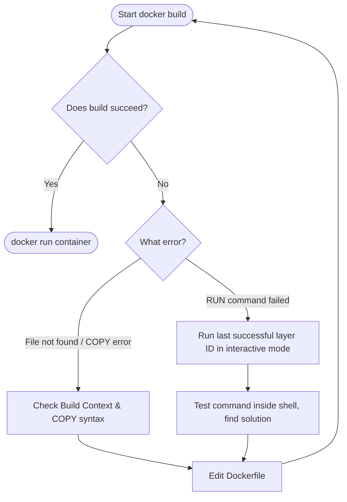

# Resolve Dockerfile Issues

## Technical Overview

During the containerization lifecycle, build failures frequently occur due to syntax errors, missing dependencies, or misunderstandings of Docker’s architecture. Troubleshooting these issues requires a systematic approach to identifying where in the layering process the build fails and correcting the underlying instructions.

### Common Dockerfile Build Errors

1. **Host-to-Container Copy Failures (`RUN cp` vs. `COPY`):**
   * **The Issue:** A common mistake is using `RUN cp /tmp/index.html /var/www/html/` to copy files from the host machine into the container. Because `RUN` commands execute inside the isolated container during build time, they have no access to the host's filesystem.
   * **The Fix:** Move the target file into the **Build Context** directory, and use the **`COPY`** (or `ADD`) instruction: `COPY index.html /var/www/html/`.

2. **Missing Build Context Files:**
   * **The Issue:** Attempting to `COPY` a file that is not present in the build context directory (or is excluded by `.dockerignore`) results in a `no source files specified` error.
   * **The Fix:** Verify the file is present in the build folder and not ignored.

3. **Deprecated Repositories in Legacy Images:**
   * **The Issue:** Running `apt-get update` on older base images (e.g., `ubuntu:16.04`) fails because archive package lists have been moved to deprecated server endpoints.
   * **The Fix:** Update the base image version or adjust the repository sources lists within the container.

---

## Systematic Dockerfile Debugging Flow

When a build fails, follow this workflow to isolate and resolve the issue:



### Advanced Debugging Techniques

* **Interactive Troubleshooting of Failing Layers:**
  Docker builds in layers. If a build fails at Step 6, Docker caches Step 5. You can launch an interactive container from the last successful layer (`Step 5`'s Image ID) to debug:
  ```bash
  docker run --rm -it <last_successful_layer_hash> /bin/bash
  ```
  Once inside, manually run the failing command to diagnose the exact error.

* **Plain Progress Output:**
  Modern Docker BuildKit hides detailed command output. Use `--progress=plain` to view full stdout/stderr of build commands:
  ```bash
  docker build --progress=plain -t test-image .
  ```

* **Force Cache Clears:**
  If you suspect cached packages are causing issues, force a clean download:
  ```bash
  docker build --no-cache -t test-image .
  ```

---

## Infrastructure & Configuration Requirements

* **Target Host:** Nautilus App Server 1 (`stapp01`) *(can vary in labs, e.g., `stapp01`, `stapp02`, `stapp03`)*
* **SSH User:** `tony` *(associated with `stapp01`; `steve` for `stapp02`, `banner` for `stapp03`)*
* **File Location (Host):** `/opt/docker/Dockerfile`
* **Target File to Copy:** `/tmp/index.html` (on the host)
* **Web Directory in Container:** `/var/www/html/` (Apache document root)

---

## Step-by-Step Implementation

### Step 1: Connect to the Application Server
Establish an SSH connection from the Jump Host to App Server 1:
```bash
ssh tony@stapp01
```
*Provide the server password when prompted.*

---

### Step 2: Navigate to the Docker Directory and Inspect the Dockerfile
Navigate to the workspace and view the non-functional `Dockerfile`:
```bash
cd /opt/docker
cat Dockerfile
```
*Example erroneous Dockerfile:*
```dockerfile
FROM ubuntu:latest
RUN apt-get update && apt-get install -y apache2
RUN cp /tmp/index.html /var/www/html/index.html
EXPOSE 80
CMD ["apache2ctl", "-D", "FOREGROUND"]
```
*Note that line 3 will fail because `/tmp/index.html` is on the host, not inside the container.*

---

### Step 3: Move the File into the Build Context
Before Docker can copy a file, it must be located within the current build directory (context):
```bash
sudo cp /tmp/index.html /opt/docker/index.html
```

---

### Step 4: Correct the Dockerfile Instructions
Edit the `Dockerfile`:
```bash
sudo vi Dockerfile
```

Modify the instructions to use `COPY` instead of `RUN cp`:
```dockerfile
FROM ubuntu:latest
RUN apt-get update && apt-get install -y apache2

# Corrected instruction: copies index.html from build context to Apache root
COPY index.html /var/www/html/index.html

EXPOSE 80
CMD ["apache2ctl", "-D", "FOREGROUND"]
```
*Save and close the file (`:wq`).*

---

### Step 5: Build the Corrected Image
Build the Docker image. Because the files are inside the build context, the COPY command will resolve correctly:
```bash
sudo docker build -t web-server:latest .
```

---

## Post-Deployment Verification

### 1. Verify Image Creation
Check if the image is successfully registered on the host:
```bash
docker images
```
*Expected Output:*
```text
REPOSITORY   TAG       IMAGE ID       CREATED         SIZE
web-server   latest    e3f4g5h6i7j8   5 seconds ago   210MB
```

### 2. Run and Query the Container
Run the web server container and verify that the copied `index.html` content is served correctly:
```bash
# Run container mapping host port 8085 to container port 80
docker run -d --name web_check -p 8085:80 web-server:latest

# Curl the port to verify content
curl http://localhost:8085
```

Log out of the Application Server:
```bash
exit
```
