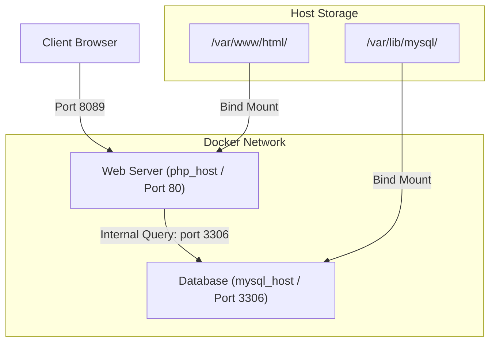

# Deploy an App on Docker Containers

## Technical Overview

Deploying modern applications on Docker typically involves orchestrating a multi-tier architecture (e.g., a web frontend, an application API, and a database backend). Rather than running each layer in a single monolithic container, the **microservices design pattern** isolates each component into its own dedicated container.

### Core Deployment Concepts

To deploy a multi-container application on Docker, three primary parameters must be configured:

1. **Service Dependency and Startup Order:**
   Web applications require their database backends to be active and ready before initialization. In Docker Compose, the `depends_on` instruction defines the boot order.
   
2. **Container Network Inter-connectivity:**
   Containers on the same user-defined network communicate using automatically registered DNS hostnames. For example, a PHP application container can connect to MySQL by using the container name `mysql_host` as the DB server address.
   
3. **Data Persistence via Volume Bind Mounts:**
   Containers are ephemeral; any files written inside them are lost when the container terminates. Map directories on the host (e.g., `/var/lib/mysql` for databases, `/var/www/html` for website assets) to locations inside the container to persist data.



---

## Environment Variables for Database Configuration

When deploying standard database images (like MySQL or MariaDB), environment variables are passed to initialize security credentials and create default databases:

* **`MYSQL_ROOT_PASSWORD`:** Sets the password for the superuser `root` account.
* **`MYSQL_DATABASE`:** Automatically creates a database with the specified name upon initialization.
* **`MYSQL_USER` & `MYSQL_PASSWORD`:** Creates a new database user and grants them all privileges on the created database.

---

## Infrastructure & Configuration Requirements

* **Target Host:** Nautilus App Server 3 (`stapp03`) *(can vary in labs, e.g., `stapp01`, `stapp02`, `stapp03`)*
* **SSH User:** `banner` *(associated with `stapp03`; `tony` for `stapp01`, `steve` for `stapp02`)*
* **Configuration File:** `/opt/docker/docker-compose.yml`
* **Web Service:**
  * **Service/Container Name:** `php_host`
  * **Base Image:** `php:apache`
  * **Port Mapping:** Host Port `8089` mapped to Container Port `80`
  * **Volume Mount:** Host `/var/www/html` mapped to Container `/var/www/html`
* **Database Service:**
  * **Service/Container Name:** `mysql_host`
  * **Base Image:** `mariadb:latest`
  * **Port Mapping:** Host Port `3306` mapped to Container Port `3306`
  * **Volume Mount:** Host `/var/lib/mysql` mapped to Container `/var/lib/mysql`
  * **Environment Variables:**
    * `MYSQL_DATABASE`: `database_host`
    * `MYSQL_USER`: `app_user`
    * `MYSQL_PASSWORD`: `password_user`
    * `MYSQL_ROOT_PASSWORD`: `R00tP@ss!`

---

## Step-by-Step Implementation

### Step 1: Connect to the Application Server
Establish an SSH connection from the Jump Host to App Server 3:
```bash
ssh banner@stapp03
```
*Provide the server password when prompted.*

---

### Step 2: Create the Configuration Folder
Ensure that the target directory for the Docker Compose file exists:
```bash
sudo mkdir -p /opt/docker
```

---

### Step 3: Write the docker-compose.yml File
Create and edit the Docker Compose configuration file:
```bash
sudo vi /opt/docker/docker-compose.yml
```

Add the following multi-container configuration:
```yaml
version: '3.8'
services:
  web:
    image: php:apache
    container_name: php_host
    ports:
      - "8089:80"
    volumes:
      - /var/www/html:/var/www/html
    depends_on:
      - db
    restart: always

  db:
    image: mariadb:latest
    container_name: mysql_host
    ports:
      - "3306:3306"
    volumes:
      - /var/lib/mysql:/var/lib/mysql
    environment:
      MYSQL_DATABASE: database_host
      MYSQL_USER: app_user
      MYSQL_PASSWORD: password_user
      MYSQL_ROOT_PASSWORD: R00tP@ss!
    restart: always
```
*Save and close the file (`:wq`).*

---

### Step 4: Deploy the Application Stack
Start both containers in detached mode:
```bash
cd /opt/docker
sudo docker compose up -d
```

---

## Post-Deployment Verification

### 1. Check Container Health
Ensure both containers are active and in the `Up` state:
```bash
docker compose ps
```
*Expected Output:*
```text
NAME         IMAGE            COMMAND                  SERVICE   CREATED         STATUS         PORTS
mysql_host   mariadb:latest   "docker-entrypoint.s…"   db        5 seconds ago   Up 5 seconds   0.0.0.0:3306->3306/tcp
php_host     php:apache       "docker-php-entrypoi…"   web       5 seconds ago   Up 5 seconds   0.0.0.0:8089->80/tcp
```

### 2. Verify Database Connection
Inspect the database server configuration and test container network communication:
```bash
# Query PHP container logs to verify database handshake
docker logs php_host

# Perform connection check from Jump Host to App Server port
curl -I http://localhost:8089
```

Log out of the Application Server:
```bash
exit
```
