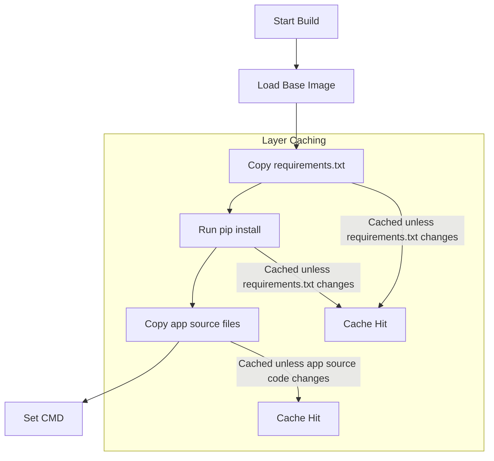

# Docker Python App

## Technical Overview

Containerizing Python applications is a standard practice in modern DevOps workflows. It guarantees that the Python runtime, external library dependencies, and configuration environment remain identical between a developer's local machine and the production cloud environment.

### Best Practices for Python Dockerization

To build high-performance, secure, and production-ready Python images, follow these three core practices:

1. **Optimize Build Caching (Dependency Layering):**
   When building a Docker image, Docker caches each instruction layer. You should copy `requirements.txt` and run `pip install` *before* copying the rest of your application code. Because source code changes frequently but project dependencies do not, this ordering prevents Docker from re-downloading and re-compiling libraries (like Flask or NumPy) on every single code change.

2. **Select the Right Base Image:**
   * Use **`python:<version>-slim`** (Debian-based) as the standard starting point. It is lightweight, stable, and has essential library compatibility.
   * Use **`python:<version>-alpine`** only if you need the smallest possible size and do not require C-extensions (which need compiling, increasing build time and complexity).

3. **Enforce Non-Root Execution:**
   By default, containers run as the root user. For production security, always create a dedicated system user and switch to it using the `USER` instruction. This prevents host filesystem escalation in case of application vulnerability.



---

## Python Dockerfile Configuration

Below is a standard, production-grade `Dockerfile` template for a Python Web application:

```dockerfile
FROM python:3.10-slim

# Set environment variables
ENV PYTHONDONTWRITEBYTECODE=1 \
    PYTHONUNBUFFERED=1

# Set the working directory inside the container
WORKDIR /app

# Create a system user and group
RUN groupadd -r appgroup && useradd -r -g appgroup appuser

# Copy only the dependency files
COPY requirements.txt .

# Install dependencies
RUN pip install --no-cache-dir -r requirements.txt

# Copy the rest of the application files
COPY . .

# Set permissions for the non-root user
RUN chown -R appuser:appgroup /app

# Switch to the non-root user
USER appuser

# Expose the application port
EXPOSE 6000

# Exec command to run the Python script
CMD ["python", "server.py"]
```

---

## Infrastructure & Configuration Requirements

* **Target Host:** Nautilus App Server 3 (`stapp03`) *(can vary in labs, e.g., `stapp01`, `stapp02`, `stapp03`)*
* **SSH User:** `banner` *(associated with `stapp03`; `tony` for `stapp01`, `steve` for `stapp02`)*
* **App Directory (Host):** `/python_app`
* **Python File:** `server.py` (Flask web server)
* **Container Name:** `pythonapp_nautilus`
* **Image Name:** `nautilus/python-app`
* **Port Mapping:** Host Port `8096` mapped to Container Port `6000`

---

## Step-by-Step Implementation

### Step 1: Connect to the Application Server
Establish an SSH connection from the Jump Host to App Server 3:
```bash
ssh banner@stapp03
```
*Provide the server password when prompted.*

---

### Step 2: Navigate to the Application Directory
Move to the directory containing the Python source files:
```bash
cd /python_app
ls -la
```
*Verify that `server.py` and `requirements.txt` are present.*

---

### Step 3: Create the Dockerfile
Create the `Dockerfile`:
```bash
sudo vi Dockerfile
```

Add the following instructions:
```dockerfile
FROM python:3.9-alpine

# Set working directory
WORKDIR /app

# Copy dependency specifications
COPY requirements.txt .

# Install Python packages
RUN pip install --no-cache-dir -r requirements.txt

# Copy source code
COPY . .

# Expose target port
EXPOSE 6000

# Run Flask application
CMD ["python", "server.py"]
```
*Save and close the file (`:wq`).*

---

### Step 4: Build the Docker Image
Build the container image using the tag `nautilus/python-app`:
```bash
sudo docker build -t nautilus/python-app .
```

---

### Step 5: Start the Container with Port Mapping
Run the container in detached mode, naming it `pythonapp_nautilus`, and publishing host port `8096`:
```bash
sudo docker run -d --name pythonapp_nautilus -p 8096:6000 nautilus/python-app
```

---

## Post-Deployment Verification

### 1. Verify Running Container
Confirm the container is running and port mapping is active:
```bash
docker ps
```
*Expected Output:*
```text
CONTAINER ID   IMAGE                 COMMAND            CREATED         STATUS         PORTS                    NAMES
8f9e0d1c2b3a   nautilus/python-app   "python server.py" 5 seconds ago   Up 5 seconds   0.0.0.0:8096->6000/tcp   pythonapp_nautilus
```

### 2. Verify Application Connectivity
Send an HTTP request to the mapped host port using `curl` to confirm the application response:
```bash
curl http://localhost:8096
```

Log out of the Application Server:
```bash
exit
```
