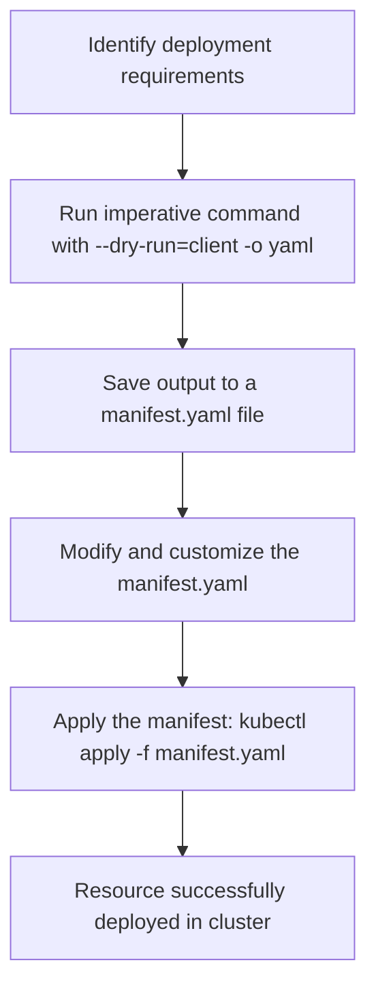

# Deploy Pods in a Kubernetes Cluster

## Technical Overview

Deploying applications in Kubernetes (K8s) requires interacting with the cluster's API server. While production environments rely on declarative YAML configuration files to maintain state, developers and system administrators frequently use **imperative commands** for rapid prototyping, ad-hoc administration, and debugging.

### Core Kubernetes Concepts

1. **`kubectl`:**
   The command-line interface (CLI) tool used to execute commands against Kubernetes API clusters. It reads configurations from the local kubeconfig file (typically located at `~/.kube/config`) to authenticate and target the active cluster context.
   
2. **Pods:**
   The smallest, most basic deployable computing unit in Kubernetes. A Pod hosts one or more containers (e.g., helper sidecars next to a main application container). Containers inside a single Pod share:
   * **Network namespace:** They share a single IP address and port space, allowing them to communicate via `localhost`.
   * **Storage volumes:** Local storage mounts can be shared directly across containers within the Pod.

---

## Imperative Commands vs. Declarative Configurations

* **Imperative Commands:** Tell Kubernetes *what to do* immediately (e.g., `kubectl run`, `kubectl create`, `kubectl delete`). It is ideal for quick testing but lacks automation history and version control.
* **Declarative Configurations:** Tell Kubernetes *what state you want* the resource to be in (e.g., `kubectl apply -f manifest.yaml`). Kubernetes continually works to reconcile the active state with your declared configuration.

---

## Key Command Parameters for Prototyping

### 1. Dry Run (`--dry-run=client`)
Executes the command locally to validate syntax, requirements, and permissions against the client-side API without sending any modifications to the live cluster. This prevents incomplete or erroneous resources from being created.

### 2. Output Formatting (`-o`)
Specifies the format in which the resource details are returned:
* **`-o yaml`:** Displays the resource definition in YAML format. Combining this with `--dry-run=client` is the industry-standard way to automatically generate starter templates.
* **`-o json`:** Outputs the complete resource manifest structure in JSON format.
* **`-o wide`:** Extends the tabular stdout listing with additional columns, showing key information like Node allocation and container IP addresses.



---

## Infrastructure & Configuration Requirements

* **Target Cluster:** Nautilus Kubernetes Cluster
* **Jump Host User:** `thor` *(or active admin cluster terminal)*
* **Namespace:** `default` *(or custom namespace if specified)*
* **Pod Name:** `nginx-pod`
* **Container Name:** `nginx-container`
* **Base Image:** `nginx:alpine`
* **Container Port:** `80`

---

## Step-by-Step Implementation

### Step 1: Log in to the Cluster Controller/Jump Host
Establish terminal access to the command host configured with cluster access:
```bash
ssh thor@jump_host_ip
```

---

### Step 2: Validate Cluster Connection
Ensure that your `kubectl` client is communicating successfully with the target cluster:
```bash
kubectl cluster-info
kubectl get nodes
```

---

### Step 3: Generate a Declarative Manifest (Dry Run)
Before creating the Pod, generate the YAML manifest template to confirm the configuration and save it for record-keeping:
```bash
kubectl run nginx-pod \
  --image=nginx:alpine \
  --port=80 \
  --dry-run=client \
  -o yaml > pod.yaml
```

Inspect the generated file to ensure it aligns with expectations:
```bash
cat pod.yaml
```
*Expected Output:*
```yaml
apiVersion: v1
kind: Pod
metadata:
  creationTimestamp: null
  labels:
    run: nginx-pod
  name: nginx-pod
spec:
  containers:
  - image: nginx:alpine
    name: nginx-pod
    ports:
    - containerPort: 80
    resources: {}
  dnsPolicy: ClusterFirst
  restartPolicy: Always
status: {}
```

---

### Step 4: Deploy the Pod
Create the Pod by applying the generated configuration:
```bash
kubectl apply -f pod.yaml
```
*Alternatively, you can run it directly using the imperative command without a dry-run:*
```bash
kubectl run nginx-pod --image=nginx:alpine --port=80
```

---

## Post-Deployment Verification

### 1. Check Pod Listing and Details
List the running pods to confirm that `nginx-pod` is in the `Running` state:
```bash
kubectl get pods
```
*Expected Output:*
```text
NAME        READY   STATUS    RESTARTS   AGE
nginx-pod   1/1     Running   0          10s
```

### 2. View Extended Listing
Show the Pod's internal IP address and the host Node it has been scheduled to run on:
```bash
kubectl get pods -o wide
```
*Expected Output:*
```text
NAME        READY   STATUS    RESTARTS   AGE   IP           NODE       NOMINATED NODE   READINESS GATES
nginx-pod   1/1     Running   0          25s   10.244.1.5   node01     <none>           <none>
```

### 3. Retrieve Resource Details in YAML
Inspect the live state of the Pod directly from the cluster in YAML format:
```bash
kubectl get pod nginx-pod -o yaml
```

### 4. Fetch Pod Web Response
Query the Nginx web root directly from inside the cluster using a temporary debug Pod:
```bash
kubectl run busybox --image=busybox -it --rm --restart=Never -- wget -qO- 10.244.1.5:80
```
*Expected Output:*
```text
<!DOCTYPE html>
<html>
<head>
<title>Welcome to nginx!</title>
...
```
