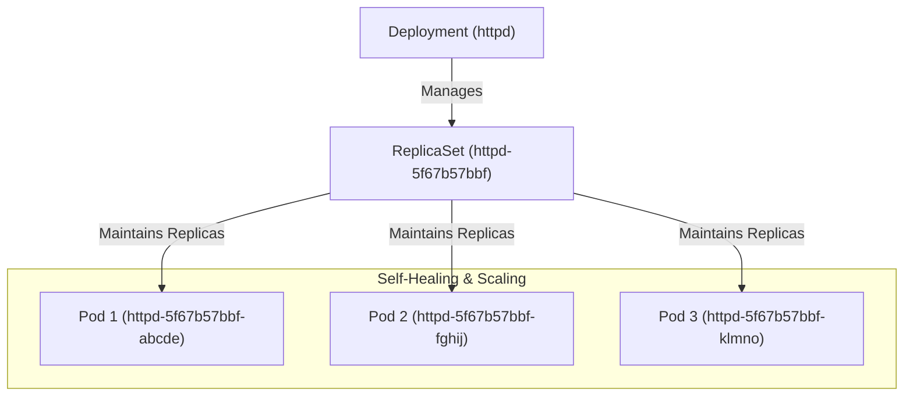

# Deploy Applications with Kubernetes Deployments

## Technical Overview

In Kubernetes (K8s), a **Deployment** is a higher-level resource controller that manages the lifecycle of application instances. While individual **Pods** are the basic execution units of K8s, they are ephemeral and disposable. Deployments provide a declarative, robust wrapper over Pods, automating key lifecycle tasks like self-healing, updates, and scaling.

### Why Deployments are Used Over Standalone Pods

Managing standalone Pods in production is a major anti-pattern. Deployments are used instead because they offer several critical operational advantages:

1. **Self-Healing and High Availability:**
   If a standalone Pod crashes, is deleted, or runs on a Node that experiences a hardware failure, it is **never replaced**. A Deployment, however, uses an underlying **ReplicaSet** to continuously monitor Pod health. If a Pod goes down, the controller immediately spins up a new identical Pod on a healthy Node to maintain the desired state.

2. **Zero-Downtime Rolling Updates:**
   Upgrading a standalone Pod requires deleting it and creating a new one, causing service disruption. A Deployment can perform a **Rolling Update**: it launches new Pods (with the new container image version) and terminates old Pods incrementally, ensuring that traffic is always routed to active instances.

3. **Seamless Rollbacks:**
   If a new version contains a critical bug, Deployments maintain a **rollout history**. You can revert the entire stack to the previous working version with a single command.

4. **Dynamic Scaling:**
   Deployments allow you to scale replicas up or down instantly. This can be done manually or automated based on CPU/Memory usage using a **Horizontal Pod Autoscaler (HPA)**.



---

## Kubernetes Deployment Commands

Below are the key commands used to manage deployments:

* **Create Deployment (Imperative):**
  `kubectl create deployment <deploy_name> --image=<image_name>`
* **Scale Replicas:**
  `kubectl scale deployment <deploy_name> --replicas=<count>`
* **Inspect Rollout Status:**
  `kubectl rollout status deployment/<deploy_name>`
* **View Rollout History:**
  `kubectl rollout history deployment/<deploy_name>`
* **Rollback to Previous Version:**
  `kubectl rollout undo deployment/<deploy_name>`

---

## Infrastructure & Configuration Requirements

* **Target Cluster:** Nautilus Kubernetes Cluster
* **Jump Host User:** `thor` *(or active admin cluster terminal)*
* **Namespace:** `default`
* **Deployment Name:** `httpd-deploy`
* **Image Name:** `httpd:latest` *(or image requested in lab)*
* **Replica Count:** `4`

---

## Step-by-Step Implementation

### Step 1: Connect to the Cluster Controller/Jump Host
Establish access to the terminal containing `kubectl` access:
```bash
ssh thor@jump_host_ip
```

---

### Step 2: Create the Declarative Deployment Manifest
Use a dry-run command to output a YAML definition file for the deployment:
```bash
kubectl create deployment httpd-deploy \
  --image=httpd:latest \
  --replicas=4 \
  --dry-run=client \
  -o yaml > httpd-deployment.yaml
```

View the manifest contents:
```bash
cat httpd-deployment.yaml
```
*Expected Output:*
```yaml
apiVersion: apps/v1
kind: Deployment
metadata:
  creationTimestamp: null
  labels:
    app: httpd-deploy
  name: httpd-deploy
spec:
  replicas: 4
  selector:
    matchLabels:
      app: httpd-deploy
  template:
    metadata:
      labels:
        app: httpd-deploy
    spec:
      containers:
      - image: httpd:latest
        name: httpd
        resources: {}
status: {}
```

---

### Step 3: Deploy the Resource
Apply the YAML file to the cluster:
```bash
kubectl apply -f httpd-deployment.yaml
```

---

### Step 4: Verify Deployment and ReplicaSet Creation
List the active deployments and check if they match the desired replica count:
```bash
kubectl get deployments
```
*Expected Output:*
```text
NAME           READY   UP-TO-DATE   AVAILABLE   AGE
httpd-deploy   4/4     4            4           20s
```

Check the ReplicaSet created by the deployment controller:
```bash
kubectl get rs
```
*Expected Output:*
```text
NAME                      DESIRED   CURRENT   READY   AGE
httpd-deploy-69bbfb9f56   4         4         4       25s
```

---

## Post-Deployment Verification (Self-Healing Demonstration)

### 1. Identify Running Pods
List all pods managed by the deployment:
```bash
kubectl get pods
```
*Expected Output:*
```text
NAME                            READY   STATUS    RESTARTS   AGE
httpd-deploy-69bbfb9f56-5n2pt   1/1     Running   0          45s
httpd-deploy-69bbfb9f56-g8kfw   1/1     Running   0          45s
httpd-deploy-69bbfb9f56-mxlqp   1/1     Running   0          45s
httpd-deploy-69bbfb9f56-zk2vl   1/1     Running   0          45s
```

---

### 2. Simulate a Pod Failure
Delete one of the active Pods manually to test K8s self-healing:
```bash
kubectl delete pod httpd-deploy-69bbfb9f56-5n2pt
```

---

### 3. Verify Automatic Replacement
Immediately query the Pod list again:
```bash
kubectl get pods
```
*Notice that the deleted Pod has been replaced by a new instance with a different random suffix:*
```text
NAME                            READY   STATUS    RESTARTS   AGE
httpd-deploy-69bbfb9f56-g8kfw   1/1     Running   0          1m
httpd-deploy-69bbfb9f56-mxlqp   1/1     Running   0          1m
httpd-deploy-69bbfb9f56-zk2vl   1/1     Running   0          1m
httpd-deploy-69bbfb9f56-zpwt4   1/1     Running   0          3s
```
*(The age of the replacement Pod `zpwt4` is just 3 seconds, demonstrating that the Deployment controller successfully healed the cluster state).*

Log out of the Application Server:
```bash
exit
```
