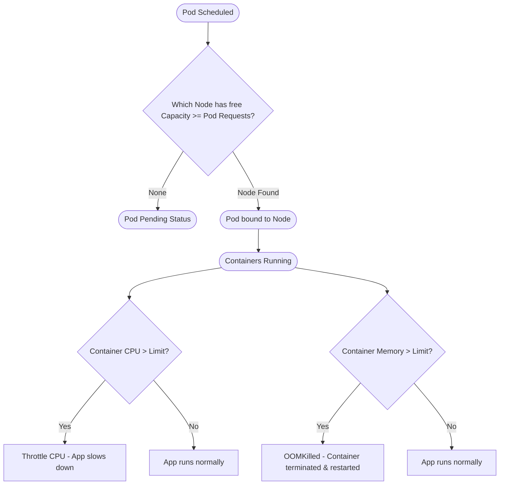

# Set Resource Limits in Kubernetes Pods

## Technical Overview

In shared Kubernetes clusters, multiple workloads compete for physical resources (CPU and Memory) on host Nodes. If resource constraints are not set, a single misconfigured or runaway application can consume all available memory or CPU on a Node, causing performance degradation or crashes of other workloads—a problem known as the **Noisy Neighbor** effect.

To prevent this, Kubernetes allows administrators and developers to define **Resource Requests and Limits** at the container level.

### Resource Requests vs. Limits

1. **`requests` (Guaranteed Allocation):**
   * **Definition:** The minimum amount of resources that a container is guaranteed to receive.
   * **Scheduling Role:** The Kubernetes scheduler uses the `requests` configuration to select a suitable Node. The scheduler sums up the requests of all containers inside a Pod and places the Pod on a Node that has sufficient unallocated capacity. If no Node has enough free resource space, the Pod remains in the `Pending` state.

2. **`limits` (Maximum Threshold):**
   * **Definition:** The maximum amount of resources that a container is allowed to consume.
   * **Enforcement:**
     * **CPU Limits:** CPU is a compressible resource. If a container reaches its CPU limit, the container runtime **throttles** its CPU cycles (slowing down the container's performance), but the container is **not terminated**.
     * **Memory Limits:** Memory is an incompressible resource. If a container attempts to allocate memory beyond its defined limit, the kernel terminates the container process with an **OOMKilled** (Out Of Memory Killed) exit status code `137`.



---

## Kubernetes Quality of Service (QoS) Classes

Kubernetes automatically assigns a **QoS Class** to each Pod based on how requests and limits are configured. The QoS class determines eviction priority if a Node runs out of resources:

* **`Guaranteed` (Highest Priority):**
  * Assigned if both `requests` and `limits` are explicitly configured and are **exactly equal** for both CPU and Memory.
  * *Use case:* Critical databases or latency-sensitive APIs. These Pods are the last to be evicted.
* **`Burstable` (Medium Priority):**
  * Assigned if requests and limits are set but not equal, or if only one container defines them.
  * *Use case:* Most standard microservices where traffic bursts.
* **`BestEffort` (Lowest Priority):**
  * Assigned if **neither** requests nor limits are specified.
  * *Use case:* Non-critical background logs or scratch jobs. These Pods are the first to be terminated if a Node runs out of memory.

---

## Infrastructure & Configuration Requirements

* **Target Cluster:** Nautilus Kubernetes Cluster
* **Jump Host User:** `thor` *(or active admin cluster terminal)*
* **Namespace:** `default`
* **Pod Name:** `httpd-pod`
* **Container Name:** `httpd-container`
* **Base Image:** `httpd:latest`
* **Resource Constraints:**
  * **CPU Requests:** `100m` (0.1 core)
  * **Memory Requests:** `15Mi`
  * **CPU Limits:** `100m`
  * **Memory Limits:** `20Mi`

---

## Step-by-Step Implementation

### Step 1: Connect to the Cluster Controller/Jump Host
Establish terminal access to the command host configured with cluster access:
```bash
ssh thor@jump_host_ip
```

---

### Step 2: Generate a Pod Manifest template
Generate a base Pod manifest file using dry-run:
```bash
kubectl run httpd-pod \
  --image=httpd:latest \
  --restart=Never \
  --dry-run=client \
  -o yaml > httpd-pod.yaml
```

---

### Step 3: Configure Resource Limits and Requests
Edit the `httpd-pod.yaml` manifest:
```bash
vi httpd-pod.yaml
```

Update the `spec.containers` block to define container name, limits, and requests. Ensure they are placed under the container specifications:
```yaml
apiVersion: v1
kind: Pod
metadata:
  labels:
    run: httpd-pod
  name: httpd-pod
spec:
  containers:
  - name: httpd-container
    image: httpd:latest
    ports:
    - containerPort: 80
    resources:
      requests:
        memory: "15Mi"
        cpu: "100m"
      limits:
        memory: "20Mi"
        cpu: "100m"
  restartPolicy: Never
```
*Save and close the file (`:wq`).*

---

### Step 4: Deploy the Pod
Create the Pod in your cluster using the manifest:
```bash
kubectl apply -f httpd-pod.yaml
```

---

## Post-Deployment Verification

### 1. Verify Resource Settings in Live Pod
Inspect the container resource configurations directly from the cluster state:
```bash
kubectl get pod httpd-pod -o yaml
```
*Locate the `resources` section inside the container specification block to verify the memory and CPU values match the configuration.*

---

### 2. Verify Assigned QoS Class
Check that the Pod was successfully categorized under the correct Quality of Service class:
```bash
kubectl describe pod httpd-pod | grep "QoS Class"
```
*Expected Output:*
```text
QoS Class:                   Guaranteed
```
*(Since requests and limits are configured and are exactly equal, the Pod receives the highest priority `Guaranteed` class).*

Log out of the Application Server:
```bash
exit
```
