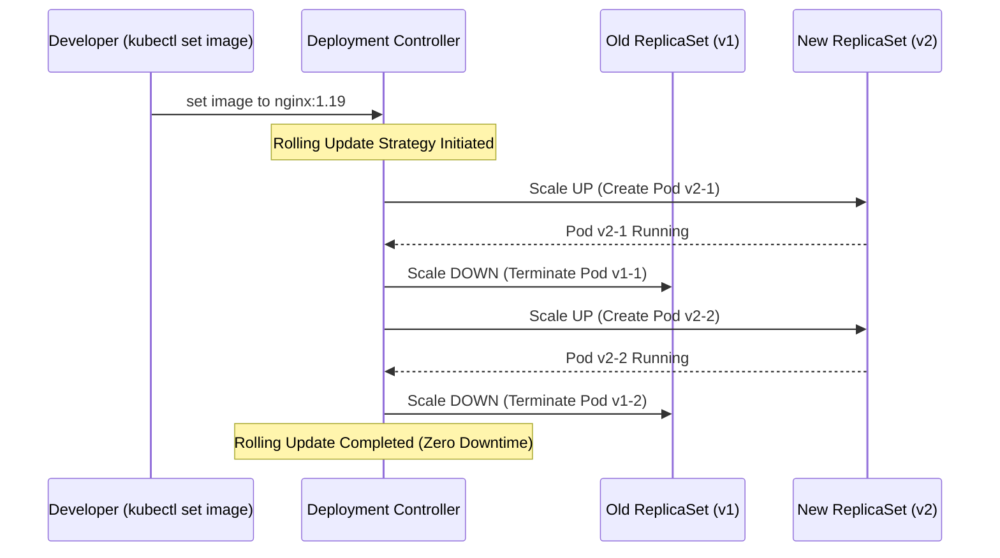

# Execute Rolling Updates in Kubernetes

## Technical Overview

Deploying application updates in production without causing service disruption is one of the core challenges of DevOps. Kubernetes addresses this via the **Rolling Update** deployment strategy, which is the default upgrade behavior for K8s Deployments.

### How Rolling Updates Work

A rolling update replaces pods of the old version with pods of the new version incrementally, one by one, rather than killing the entire application stack at once. This ensures that a subset of Pods is always active and ready to handle incoming user traffic, resulting in **zero downtime**.

The Deployment controller coordinates this process by managing two distinct **ReplicaSets**: the old ReplicaSet (which it scales down to 0) and the new ReplicaSet (which it scales up to the desired replica count).



---

## Configuring Rolling Update Parameters

You can fine-tune the speed and safety margins of a rolling update inside the deployment spec (`spec.strategy.rollingUpdate`):

1. **`maxSurge`:**
   * **Definition:** The maximum number of Pods that can be created *above* the desired replica count during the update.
   * **Value:** Can be an absolute number (e.g., `2`) or a percentage (e.g., `25%`).
   * *Example:* If replicas = 4 and `maxSurge` = 1, Kubernetes will bring up 1 new Pod before terminating any old ones (totaling 5 active Pods temporarily).

2. **`maxUnavailable`:**
   * **Definition:** The maximum number of Pods that can be offline/unavailable during the update.
   * **Value:** Can be an absolute number (e.g., `1`) or a percentage (e.g., `25%`).
   * *Example:* If replicas = 4 and `maxUnavailable` = 1, Kubernetes ensures that at least 3 Pods are active and serving traffic throughout the update.

---

## Rollout Command Reference

* **Trigger Image Update:**
  `kubectl set image deployment/<deploy_name> <container_name>=<new_image>:<tag>`
* **Monitor Rollout Status:**
  `kubectl rollout status deployment/<deploy_name>`
* **Check Rollout History:**
  `kubectl rollout history deployment/<deploy_name>`
* **Revert to Previous Revision:**
  `kubectl rollout undo deployment/<deploy_name>`
* **Revert to Specific Revision:**
  `kubectl rollout undo deployment/<deploy_name> --to-revision=<rev_number>`

---

## Infrastructure & Configuration Requirements

* **Target Cluster:** Nautilus Kubernetes Cluster
* **Jump Host User:** `thor` *(or active admin cluster terminal)*
* **Namespace:** `default`
* **Deployment Name:** `nginx-deployment`
* **Container Name:** `nginx-container` *(or name inside your deployment)*
* **Original Image Tag:** `nginx:1.17`
* **Target Image Tag:** `nginx:1.19`

---

## Step-by-Step Implementation

### Step 1: Connect to the Cluster Controller/Jump Host
Establish terminal access to the command host configured with cluster access:
```bash
ssh thor@jump_host_ip
```

---

### Step 2: Identify the Active Deployment and Container Name
List the active deployments to verify the target name:
```bash
kubectl get deployments
```

Query the deployment details to extract the exact container name defined in the Pod template specs:
```bash
kubectl get deployment nginx-deployment -o jsonpath='{.spec.template.spec.containers[*].name}'
```
*Take note of the container name output (e.g., `nginx-container` or `nginx`).*

---

### Step 3: Trigger the Rolling Update
Execute the `kubectl set image` command, passing the target deployment name, the container name, and the new Nginx version tag:
```bash
kubectl set image deployment/nginx-deployment nginx-container=nginx:1.19
```

---

### Step 4: Monitor the Rollout Progress
Track the update status in real-time to watch old pods terminate and new pods initialize:
```bash
kubectl rollout status deployment/nginx-deployment
```
*Expected Output:*
```text
Waiting for deployment "nginx-deployment" rollout to finish: 1 out of 3 new replicas have been updated...
Waiting for deployment "nginx-deployment" rollout to finish: 2 out of 3 new replicas have been updated...
Waiting for deployment "nginx-deployment" rollout to finish: 1 old replicas are pending termination...
deployment "nginx-deployment" successfully rolled out
```

---

## Post-Deployment Verification & Troubleshooting (Rollback)

### 1. Verify Active Image Versions
List the Pods and check their running images to confirm the update succeeded:
```bash
kubectl describe deployment nginx-deployment | grep Image
```
*Expected Output:*
```text
  Image:        nginx:1.19
```

---

### 2. Inspect Rollout History Revisions
Verify the historical revisions list to audit changes:
```bash
kubectl rollout history deployment/nginx-deployment
```
*Expected Output:*
```text
REVISION  CHANGE-CAUSE
1         <none>
2         <none>
```

---

### 3. Perform a Rollback (Simulated Rollout Undo)
If an update is broken, revert to the previous version instantly:
```bash
kubectl rollout undo deployment/nginx-deployment
```
*Expected Output:*
```text
deployment.apps/nginx-deployment rolled back
```

Confirm that the image reverted back to the previous tag:
```bash
kubectl describe deployment nginx-deployment | grep Image
```
*Expected Output:*
```text
  Image:        nginx:1.17
```

Log out of the Application Server:
```bash
exit
```
