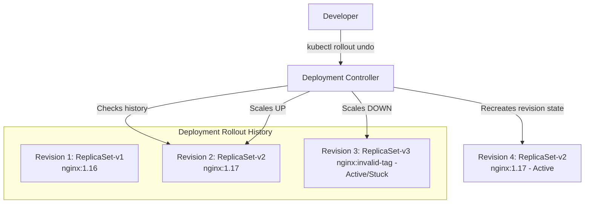

# Revert Deployment to Previous Version in Kubernetes

## Technical Overview

When a new container version is deployed to a Kubernetes (K8s) cluster, configuration errors or code bugs can cause immediate application failures. Common failure modes include:
* **`ImagePullBackOff` / `ErrImagePull`:** Occurs when the new image tag is mistyped or does not exist in the container registry.
* **`CrashLoopBackOff`:** Occurs when the container starts but repeatedly exits due to runtime errors, misconfigured environment variables, or database connection failures.

Rather than manually editing YAML configurations or re-applying old files—which is slow and introduces security/compliance risks—Kubernetes provides a native **Rollback** feature.

### How Kubernetes Tracks Deployment History

Every time a Deployment’s Pod template specification (such as labels, volumes, environment variables, or images) is modified, the Deployment controller:
1. Generates a new **ReplicaSet** corresponding to the updated template.
2. Increments the **Revision Number** in the rollout history.
3. Keeps old ReplicaSets cached on the cluster. The maximum number of historical revisions stored is governed by the `spec.revisionHistoryLimit` field (default is `10`).

When you execute a rollback (`kubectl rollout undo`), the controller simply scales up the selected historical ReplicaSet and scales down the active, broken ReplicaSet.


*Note: A rollback operation creates a new revision (e.g., Revision 4) that contains the exact configuration templates of the target historical revision (e.g., Revision 2).*

---

## Rollback Command Reference

* **Revert to Preceding Revision:**
  `kubectl rollout undo deployment/<deploy_name>`
* **Revert to a Specific Revision:**
  `kubectl rollout undo deployment/<deploy_name> --to-revision=<rev_number>`
* **View History Revisions:**
  `kubectl rollout history deployment/<deploy_name>`
* **View Configuration of a Specific Revision:**
  `kubectl rollout history deployment/<deploy_name> --revision=<rev_number>`

---

## Infrastructure & Configuration Requirements

* **Target Cluster:** Nautilus Kubernetes Cluster
* **Jump Host User:** `thor` *(or active admin cluster terminal)*
* **Namespace:** `default`
* **Deployment Name:** `nginx-deployment`
* **Broken Image Tag:** `nginx:1.191` *(non-existent tag causing ImagePullBackOff)*
* **Target Revision to Restore:** Revision `1` *(running stable `nginx:1.16` or `nginx:1.17`)*

---

## Step-by-Step Implementation

### Step 1: Connect to the Cluster Controller/Jump Host
Establish terminal access to the command host configured with cluster access:
```bash
ssh thor@jump_host_ip
```

---

### Step 2: Diagnose the Failing Deployment
Check the status of the pods to identify any active failures:
```bash
kubectl get pods
```
*Expected Output showing ImagePullBackOff:*
```text
NAME                                READY   STATUS             RESTARTS   AGE
nginx-deployment-7f8a9b0c-abcde     0/1     ImagePullBackOff   0          1m
nginx-deployment-7f8a9b0c-fghij     0/1     ImagePullBackOff   0          1m
```

Query the deployment status to confirm rollout has stalled:
```bash
kubectl rollout status deployment/nginx-deployment
```

---

### Step 3: Inspect the Deployment Rollout History
List the available history revisions to find the target stable revision:
```bash
kubectl rollout history deployment/nginx-deployment
```
*Expected Output:*
```text
REVISION  CHANGE-CAUSE
1         <none>
2         <none>
```

Inspect the exact details of Revision `1` to confirm it is the stable target version:
```bash
kubectl rollout history deployment/nginx-deployment --revision=1
```
*Expected Output:*
```text
deployment.apps/nginx-deployment with revision #1
Pod Template:
  Labels:       app=nginx
  Containers:
   nginx-container:
    Image:      nginx:1.17
    Port:       80
```

---

### Step 4: Perform the Rollback
Revert the deployment back to Revision `1`:
```bash
kubectl rollout undo deployment/nginx-deployment --to-revision=1
```
*Expected Output:*
```text
deployment.apps/nginx-deployment rolled back
```

---

## Post-Deployment Verification

### 1. Monitor the Rollback Progress
Track the status in real-time to watch the old/broken pods terminate and the stable pods launch:
```bash
kubectl rollout status deployment/nginx-deployment
```
*Expected Output:*
```text
deployment "nginx-deployment" successfully rolled out
```

### 2. Verify Pod Health
Ensure all pods are healthy and in the `Running` state:
```bash
kubectl get pods
```
*Expected Output:*
```text
NAME                                READY   STATUS    RESTARTS   AGE
nginx-deployment-6f5d4c3b-klmno     1/1     Running   0          10s
nginx-deployment-6f5d4c3b-pqrst     1/1     Running   0          10s
```

### 3. Verify Restored Image
Confirm that the running container image has reverted back to the target version:
```bash
kubectl describe deployment nginx-deployment | grep Image
```
*Expected Output:*
```text
  Image:        nginx:1.17
```

Log out of the Application Server:
```bash
exit
```
