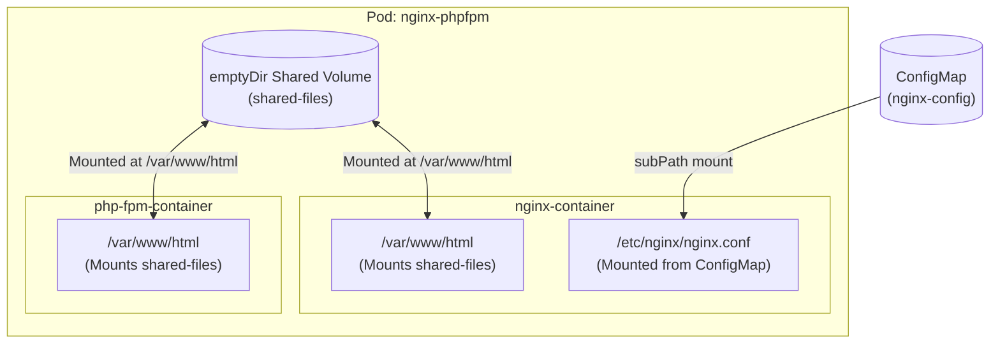

# Resolve Volume Mounts Issue in Kubernetes

## Technical Overview

In modern cloud-native architectures, applications are often decomposed into specialized single-purpose containers. A classic example is the **Nginx + PHP-FPM** pattern:
*   **Nginx** acts as the high-performance reverse proxy and web server, serving static files directly and routing dynamic queries to an backend.
*   **PHP-FPM** (FastCGI Process Manager) handles the execution of server-side PHP scripts.

Since Nginx and PHP-FPM run in separate, isolated containers, they do not share a common filesystem by default. However, both containers require access to the application's source code: Nginx needs it to verify static file requests, and PHP-FPM needs it to run the script. To solve this, Kubernetes uses **Shared Volumes** within a multi-container Pod.



### Shared Storage via `emptyDir`
An `emptyDir` volume is created when a Pod is assigned to a node and exists as long as that Pod is running on that node. It starts out empty, and all containers in the Pod can read and write the same files in the `emptyDir` volume, though that volume can be mounted at the same or different paths in each container.

### ConfigMap-Based Configuration File Mounting
To run Nginx, configuration files (like `nginx.conf`) must be injected. Instead of baking custom configurations into the container image, Kubernetes provides **ConfigMaps** to decouple configuration from containerized applications.

---

## Kubernetes ConfigMaps: Concept & Usage

A **ConfigMap** is an API object used to store non-confidential data in key-value pairs. Pods can consume ConfigMaps as environment variables, command-line arguments, or configuration files in a volume.

### Why Use ConfigMaps?
*   **Decoupled Configurations:** Allows you to change environment configurations without rebuilding container images.
*   **Centralized Configuration:** Configures multiple apps from a single control point.
*   **Multiple Mounting Formats:** Can be exposed as entire directories, environment variables, or single file overlays.

### Single File Overlays using `subPath`
By default, mounting a ConfigMap volume into a container directory overwrites all existing files in that target directory. For example, if you mount a ConfigMap to `/etc/nginx/`, you will wipe out other files in `/etc/nginx/` like `mime.types` or `fastcgi.conf`.

To avoid this, use the `subPath` property. `subPath` specifies a relative path within the volume, allowing you to overlay a single file inside a container without modifying the rest of the target directory:

```yaml
volumeMounts:
- name: nginx-config-volume
  mountPath: /etc/nginx/nginx.conf
  subPath: nginx.conf
```

---

## Troubleshooting ConfigMaps & Volume Mounts

Volume mount and configuration mismatch issues manifest in specific ways. Below is a structured guide to diagnosing and fixing them.

### Common Troubleshooting Scenarios

#### Scenario 1: Path Inconsistency (HTTP `404 Not Found`)
*   **Symptom:** The pod runs successfully, but accessing the web app returns a `404 Not Found` error.
*   **Cause:** The volume is mounted at different paths in Nginx and PHP-FPM, or the `root` path in `nginx.conf` does not match the shared volume mount path. Nginx maps a request (e.g., `http://example.com/index.php`) and forwards the file path (via `SCRIPT_FILENAME`) to PHP-FPM. If PHP-FPM mounts the volume to a different path, it cannot find the script to execute.
*   **Resolution:** Align all container `mountPath` configurations and the Nginx `root` directive to the exact same path (e.g., `/var/www/html`).

#### Scenario 2: Container Creation Failure (`CreateContainerConfigError` / `CreateContainerError`)
*   **Symptom:** Pod is stuck in `CreateContainerConfigError` or `CreateContainerError` state.
*   **Cause:** The container configuration specifies a ConfigMap volume, but the named ConfigMap does not exist in the namespace, or the key specified in `subPath` is missing from the ConfigMap's data.
*   **Resolution:** Verify the ConfigMap name and data keys using `kubectl get configmap`.

#### Scenario 3: Stale Configurations (Updates not propagating)
*   **Symptom:** You edited the ConfigMap, but the container's configuration has not changed.
*   **Cause:** ConfigMaps mounted using `subPath` **are not automatically updated** when the ConfigMap is modified in the cluster. Kubernetes only syncs directory-level mounts automatically.
*   **Resolution:** You must restart or recreate the Pod to apply the new configuration.

---

### Troubleshooting Checklist & Commands

1.  **Describe the Pod Configuration:**
    Inspect the volume configurations, mounts, and container status.
    ```bash
    kubectl describe pod nginx-phpfpm
    ```
    *   Verify the `Mounts` section for all containers.
    *   Verify the `Volumes` definition section at the bottom.

2.  **Inspect the ConfigMap Content:**
    Check that the ConfigMap contains the correct configuration keys and server block details.
    ```bash
    kubectl get configmap nginx-config -o yaml
    ```
    *   Ensure the `root` directive points to the shared volume mount path.
    *   Verify the FastCGI parameter: `fastcgi_param SCRIPT_FILENAME $document_root$fastcgi_script_name;`

3.  **Check Container Logs:**
    Extract log messages to diagnose Nginx errors or PHP execution issues.
    ```bash
    # Nginx container logs
    kubectl logs nginx-phpfpm -c nginx-container
    
    # PHP-FPM container logs
    kubectl logs nginx-phpfpm -c php-fpm-container
    ```

4.  **Interactive Diagnostics:**
    Log into the containers to check directories, configurations, and connectivity.
    ```bash
    # Verify Nginx configuration syntax inside the container
    kubectl exec -it nginx-phpfpm -c nginx-container -- nginx -t
    
    # Check if files exist in the shared volume in Nginx
    kubectl exec -it nginx-phpfpm -c nginx-container -- ls -la /var/www/html
    
    # Check if files exist in the shared volume in PHP-FPM
    kubectl exec -it nginx-phpfpm -c php-fpm-container -- ls -la /var/www/html
    ```

---

## Infrastructure & Configuration Requirements

*   **Target Cluster:** Nautilus Kubernetes Cluster
*   **Jump Host User:** `thor`
*   **Pod Name:** `nginx-phpfpm`
*   **ConfigMap Name:** `nginx-config`
*   **Shared Volume Name:** `shared-files` (uses `emptyDir`)
*   **ConfigMap Volume Name:** `nginx-config-volume`
*   **Standard Directory Path:** `/var/www/html`
*   **PHP File to Deploy:** `/home/thor/index.php`

---

## Step-by-Step Implementation

### Step 1: Diagnose the Inactive Pod Setup
Connect to the Jump Host and query the pod and ConfigMap configurations:
```bash
kubectl describe pod nginx-phpfpm
```
*Observe that the mount paths are misaligned (e.g., Nginx mounts `shared-files` at `/usr/share/nginx/html`, but PHP-FPM mounts it at `/var/www/html`).*

Next, inspect the ConfigMap to see what document root Nginx expects:
```bash
kubectl get configmap nginx-config -o yaml
```
*Note that the configuration expects the root path to be `/var/www/html`.*

---

### Step 2: Extract and Correct the Pod Manifest
Since Pod configurations are immutable, you must export, modify, and replace the running Pod.

Export the running Pod manifest:
```bash
kubectl get pod nginx-phpfpm -o yaml > /tmp/nginx-phpfpm.yaml
```

Edit `/tmp/nginx-phpfpm.yaml` to ensure the `mountPath` is aligned. Update both containers to mount the `shared-files` volume at `/var/www/html`:

```yaml
# Inside nginx-container
    volumeMounts:
    - name: shared-files
      mountPath: /var/www/html
    - name: nginx-config-volume
      mountPath: /etc/nginx/nginx.conf
      subPath: nginx.conf

# Inside php-fpm-container
    volumeMounts:
    - name: shared-files
      mountPath: /var/www/html
```

---

### Step 3: Recreate the Pod
Force delete and reapply the Pod manifest to trigger container recreation:
```bash
kubectl delete pod nginx-phpfpm --force --grace-period=0
kubectl apply -f /tmp/nginx-phpfpm.yaml
```

Ensure the Pod is in a healthy, running status:
```bash
kubectl get pods -w
```
*Expected Output:*
```text
NAME           READY   STATUS    RESTARTS   AGE
nginx-phpfpm   2/2     Running   0          12s
```

---

### Step 4: Copy Application Code to the Shared Volume
The web server expects `index.php` to serve content. Since both containers share the `emptyDir` volume, copying the file into `/var/www/html` of either container makes it immediately accessible to both.

Copy the PHP index file from the jump host into the Nginx container:
```bash
kubectl cp /home/thor/index.php nginx-phpfpm:/var/www/html/index.php -c nginx-container
```

---

## Post-Deployment Verification

### 1. Confirm File Exists on Shared Volume
Verify the file was correctly copied to the shared filesystem on both containers:
```bash
kubectl exec nginx-phpfpm -c nginx-container -- ls -la /var/www/html/index.php
kubectl exec nginx-phpfpm -c php-fpm-container -- ls -la /var/www/html/index.php
```
*Expected Output for both commands:*
```text
-rw-r--r-- 1 root root ... /var/www/html/index.php
```

### 2. Verify Nginx Local Communication
Test the web application by sending a local HTTP request within the Pod:
```bash
kubectl exec nginx-phpfpm -c nginx-container -- curl -I http://localhost:8099
```
*Expected Output:*
```text
HTTP/1.1 200 OK
Server: nginx/...
Content-Type: text/html; charset=UTF-8
...
```

The site will now render the dynamic PHP page successfully through Nginx!
