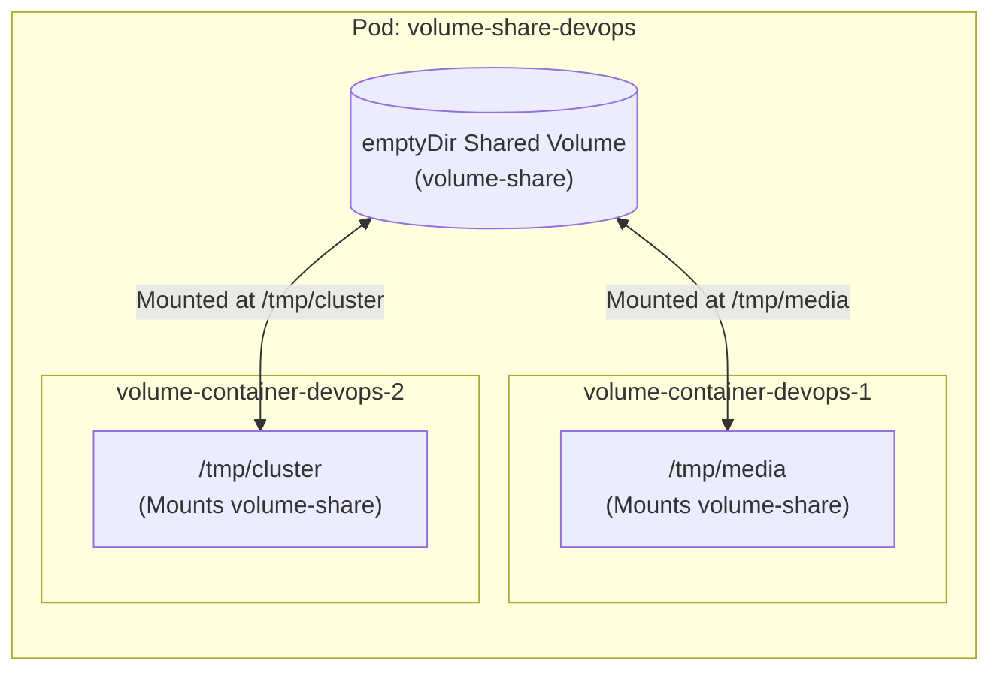

# Kubernetes Shared Volumes

## Technical Overview

By default, container filesystems are ephemeral and isolated. If a container crashes, any changes or files written to its filesystem are lost, and a newly restarted container starts with a clean state. Additionally, containers running within the same Pod cannot share files or access each other's filesystems unless explicit volume mapping is established.

To solve these limitations, Kubernetes implements **Volumes**. A Volume is a directory that is accessible to all containers in a Pod, allowing data persistence and inter-container data sharing.



### Pod-Level Shared Storage: `emptyDir`
The simplest volume type is `emptyDir`. As the name suggests, it starts as an empty directory when the Pod is scheduled onto a node. 

Key characteristics of `emptyDir` include:
*   **Lifetime Bound to Pod:** The lifetime of an `emptyDir` volume is strictly tied to the lifetime of the Pod. If the Pod is deleted, relocated, or terminated, the data in the `emptyDir` is deleted permanently. (However, it survives container crashes).
*   **Inter-Container Sharing:** Any container within the Pod can mount the `emptyDir` volume. The containers can mount it at the same or different mount paths, enabling simple, fast sharing of assets, logs, and configuration state.
*   **Storage Medium:** By default, `emptyDir` volumes are stored on whatever medium backs the node (such as local SSD/HDD). However, you can configure the volume to store data on a memory-backed filesystem (tmpfs) by setting the `medium` field to `Memory` for ultra-fast cache tasks.

---

## Kubernetes Shared Volumes Deep Dive

Kubernetes supports a wide variety of volume types designed for different architectures:

### 1. Ephemeral Volumes
*   **`emptyDir`:** Temporary directory created on Pod startup. Used for scratch space, sorting algorithms, caching, or shared directories between sidecars and application containers.
*   **`configMap` / `secret`:** Injects configuration details and credentials directly into the container as files.

### 2. Node-Local Persistent Volumes
*   **`hostPath`:** Mounts a file or directory from the host node’s filesystem into the Pod. Used for system-level monitoring agents (like Fluentd or Prometheus Node Exporter) that need access to node logs/system files.

### 3. Networked Persistent Volumes
*   **`persistentVolumeClaim` (PVC):** Deconstructs storage requests from specific infrastructure, allowing Pods to mount block or file storage (like AWS EBS, NFS, Ceph, Google Persistent Disk) dynamically.

### Inter-Container Communication Patterns: The Sidecar Pattern
Shared volumes form the foundation of the **Sidecar Pattern**, where a helper container works alongside the main container. Typical examples include:
*   **Log Shippers:** A main application container writes logs to a shared `emptyDir` volume, and a sidecar container reads and streams those logs to a centralized storage cluster (e.g., Elasticsearch, Splunk).
*   **Data Loaders/Syncers:** A sidecar container periodically pulls assets (like git updates, config files, static assets) from an external repository and writes them to a shared volume where the web server container serves them.

---

## Infrastructure & Configuration Requirements

*   **Target Cluster:** Nautilus Kubernetes Cluster
*   **Jump Host User:** `thor`
*   **Namespace:** `default`
*   **Pod Name:** `volume-share-devops`
*   **Shared Volume Name:** `volume-share` (type: `emptyDir`)
*   **Container 1:**
    *   **Name:** `volume-container-devops-1`
    *   **Image:** `ubuntu:latest`
    *   **Mount Path:** `/tmp/media`
    *   **Command:** `sleep 3600` (to prevent container exit)
*   **Container 2:**
    *   **Name:** `volume-container-devops-2`
    *   **Image:** `ubuntu:latest`
    *   **Mount Path:** `/tmp/cluster`
    *   **Command:** `sleep 3600`

---

## Step-by-Step Implementation

### Step 1: Connect to the Kubernetes Cluster Controller
Access the admin terminal host configured with cluster credentials:
```bash
ssh thor@jump_host_ip
```

---

### Step 2: Create the Pod Manifest File
Create a new file named `volume-share.yaml` defining the multi-container Pod structure with shared volume mounts:

```yaml
apiVersion: v1
kind: Pod
metadata:
  name: volume-share-devops
  labels:
    app: volume-share
spec:
  volumes:
  - name: volume-share
    emptyDir: {}
  containers:
  - name: volume-container-devops-1
    image: ubuntu:latest
    command: ["/bin/sh", "-c", "sleep 3600"]
    volumeMounts:
    - name: volume-share
      mountPath: /tmp/media
  - name: volume-container-devops-2
    image: ubuntu:latest
    command: ["/bin/sh", "-c", "sleep 3600"]
    volumeMounts:
    - name: volume-share
      mountPath: /tmp/cluster
```

---

### Step 3: Deploy the Pod
Apply the manifest file to start container creation in the active namespace:
```bash
kubectl apply -f volume-share.yaml
```
*Expected Output:*
```text
pod/volume-share-devops created
```

Verify that the Pod successfully initializes and both containers transition to the `Running` state:
```bash
kubectl get pods
```
*Expected Output showing 2/2 containers ready:*
```text
NAME                  READY   STATUS    RESTARTS   AGE
volume-share-devops   2/2     Running   0          15s
```

---

### Step 4: Write and Verify the Shared Storage
To verify that the containers are successfully sharing the same volume, perform the following validation steps.

#### 1. Write a Test File in Container 1
Access the terminal of the first container and write a string to a file inside the mounted path `/tmp/media`:
```bash
kubectl exec -it volume-share-devops -c volume-container-devops-1 -- /bin/sh -c 'echo "Shared Volume DevOps Verification Success" > /tmp/media/media.txt'
```

#### 2. Verify File Visibility in Container 2
Query the file from the second container under its configured mount path `/tmp/cluster`:
```bash
kubectl exec -it volume-share-devops -c volume-container-devops-2 -- cat /tmp/cluster/media.txt
```
*Expected Output:*
```text
Shared Volume DevOps Verification Success
```

This confirms the file created in container 1 was written to the shared `emptyDir` volume and read successfully from container 2!

---

## Post-Deployment Verification

### 1. Confirm Volume Mount Specifications
Describe the running Pod to confirm that both containers successfully mount the volume using `volume-share`:
```bash
kubectl get pod volume-share-devops -o jsonpath='{.spec.containers[*].volumeMounts}'
```
*Expected Output showing correct mount paths:*
```json
[{"mountPath":"/tmp/media","name":"volume-share"}] [{"mountPath":"/tmp/cluster","name":"volume-share"}]
```

### 2. Verify Volume Persistence Across Container Crash
Induce a crash/restart on Container 1 to verify that data survives container restarts:
```bash
# Get PID of sleep inside container 1 and kill it
kubectl exec -it volume-share-devops -c volume-container-devops-1 -- kill 1
```
Check status:
```bash
kubectl get pods
```
*Expected Output showing 1 restart on Container 1:*
```text
NAME                  READY   STATUS    RESTARTS      AGE
volume-share-devops   2/2     Running   1 (10s ago)   2m
```
Check if the file is still present inside container 2:
```bash
kubectl exec -it volume-share-devops -c volume-container-devops-2 -- cat /tmp/cluster/media.txt
```
*Expected Output:*
```text
Shared Volume DevOps Verification Success
```
*(This confirms that while container 1 crashed and restarted, the data was kept intact because it resides in the pod-level `emptyDir` volume, not the container filesystem).*
