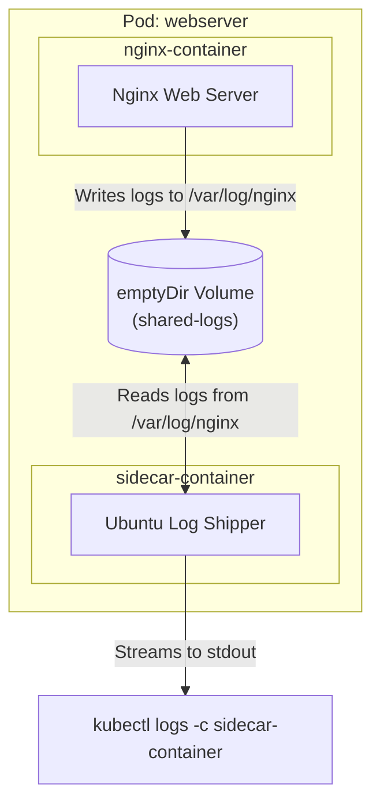

# Kubernetes Sidecar Containers

## Technical Overview

A core tenet of containerization is the **Single Responsibility Principle**: a container should do one thing and do it well. However, applications often require peripheral operations such as logging, monitoring, caching, database connection pooling, or configuration syncing. 

Rather than coupling these utility services directly into the main application codebase, Kubernetes allows you to deploy multiple, co-located containers inside a single Pod. This architectural model is known as the **Sidecar Container Pattern**.



### Pod Container Co-location Features
Containers running in the same Pod share crucial namespaces that make sidecar communication fast and lightweight:
1.  **Network Namespace:** They share the same IP address and port space. They can communicate with each other over `localhost` (e.g., the main container can access a local cache container on `localhost:6379`).
2.  **IPC Namespace:** They can share memory segments for high-performance communication.
3.  **Storage Volumes:** They can mount the same Volume (such as `emptyDir`) to share file directory access in real-time.

---

## Kubernetes Sidecar Design Pattern

The **Sidecar Pattern** involves deploying a secondary helper container (the "sidecar") alongside the primary application container within a single Pod. The sidecar container enhances or extends the primary container's functionality without the primary container even being aware of its presence.

### Common Sidecar Use Cases

#### 1. Log Aggregators & Shippers
The main application container writes its logs to files in a shared volume. A sidecar container running a lightweight log shipper (like Filebeat, Fluent Bit, or a custom script) tails those log files and sends them to centralized log storage (e.g., Elasticsearch, Splunk, Loki). This keeps the main application free from the overhead of log transportation network calls.

#### 2. Service Proxies & Adapters
Service Meshes (like Istio or Linkerd) inject a sidecar proxy (like Envoy) next to every application container. The proxy intercepts all incoming and outgoing network traffic, handling mutual TLS (mTLS), circuit breaking, routing rules, and metrics collection transparently.

#### 3. Configuration Syncers
A sidecar container runs a process that watches a Git repository or a configuration service (like HashiCorp Consul). When configuration changes occur, the sidecar downloads the updated files and writes them to a shared volume, where the main application container picks them up without requiring a container restart.

---

### The Evolution of Sidecars: Native Sidecar Containers (Kubernetes 1.28+)

Historically, sidecars were configured as standard containers in the `containers` array of a Pod. This caused two major lifecycle issues:
1.  **Startup Ordering:** If the main application container started before the sidecar proxy was ready, the application's initial network requests would fail.
2.  **Termination Ordering:** When a batch Job completed, the main container would exit, but the infinite-loop sidecar container (like a log-shipper) would keep running forever, preventing the Pod from transitioning to a `Completed` state.

#### Native Sidecar Lifecycle Solution
Starting in Kubernetes 1.28, you can designate an `initContainer` as a native sidecar by adding the `restartPolicy: Always` field to its specification. 

Kubernetes handles these native sidecars differently:
*   They start sequentially before standard containers, ensuring proxy sidecars are fully operational before the app starts.
*   The startup probe blocks the next init or app container until the sidecar reports as healthy.
*   They do not block Job completion: once all standard containers terminate, Kubernetes automatically terminates any native sidecars.

```yaml
# Example Native Sidecar Syntax (K8s 1.28+)
spec:
  initContainers:
  - name: log-shipper
    image: fluent-bit:latest
    restartPolicy: Always  # Defines it as a native sidecar container
```

---

## Infrastructure & Configuration Requirements

*   **Target Cluster:** Nautilus Kubernetes Cluster
*   **Jump Host User:** `thor`
*   **Namespace:** `default`
*   **Pod Name:** `webserver`
*   **Shared Volume Name:** `shared-logs` (uses `emptyDir`)
*   **Container 1 (Main App):**
    *   **Name:** `nginx-container`
    *   **Image:** `nginx:latest`
    *   **Mount Path:** `/var/log/nginx`
*   **Container 2 (Sidecar):**
    *   **Name:** `sidecar-container`
    *   **Image:** `ubuntu:latest`
    *   **Mount Path:** `/var/log/nginx`
    *   **Command:** `["sh", "-c", "while true; do cat /var/log/nginx/access.log /var/log/nginx/error.log; sleep 30; done"]`

---

## Step-by-Step Implementation

### Step 1: Connect to the Jump Host
Establish connection to the cluster control terminal:
```bash
ssh thor@jump_host_ip
```

---

### Step 2: Define the Pod Manifest File
Create a new file named `sidecar-pod.yaml` containing the specifications for the main Nginx container and the log-shipping sidecar container:

```yaml
apiVersion: v1
kind: Pod
metadata:
  name: webserver
  labels:
    app: web-logging
spec:
  volumes:
  - name: shared-logs
    emptyDir: {}
  containers:
  - name: nginx-container
    image: nginx:latest
    volumeMounts:
    - name: shared-logs
      mountPath: /var/log/nginx
  - name: sidecar-container
    image: ubuntu:latest
    command: ["sh", "-c", "while true; do cat /var/log/nginx/access.log /var/log/nginx/error.log; sleep 30; done"]
    volumeMounts:
    - name: shared-logs
      mountPath: /var/log/nginx
```

---

### Step 3: Deploy the Pod Configuration
Apply the manifest to initialize the Pod inside the cluster:
```bash
kubectl apply -f sidecar-pod.yaml
```
*Expected Output:*
```text
pod/webserver created
```

Wait until the Pod status is reported as `Running`:
```bash
kubectl get pods
```
*Expected Output showing both containers initialized:*
```text
NAME        READY   STATUS    RESTARTS   AGE
webserver   2/2     Running   0          10s
```

---

## Post-Deployment Verification

### 1. Generate Activity Logs
Send an HTTP request directly to Nginx using `curl` inside the Nginx container to populate `/var/log/nginx/access.log` with data:
```bash
kubectl exec -it webserver -c nginx-container -- curl http://localhost
```

---

### 2. Verify Sidecar Output
Query the logs from the `sidecar-container`. The sidecar executes a `cat` command inside an infinite loop, showing log traffic output:
```bash
kubectl logs webserver -c sidecar-container
```
*Expected Output containing the curl request details:*
```text
127.0.0.1 - - [18/Jul/2026:14:28:10 +0000] "GET / HTTP/1.1" 200 615 "-" "curl/7.74.0" "-"
```

The sidecar container successfully monitors and outputs the main Nginx application's log files from the shared volume!
