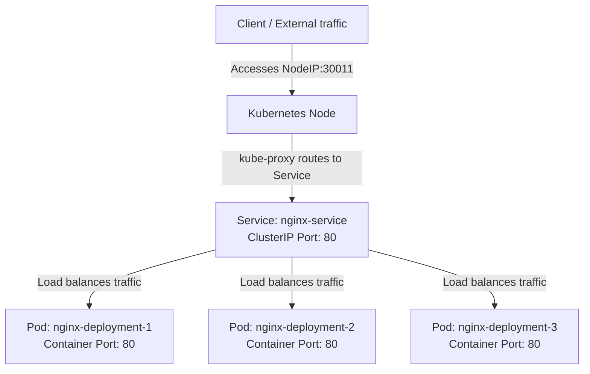

# Deploy Nginx Web Server on Kubernetes Cluster

## Technical Overview

Deploying an application to a Kubernetes cluster requires two primary tasks: running the application containers and exposing those containers to handle traffic.

1.  **Deployment:** A controller that manages a replicated set of Pods. It ensures that the specified number of Pod replicas (e.g., 3) are active, self-heals crashed containers, and facilitates zero-downtime rolling updates.
2.  **Service:** An abstraction that defines a logical set of Pods and a policy to access them. Since Pods are ephemeral and have dynamic IP addresses, a Service provides a stable network endpoint (IP address, DNS name, and Port) to decouple clients from backend changes.



---

## Kubernetes Services & Types

A Kubernetes **Service** allocates a stable IP address and DNS name. It selects Pods using label selectors (e.g., `app: nginx`) and routes incoming traffic to the selected Pods' `targetPort`.

### Service Types

Kubernetes supports four main types of Services:

| Service Type | Scope | Description |
| :--- | :--- | :--- |
| **`ClusterIP`** | Internal | Exposes the Service on a cluster-internal IP. This makes the Service only reachable from within the cluster. This is the default service type. |
| **`NodePort`** | External | Exposes the Service on each Node's IP at a static port (the `NodePort`). You can contact the NodePort Service from outside the cluster by requesting `<NodeIP>:<NodePort>`. |
| **`LoadBalancer`** | External | Exposes the Service externally using a cloud provider's external load balancer. It automatically provisions a public IP address and forwards traffic to NodePorts created under the hood. |
| **`ExternalName`** | Internal/External | Maps a Service to the contents of the `externalName` field (e.g. `my.database.example.com`), by returning a `CNAME` record with its value. |

---

### Deep-Dive: How NodePort Works

A `NodePort` service is specifically designed to allow external access directly through any host node's IP address.

```text
  [ External Client ]
          |
          v
   <Node_IP>:<NodePort> (e.g., 30011)
          |
          v (kube-proxy IPTables/IPVS Rules)
   Service ClusterIP:Port (e.g., Cluster_IP:80)
          |
          v (Load Balanced Round-Robin)
     Pod_IP:TargetPort (e.g., Pod_IP:80)
```

#### Port Configurations in NodePort
When defining a `NodePort` service, you configure three distinct ports:
1.  **`nodePort` (External Port):** The port exposed on all cluster host nodes. This must fall in the default range `30000-32767`. If left blank, Kubernetes will assign a random port in that range. (e.g., `30011`).
2.  **`port` (Internal Service Port):** The port exposed inside the cluster on the Service's ClusterIP. Other pods inside the cluster can access the service on this port. (e.g., `80`).
3.  **`targetPort` (Container Port):** The port that the application container is listening on inside the Pod. Traffic is forwarded here. (e.g., `80`).

---

## Infrastructure & Configuration Requirements

*   **Target Cluster:** Nautilus Kubernetes Cluster
*   **Jump Host User:** `thor`
*   **Namespace:** `default`
*   **Deployment Details:**
    *   **Name:** `nginx-deployment`
    *   **Container Name:** `nginx-container`
    *   **Image:** `nginx:latest`
    *   **Replicas:** `3`
    *   **Container Port:** `80`
*   **Service Details:**
    *   **Name:** `nginx-service`
    *   **Type:** `NodePort`
    *   **NodePort:** `30011`
    *   **Port:** `80`
    *   **TargetPort:** `80`

---

## Step-by-Step Implementation

### Step 1: Connect to the Cluster Controller
Establish connection to the jump host:
```bash
ssh thor@jump_host_ip
```

---

### Step 2: Create the Deployment Manifest
Create a file named `nginx-deployment.yaml` defining the replica size and container details:

```yaml
apiVersion: apps/v1
kind: Deployment
metadata:
  name: nginx-deployment
  labels:
    app: nginx
spec:
  replicas: 3
  selector:
    matchLabels:
      app: nginx
  template:
    metadata:
      labels:
        app: nginx
    spec:
      containers:
      - name: nginx-container
        image: nginx:latest
        ports:
        - containerPort: 80
```

---

### Step 3: Create the Service Manifest
Create a file named `nginx-service.yaml` declaring the NodePort configuration:

```yaml
apiVersion: v1
kind: Service
metadata:
  name: nginx-service
spec:
  type: NodePort
  selector:
    app: nginx
  ports:
  - port: 80
    targetPort: 80
    nodePort: 30011
```

---

### Step 4: Deploy the Configuration
Apply both manifest files to initialize the resources in the cluster:
```bash
kubectl apply -f nginx-deployment.yaml
kubectl apply -f nginx-service.yaml
```
*Expected Output:*
```text
deployment.apps/nginx-deployment created
service/nginx-service created
```

---

## Post-Deployment Verification

### 1. Check Pod Deployment Status
Verify that all 3 Pod replicas are healthy and in `Running` state:
```bash
kubectl get deployments nginx-deployment
```
*Expected Output:*
```text
NAME               READY   UP-TO-DATE   AVAILABLE   AGE
nginx-deployment   3/3     3            3           20s
```

Check individual Pod statuses:
```bash
kubectl get pods -l app=nginx
```
*Expected Output:*
```text
NAME                                READY   STATUS    RESTARTS   AGE
nginx-deployment-7f8a9b0c-abcde     1/1     Running   0          25s
nginx-deployment-7f8a9b0c-fghij     1/1     Running   0          25s
nginx-deployment-7f8a9b0c-klmno     1/1     Running   0          25s
```

---

### 2. Check Service Details
Confirm the service has allocated a ClusterIP and bound the host nodePort 30011:
```bash
kubectl get service nginx-service
```
*Expected Output:*
```text
NAME            TYPE       CLUSTER-IP     EXTERNAL-IP   PORT(S)        AGE
nginx-service   NodePort   10.96.184.22   <none>        80:30011/TCP   30s
```

---

### 3. Verify External Accessibility
Send an HTTP request from outside the cluster network (e.g. from the jump host) targeting one of the worker nodes' IP addresses on port `30011`:
```bash
curl -I http://<NODE_IP>:30011
```
*Expected Output:*
```text
HTTP/1.1 200 OK
Server: nginx/1.25.x
Date: Sat, 18 Jul 2026 ...
Content-Type: text/html
...
```

The Nginx web server deployment is successfully exposed externally via the static NodePort!
