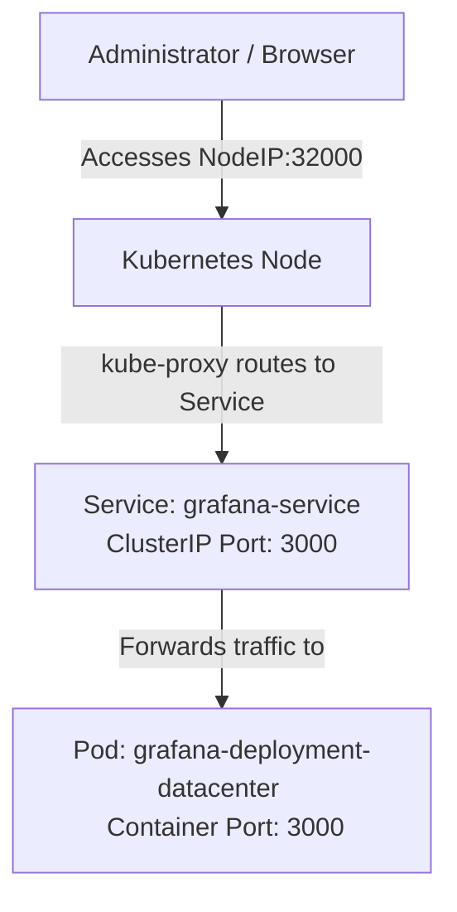

# Deploy Grafana on Kubernetes Cluster

## Technical Overview

Monitoring and observability are foundational pillars of system operations. **Grafana** is an industry-standard, open-source visualization and analytics platform that allows you to query, visualize, alert on, and understand metrics no matter where they are stored. 

Deploying Grafana to a Kubernetes cluster involves running a Pod running the Grafana container image and exposing it externally using a **NodePort Service** so administrators can access the web dashboard interface.



---

## Deploying Observability Tools in Kubernetes

When running applications like Grafana inside Kubernetes, several architectural concerns must be considered:

### 1. Data Persistence (State)
By default, Grafana stores user configurations, dashboards, data sources, and session details inside an internal SQLite database (`/var/lib/grafana/grafana.db`). Because container filesystems are ephemeral, restarting the Pod would result in the loss of all dashboards.
*   **Production Setup:** Use a **PersistentVolumeClaim (PVC)** to bind a Persistent Volume (backed by storage like EBS, NFS, or Ceph) to `/var/lib/grafana`. Alternatively, configure Grafana to use an external PostgreSQL or MySQL database.
*   **This Challenge:** For simple demonstration or stateless/ephemeral configurations, Grafana is run without a persistent volume.

### 2. High Availability (Scaling)
To scale Grafana to multiple replicas for high availability (HA):
*   You must configure a shared database (like PostgreSQL/MySQL) rather than local SQLite so all replicas share the same configuration state.
*   A shared session storage mechanism (like Redis) or sticky sessions on the load balancer must be implemented if session state is not stored in the database.

---

## Infrastructure & Configuration Requirements

*   **Target Cluster:** Nautilus Kubernetes Cluster
*   **Jump Host User:** `thor`
*   **Namespace:** `default`
*   **Deployment Details:**
    *   **Name:** `grafana-deployment-datacenter`
    *   **Container Name:** `grafana-container`
    *   **Image:** `grafana/grafana:latest`
    *   **Replicas:** `1`
    *   **Container Port:** `3000`
*   **Service Details:**
    *   **Name:** `grafana-service`
    *   **Type:** `NodePort`
    *   **NodePort:** `32000`
    *   **Port:** `3000`
    *   **TargetPort:** `3000`

---

## Step-by-Step Implementation

### Step 1: Connect to the Kubernetes Jump Host
SSH from your terminal into the controller command host:
```bash
ssh thor@jump_host_ip
```

---

### Step 2: Create a Unified Manifest File
Create a unified YAML file named `grafana.yaml` declaring both the Deployment and Service. Using a single file separated by `---` simplifies resource lifecycle management:

```yaml
apiVersion: apps/v1
kind: Deployment
metadata:
  name: grafana-deployment-datacenter
  labels:
    app: grafana
spec:
  replicas: 1
  selector:
    matchLabels:
      app: grafana
  template:
    metadata:
      labels:
        app: grafana
    spec:
      containers:
      - name: grafana-container
        image: grafana/grafana:latest
        ports:
        - containerPort: 3000
---
apiVersion: v1
kind: Service
metadata:
  name: grafana-service
spec:
  type: NodePort
  selector:
    app: grafana
  ports:
  - port: 3000
    targetPort: 3000
    nodePort: 32000
    protocol: TCP
```

---

### Step 3: Deploy the Resources
Apply the configuration manifest:
```bash
kubectl apply -f grafana.yaml
```
*Expected Output:*
```text
deployment.apps/grafana-deployment-datacenter created
service/grafana-service created
```

---

### Step 4: Monitor Pod Execution
Verify the Grafana Pod successfully initializes and transitions into the `Running` state:
```bash
kubectl get pods -w -l app=grafana
```
*Expected Output:*
```text
NAME                                             READY   STATUS              RESTARTS   AGE
grafana-deployment-datacenter-5f8a9b0c-abcde     0/1     ContainerCreating   0          2s
grafana-deployment-datacenter-5f8a9b0c-abcde     1/1     Running             0          10s
```

---

## Post-Deployment Verification

### 1. Confirm Resource Initialization
Verify deployment scale:
```bash
kubectl get deployment grafana-deployment-datacenter
```
*Expected Output:*
```text
NAME                            READY   UP-TO-DATE   AVAILABLE   AGE
grafana-deployment-datacenter   1/1     1            1           30s
```

Verify service mapping:
```bash
kubectl get service grafana-service
```
*Expected Output:*
```text
NAME              TYPE       CLUSTER-IP      EXTERNAL-IP   PORT(S)          AGE
grafana-service   NodePort   10.96.195.101   <none>        3000:32000/TCP   35s
```

---

### 2. Verify Dashboard Accessibility
Send an HTTP request from outside the cluster network (e.g., from the jump host) targeting one of the worker nodes' IP addresses on NodePort `32000` to confirm that Grafana's web server responds:
```bash
curl -L -I http://<NODE_IP>:32000
```
*Expected Output showing redirect/access to login page:*
```text
HTTP/1.1 302 Found
Cache-Control: no-cache
Content-Type: text/html; charset=utf-8
Location: /login
...

HTTP/1.1 200 OK
Content-Type: text/html; charset=utf-8
...
```

The Grafana instance is now successfully deployed and reachable on static NodePort `32000`!
