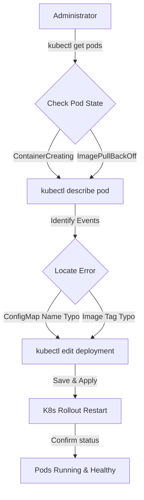

# Troubleshoot Deployment Issues in Kubernetes

## Technical Overview

Deploying applications in Kubernetes requires multiple dependent API resources (Deployments, Services, ConfigMaps, Secrets, PVCs) to work in synchronization. When a team member updates a Deployment manifest, minor typos can disrupt the application lifecycle.

Understanding how to read Pod lifecycle states and extract system events is critical for identifying and correcting deployment failures.



---

## Troubleshooting Deployment Failures: Deep Dive

When troubleshooting application deployments, the issue can usually be narrowed down by checking the Pod's lifecycle status.

### Common Container Failure States

#### 1. `ContainerCreating` (Stuck) / `FailedMount`
*   **Symptom:** The Pod is stuck in the `ContainerCreating` state for several minutes.
*   **Root Cause:** A volume configuration error. The Pod specification references a `ConfigMap`, `Secret`, or `PersistentVolumeClaim` that does not exist in the namespace or is named incorrectly.
*   **Diagnostic Event:** `MountVolume.SetUp failed for volume "..." : configmap "..." not found`.

#### 2. `ImagePullBackOff` / `ErrImagePull`
*   **Symptom:** The Pod status shows `ImagePullBackOff` or `ErrImagePull`.
*   **Root Cause:** The kubelet daemon cannot pull the container image from the registry. This is usually due to:
    *   A typo in the image name or tag (e.g., `redis:alpin` instead of `redis:alpine`).
    *   The registry credentials (ImagePullSecrets) are missing or misconfigured.
    *   Network connectivity issues between the worker node and the container registry.
*   **Diagnostic Event:** `Failed to pull image "...": rpc error: code = NotFound`.

#### 3. `CrashLoopBackOff`
*   **Symptom:** The Pod starts, reaches `Running` state briefly, exits with an error code, and enters `CrashLoopBackOff` where Kubernetes restarts it with increasing wait intervals.
*   **Root Cause:** The container successfully downloads and initializes, but fails internally. Common causes include missing environment variables, DB connection timeouts, or start command typos.
*   **Diagnostic Event:** Run `kubectl logs <pod-name>` to view application stack traces.

---

### Core Troubleshooting Checklist

1.  **Check Pod Status:**
    ```bash
    kubectl get pods
    ```
2.  **Describe the Pod (Events Inspection):**
    The most valuable debugging command in Kubernetes. It displays configuration metadata and chronological system events:
    ```bash
    kubectl describe pod <pod-name>
    ```
3.  **Inspect Dependent ConfigMaps:**
    List existing ConfigMaps to compare spelling:
    ```bash
    kubectl get configmaps
    ```
4.  **Edit the Live Deployment:**
    Edit the active configuration directly in the cluster:
    ```bash
    kubectl edit deployment <deployment-name>
    ```

---

## Infrastructure & Configuration Requirements

*   **Target Cluster:** Nautilus Kubernetes Cluster
*   **Jump Host User:** `thor`
*   **Namespace:** `default`
*   **Deployment Name:** `redis-deployment`
*   **Identified Typos:**
    *   **Image Typo:** `redis:alpin` (Should be `redis:alpine`)
    *   **ConfigMap Typo:** `redis-conig` (Should be `redis-config`)

---

## Step-by-Step Implementation

### Step 1: Connect to the Kubernetes Jump Host
Establish connection to the admin terminal host:
```bash
ssh thor@jump_host_ip
```

---

### Step 2: Diagnose the Failing Deployment
Check the status of the pods in the default namespace:
```bash
kubectl get pods
```
*Expected Output showing stuck and failed pods:*
```text
NAME                                READY   STATUS              RESTARTS   AGE
redis-deployment-7f8a9b0c-abcde     0/1     ContainerCreating   0          2m
```

Describe the failing Pod to extract the event logs:
```bash
kubectl describe pod redis-deployment-7f8a9b0c-abcde
```

Look at the **Events** section at the bottom of the output. You will see errors similar to:
```text
Events:
  Type     Reason       Age                    From               Message
  ----     ------       ----                   ----               -------
  Warning  FailedMount  12s (x5 over 1m)       kubelet            MountVolume.SetUp failed for volume "redis-config-volume" : configmap "redis-conig" not found
  Warning  Failed       5s                     kubelet            Failed to pull image "redis:alpin": rpc error: code = NotFound desc = failed to pull and unpack image
```

---

### Step 3: Verify the Correct ConfigMap Name
Query the namespace's ConfigMaps to check if the referenced `redis-conig` exists:
```bash
kubectl get configmaps
```
*Expected Output:*
```text
NAME           DATA   AGE
redis-config   1      15m
```
*Notice that the ConfigMap is named `redis-config`, meaning the deployment's volume reference contains a typo (`redis-conig`).*

---

### Step 4: Edit the Deployment Spec
Open the Deployment configuration editor directly:
```bash
kubectl edit deployment redis-deployment
```

Locate the container specification block and correct the image tag typo:
```yaml
# BEFORE
      - name: redis-container
        image: redis:alpin

# AFTER
      - name: redis-container
        image: redis:alpine
```

Locate the volumes block and correct the ConfigMap name typo:
```yaml
# BEFORE
      volumes:
      - name: redis-config-volume
        configMap:
          name: redis-conig

# AFTER
      volumes:
      - name: redis-config-volume
        configMap:
          name: redis-config
```

Save and exit the editor (in vi, press `Esc`, type `:wq`, and press `Enter`).
*Expected Output:*
```text
deployment.apps/redis-deployment edited
```

---

### Step 5: Monitor the Rollout
Track the rolling update process to confirm that Kubernetes successfully terminates the old broken Pods and deploys the corrected ones:
```bash
kubectl rollout status deployment/redis-deployment
```
*Expected Output:*
```text
deployment "redis-deployment" successfully rolled out
```

Confirm that the new Pods are fully healthy and in the `Running` state:
```bash
kubectl get pods
```
*Expected Output:*
```text
NAME                                READY   STATUS    RESTARTS   AGE
redis-deployment-6f5d4c3b-klmno     1/1     Running   0          10s
```

---

## Post-Deployment Verification

### 1. Confirm Correct Image Deployment
Verify that the running Pod uses the correct container image:
```bash
kubectl describe deployment redis-deployment | grep Image
```
*Expected Output:*
```text
    Image:      redis:alpine
```

---

### 2. Verify Database Accessibility
Interact directly with the Redis CLI inside the container to verify database functionality:
```bash
kubectl exec -it redis-deployment-6f5d4c3b-klmno -- redis-cli ping
```
*Expected Output:*
```text
PONG
```

The Redis deployment is now successfully debugged, rolling out, and functional!
