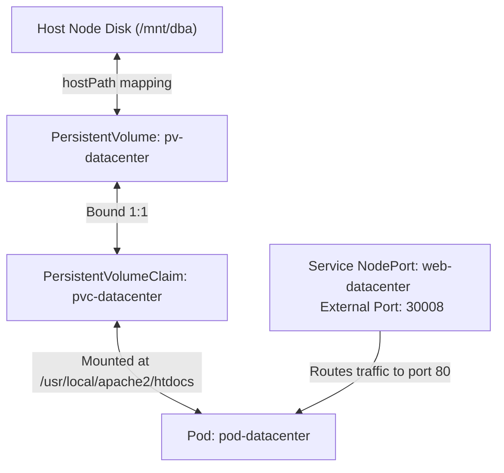

# Persistent Volumes in Kubernetes

## Technical Overview

In Kubernetes, standard container filesystems are ephemeral. When a container restarts, all local modifications are lost. While simple `emptyDir` volumes let containers in a single Pod share data, the volume’s lifetime is still tied to the Pod's lifecycle—deleting the Pod deletes the volume.

For database engines, content management systems, and stateful applications, data must exist independently of any individual Pod. Kubernetes achieves this by decoupling storage provisioning from consumption using **PersistentVolumes (PV)** and **PersistentVolumeClaims (PVC)**.



---

## PV & PVC Deep Dive

Kubernetes separates storage infrastructure roles into two distinct layers: provisioning (infra/admin) and consumption (developers).

### 1. PersistentVolume (PV)
A **PersistentVolume (PV)** is a piece of storage in the cluster that has been provisioned by an administrator or dynamically provisioned using a **StorageClass**.
*   **Cluster-Scoped Resource:** A PV is a cluster-level resource (like a Node) and exists outside the context of any individual namespace.
*   **Storage Backends:** PVs can be backed by local disks (`hostPath`, `local`), network filesystems (`NFS`), cloud block storage (`AWS EBS`, `GCE PD`, `Azure Disk`), or dedicated storage networks (Ceph, GlusterFS).

### 2. PersistentVolumeClaim (PVC)
A **PersistentVolumeClaim (PVC)** is a request for storage by a developer/user. It is similar to a Pod: Pods consume Node resources (CPU/Memory), and PVCs consume PV resources (size/access modes).
*   **Namespace-Scoped Resource:** A PVC is created inside a specific namespace and can only be mounted by Pods running in that same namespace.
*   **Binding:** The Kubernetes control loop monitors for new PVCs, finds a matching PV (same access modes, matching `storageClassName`, and capacity >= requested size), and binds them together in a strict **1:1 relationship**. Once bound, the PV cannot be claimed by other PVCs.

---

### Access Modes
When configuring PVs and PVCs, you specify the access modes indicating how the storage can be mounted on host nodes:
*   **`ReadWriteOnce` (RWO):** The volume can be mounted as read-write by a single node. (Common for block storage like AWS EBS).
*   **`ReadOnlyMany` (ROX):** The volume can be mounted as read-only by many nodes.
*   **`ReadWriteMany` (RWX):** The volume can be mounted as read-write by many nodes simultaneously. (Common for file storage like NFS).
*   **`ReadWriteOncePod` (RWOP):** The volume can be mounted as read-write by a single Pod in the entire cluster (introduced in K8s 1.22).

---

### Reclaim Policies
The reclaim policy tells the cluster what to do with the backing storage when a PVC is deleted:
1.  **`Retain` (Default/Static):** The PV is kept intact. The data remains on the external storage, but the PV status transitions to `Released`. It cannot be bound to other claims until the administrator manually cleans up the data and recreates the resource.
2.  **`Delete` (Dynamic Default):** The backing storage resource (e.g., AWS EBS volume) and the PV object are deleted automatically from the cluster.
3.  **`Recycle` (Deprecated):** Performs a basic data scrub (`rm -rf /thevolume/*`) and makes the PV available again for binding.

---

## Infrastructure & Configuration Requirements

*   **Target Cluster:** Nautilus Kubernetes Cluster
*   **Jump Host User:** `thor`
*   **Namespace:** `default`
*   **PersistentVolume (PV) Details:**
    *   **Name:** `pv-datacenter`
    *   **Storage Class:** `manual`
    *   **Capacity:** `5Gi`
    *   **Access Mode:** `ReadWriteOnce`
    *   **Volume Type:** `hostPath`
    *   **Host Directory Path:** `/mnt/dba`
*   **PersistentVolumeClaim (PVC) Details:**
    *   **Name:** `pvc-datacenter`
    *   **Storage Class:** `manual`
    *   **Requested Capacity:** `3Gi`
    *   **Access Mode:** `ReadWriteOnce`
*   **Pod Details:**
    *   **Name:** `pod-datacenter`
    *   **Container Name:** `container-datacenter`
    *   **Image:** `httpd:latest`
    *   **Mount Path:** `/usr/local/apache2/htdocs`
*   **Service Details:**
    *   **Name:** `web-datacenter`
    *   **Type:** `NodePort`
    *   **Port:** `80`
    *   **TargetPort:** `80`
    *   **NodePort:** `30008`

---

## Step-by-Step Implementation

### Step 1: Connect to the Kubernetes Jump Host
SSH to the cluster control terminal:
```bash
ssh thor@jump_host_ip
```

---

### Step 2: Create the PersistentVolume Manifest
Create a file named `pv.yaml` to declare the cluster storage resource mapping to the `/mnt/dba` directory:

```yaml
apiVersion: v1
kind: PersistentVolume
metadata:
  name: pv-datacenter
  labels:
    type: local
spec:
  storageClassName: manual
  capacity:
    storage: 5Gi
  accessModes:
    - ReadWriteOnce
  hostPath:
    path: "/mnt/dba"
```

---

### Step 3: Create the PersistentVolumeClaim Manifest
Create a file named `pvc.yaml` requesting a portion of the manual storage:

```yaml
apiVersion: v1
kind: PersistentVolumeClaim
metadata:
  name: pvc-datacenter
spec:
  storageClassName: manual
  accessModes:
    - ReadWriteOnce
  resources:
    requests:
      storage: 3Gi
```

---

### Step 4: Create the Pod and Service Manifests
Create a unified file named `app.yaml` defining the web server Pod (mounting the claim) and the NodePort Service exposing it:

```yaml
apiVersion: v1
kind: Pod
metadata:
  name: pod-datacenter
  labels:
    app: web-app
spec:
  volumes:
  - name: storage-volume
    persistentVolumeClaim:
      claimName: pvc-datacenter
  containers:
  - name: container-datacenter
    image: httpd:latest
    ports:
    - containerPort: 80
    volumeMounts:
    - name: storage-volume
      mountPath: /usr/local/apache2/htdocs
---
apiVersion: v1
kind: Service
metadata:
  name: web-datacenter
spec:
  type: NodePort
  selector:
    app: web-app
  ports:
  - port: 80
    targetPort: 80
    nodePort: 30008
```

---

### Step 5: Deploy the Configurations
Apply the manifests sequentially to ensure components initialize and bind correctly:
```bash
kubectl apply -f pv.yaml
kubectl apply -f pvc.yaml
kubectl apply -f app.yaml
```
*Expected Output:*
```text
persistentvolume/pv-datacenter created
persistentvolumeclaim/pvc-datacenter created
pod/pod-datacenter created
service/web-datacenter created
```

---

## Post-Deployment Verification

### 1. Verify PV and PVC Binding
Check that the PV successfully binds to the PVC:
```bash
kubectl get pv pv-datacenter
```
*Expected Output showing status Bound:*
```text
NAME            CAPACITY   ACCESS MODES   RECLAIM POLICY   STATUS   CLAIM                    STORAGECLASS   REASON   AGE
pv-datacenter   5Gi        RWO            Retain           Bound    default/pvc-datacenter   manual                  30s
```

Check the claim status:
```bash
kubectl get pvc pvc-datacenter
```
*Expected Output:*
```text
NAME             STATUS   VOLUME          CAPACITY   ACCESS MODES   STORAGECLASS   AGE
pvc-datacenter   Bound    pv-datacenter   5Gi        RWO            manual         35s
```

---

### 2. Verify Storage Persistence
Create a static web file inside the host directory `/mnt/dba` (this represents writing database records or site assets directly to host storage):
```bash
echo "Nautilus Persistent Storage Verified" > /mnt/dba/index.html
```

Test the web server response by curling NodePort `30008` from outside the cluster network:
```bash
curl http://<NODE_IP>:30008
```
*Expected Output:*
```text
Nautilus Persistent Storage Verified
```

### 3. Verify Data Survival Across Pod Restarts
Delete the Pod to verify data survival:
```bash
kubectl delete pod pod-datacenter --force
```

Recreate the Pod:
```bash
kubectl apply -f app.yaml
```

Wait until the Pod status returns to `Running`:
```bash
kubectl get pods
```

Curl the node endpoint once more:
```bash
curl http://<NODE_IP>:30008
```
*Expected Output:*
```text
Nautilus Persistent Storage Verified
```
*(This confirms that the data survived pod termination, as it resides safely in the external `hostPath` storage directory)*
