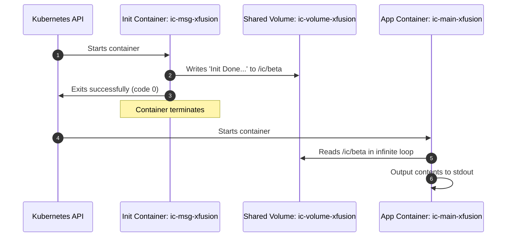

# Init Containers in Kubernetes

## Technical Overview

A standard Kubernetes Pod is designed to host one or more application containers running concurrently for the life of the Pod. However, applications often require initialization steps—such as configuring environment files, running database migrations, or waiting for helper services to be online—before the main application container starts.

Kubernetes addresses this pre-requisite requirement using **Init Containers**. An Init Container is a specialized container that runs to completion before any app containers start.



---

## Kubernetes Init Containers Deep Dive

Init Containers are defined inside the Pod specification under the `initContainers` array, parallel to the `containers` array.

### Init Container Lifecycle Rules

#### 1. Sequential Execution
Unlike application containers that start in parallel, if a Pod has multiple Init Containers, **they run sequentially, one by one**. Each Init Container must exit successfully (with exit code `0`) before the next one starts.

#### 2. Re-execution and Restart Policy
If an Init Container fails, Kubernetes restarts the entire Pod repeatedly until the Init Container succeeds. However, if the Pod's `restartPolicy` is set to `Never` and an Init Container fails, the Pod status immediately transitions to `Failed` and execution stops.

#### 3. Active Probes Exclusion
Init Containers do not support liveness, readiness, or startup probes. Because they are designed to run to completion and terminate, they do not remain active to be probed.

#### 4. Pod Readiness Block
A Pod cannot transition into the `Ready` status (and therefore cannot receive traffic from a Service) until all Init Containers have successfully terminated and the main application containers are running and report ready.

---

### Resource Requests and Limits Allocation
Kubernetes schedules Pods based on their resource requirements. For a Pod with Init Containers, the resource requests and limits are calculated using the following formulas:

$$\text{Pod Request} = \max\left(\max(\text{Init Container Requests}), \sum(\text{App Container Requests})\right)$$

$$\text{Pod Limit} = \max\left(\max(\text{Init Container Limits}), \sum(\text{App Container Limits})\right)$$

*Why?* Since Init Containers run sequentially and terminate before the application containers start, they never consume resources at the same time as the application containers. Therefore, the scheduler only needs to allocate enough resources for the heaviest initialization phase, or the sum of all concurrently running application containers (whichever is larger).

---

## Infrastructure & Configuration Requirements

*   **Target Cluster:** Nautilus Kubernetes Cluster
*   **Jump Host User:** `thor`
*   **Namespace:** `default`
*   **Deployment Details:**
    *   **Name:** `ic-deploy-xfusion`
    *   **Replicas:** `1`
*   **Shared Volume Details:**
    *   **Name:** `ic-volume-xfusion`
    *   **Type:** `emptyDir`
    *   **Mount Path (Both Containers):** `/ic`
*   **Init Container Details:**
    *   **Name:** `ic-msg-xfusion`
    *   **Image:** `ubuntu:latest`
    *   **Command:** `["/bin/bash", "-c", "echo Init Done - Welcome to xFusionCorp Industries > /ic/beta"]`
*   **Main Container Details:**
    *   **Name:** `ic-main-xfusion`
    *   **Image:** `ubuntu:latest`
    *   **Command:** `["/bin/bash", "-c", "while true; do cat /ic/beta; sleep 5; done"]`

---

## Step-by-Step Implementation

### Step 1: Connect to the Kubernetes Jump Host
SSH from your administrator terminal:
```bash
ssh thor@jump_host_ip
```

---

### Step 2: Create the Deployment Manifest
Create a file named `ic-deploy.yaml` declaring the Deployment, the shared volume, the `initContainers` block, and the `containers` block:

```yaml
apiVersion: apps/v1
kind: Deployment
metadata:
  name: ic-deploy-xfusion
  labels:
    app: ic-app
spec:
  replicas: 1
  selector:
    matchLabels:
      app: ic-app
  template:
    metadata:
      labels:
        app: ic-app
    spec:
      volumes:
      - name: ic-volume-xfusion
        emptyDir: {}
      initContainers:
      - name: ic-msg-xfusion
        image: ubuntu:latest
        command: ["/bin/bash", "-c", "echo Init Done - Welcome to xFusionCorp Industries > /ic/beta"]
        volumeMounts:
        - name: ic-volume-xfusion
          mountPath: /ic
      containers:
      - name: ic-main-xfusion
        image: ubuntu:latest
        command: ["/bin/bash", "-c", "while true; do cat /ic/beta; sleep 5; done"]
        volumeMounts:
        - name: ic-volume-xfusion
          mountPath: /ic
```

---

### Step 3: Deploy the Manifest
Apply the configuration:
```bash
kubectl apply -f ic-deploy.yaml
```
*Expected Output:*
```text
deployment.apps/ic-deploy-xfusion created
```

---

### Step 4: Monitor Pod Lifecycle Transitions
Observe the Pod startup states in real-time. You will watch it transition through initialization phases:
```bash
kubectl get pods -w -l app=ic-app
```
*Expected Output Transition:*
```text
NAME                                 READY   STATUS              RESTARTS   AGE
ic-deploy-xfusion-7f8a9b0c-abcde     0/1     Pending             0          0s
ic-deploy-xfusion-7f8a9b0c-abcde     0/1     Init:0/1            0          2s
ic-deploy-xfusion-7f8a9b0c-abcde     0/1     PodInitializing     0          5s
ic-deploy-xfusion-7f8a9b0c-abcde     1/1     Running             0          7s
```
*Note:*
*   `Init:0/1` means 0 out of 1 Init Containers have completed successfully.
*   `PodInitializing` indicates that the Init Container completed successfully with exit code 0, and the main container is now starting up.

---

## Post-Deployment Verification

### 1. Read Logs of the Main Container
Query the logs of the `ic-main-xfusion` container to verify that the file written by the Init Container is successfully read:
```bash
# Get the generated Pod name
POD_NAME=$(kubectl get pods -l app=ic-app -o jsonpath='{.items[0].metadata.name}')

# View logs from the app container
kubectl logs $POD_NAME -c ic-main-xfusion
```
*Expected Output repeating every 5 seconds:*
```text
Init Done - Welcome to xFusionCorp Industries
Init Done - Welcome to xFusionCorp Industries
```

---

### 2. Verify Shared File Presence Interactively
Exec directly into the running application container and inspect the `/ic/beta` file:
```bash
kubectl exec -it $POD_NAME -c ic-main-xfusion -- cat /ic/beta
```
*Expected Output:*
```text
Init Done - Welcome to xFusionCorp Industries
```

This confirms the Init Container successfully terminated and passed the setup details to the application container via the shared volume!
