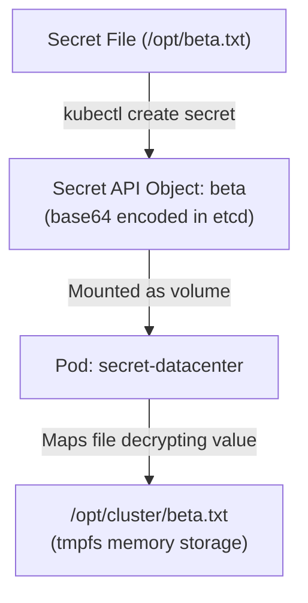

# Kubernetes Secrets

## Technical Overview

Applications frequently require sensitive data to run—such as database credentials, API keys, SSH private keys, TLS certificates, and software license keys. Hardcoding these credentials inside container images or Pod environment fields compromises security and violates Twelve-Factor App guidelines.

To address this, Kubernetes provides **Secrets**. Secrets allow you to store and manage sensitive information independently of container images, namespaces, or Pod specs.



---

## Kubernetes Secrets Deep Dive

A Kubernetes **Secret** object stores credentials in key-value format inside `etcd` (the cluster database).

### Secret Types
Kubernetes supports several types of Secrets depending on the target use case:
*   **`Opaque` (Default):** Generic user-defined arbitrary key-value pairs (used for passwords, license files, custom configuration keys).
*   **`kubernetes.io/service-account-token`:** Used by ServiceAccounts to store token credentials for communicating with the Kubernetes API server.
*   **`kubernetes.io/dockerconfigjson`:** Used to store credentials for accessing private container registries (`imagePullSecrets`).
*   **`kubernetes.io/tls`:** Used to store a public/private key pair (`tls.crt` and `tls.key`) for SSL/TLS endpoints (e.g., Ingress Controllers).

---

### Methods of Creating Secrets

#### 1. From a File
When creating a secret from a file, the filename becomes the **key** inside the secret mapping, and the contents of the file become the **value**.
```bash
kubectl create secret generic beta --from-file=/opt/beta.txt
```

#### 2. From Literal Key-Values
Allows creating key-value pairings directly from shell arguments:
```bash
kubectl create secret generic database-secret --from-literal=db-password=mySuperSecr3t
```

---

### Mounting Secrets inside Pods

Pods can consume Secrets in two primary ways:

#### A. Injected as Environment Variables
Ideal for applications that expect config credentials through process environment setups.
```yaml
env:
- name: APP_LICENSE_NUMBER
  valueFrom:
    secretKeyRef:
      name: beta
      key: beta.txt
```

#### B. Mounted as Files in a Volume
In this method, the secret values are mounted under a specific directory. Kubernetes creates a file for each key in the secret map, and the content of that file is the decrypted secret value.
*   **Security Benefit:** Volume-mounted secrets are backed by a **`tmpfs` (temporary memory-backed filesystem)**. This ensures that the secret keys never touch the physical disks of the worker nodes.
```yaml
volumeMounts:
- name: secret-volume
  mountPath: /opt/cluster
volumes:
- name: secret-volume
  secret:
    secretName: beta
```

---

### Critical Security Practices for Secrets

> [!CAUTION]
> *   **Base64 is NOT Encryption:** By default, Kubernetes Secret values are stored as **Base64 encoded strings** in `etcd`, which is just a text representation and offers *no* security. Anyone with API access or etcd backup access can decode the secrets instantly: `echo <secret> | base64 --decode`.
> *   **Encryption at Rest:** Ensure that the Kubernetes Control Plane has **encryption at rest** configured. This encrypts secret data before writing it to etcd.
> *   **Role-Based Access Control (RBAC):** Restrict access to Secret resources (`get`, `list`, `watch`) to only authorized users and service accounts to prevent security leaks.

---

## Infrastructure & Configuration Requirements

*   **Target Cluster:** Nautilus Kubernetes Cluster
*   **Jump Host User:** `thor`
*   **Namespace:** `default`
*   **Source Secret File:** `/opt/beta.txt` on the node
*   **Output Secret Details:**
    *   **Name:** `beta`
    *   **Type:** `Opaque`
*   **Pod Details:**
    *   **Name:** `secret-datacenter`
    *   **Container Name:** `secret-container-datacenter`
    *   **Image:** `fedora:latest`
    *   **Mount Path:** `/opt/cluster`
    *   **Command:** `["/bin/sh", "-c", "sleep 3600"]` (keeps container running)

---

## Step-by-Step Implementation

### Step 1: Connect to the Kubernetes Jump Host
SSH into the command host:
```bash
ssh thor@jump_host_ip
```

---

### Step 2: Create the Generic Secret
Verify the content of the license key file inside the `/opt` directory:
```bash
cat /opt/beta.txt
```

Create the `Opaque` secret named `beta` using the file as source:
```bash
kubectl create secret generic beta --from-file=/opt/beta.txt
```
*Expected Output:*
```text
secret/beta created
```

---

### Step 3: Define the Pod Manifest File
Create a YAML configuration file named `secret-pod.yaml`. This file configures the Pod to reference the `beta` secret and mount it to `/opt/cluster`:

```yaml
apiVersion: v1
kind: Pod
metadata:
  name: secret-datacenter
  labels:
    app: secret-app
spec:
  volumes:
  - name: secret-volume-cluster
    secret:
      secretName: beta
  containers:
  - name: secret-container-datacenter
    image: fedora:latest
    command: ["/bin/sh", "-c", "sleep 3600"]
    volumeMounts:
    - name: secret-volume-cluster
      mountPath: /opt/cluster
      readOnly: true
```

---

### Step 4: Deploy the Pod
Apply the manifest file to start container creation inside the namespace:
```bash
kubectl apply -f secret-pod.yaml
```
*Expected Output:*
```text
pod/secret-datacenter created
```

Ensure the Pod is in a healthy, running status:
```bash
kubectl get pods
```
*Expected Output:*
```text
NAME                READY   STATUS    RESTARTS   AGE
secret-datacenter   1/1     Running   0          10s
```

---

## Post-Deployment Verification

### 1. Retrieve and Decode Secret Metadata
Check the secret's Base64 representation in the cluster:
```bash
kubectl get secret beta -o yaml
```
*Expected Output showing base64 value:*
```yaml
apiVersion: v1
data:
  beta.txt: dGVzdFBhc3N3b3JkMTIzCg==
kind: Secret
...
```

Decode the value to confirm it matches the raw password:
```bash
echo "dGVzdFBhc3N3b3JkMTIzCg==" | base64 --decode
```
*Expected Output:*
```text
testPassword123
```

---

### 2. Verify Decrypted Secrets inside the Pod Container
Log into the running container and verify the secret file was automatically decrypted and mapped under `/opt/cluster`:
```bash
kubectl exec -it secret-datacenter -c secret-container-datacenter -- cat /opt/cluster/beta.txt
```
*Expected Output:*
```text
testPassword123
```

The secret has been successfully mounted and decrypted inside the container!
