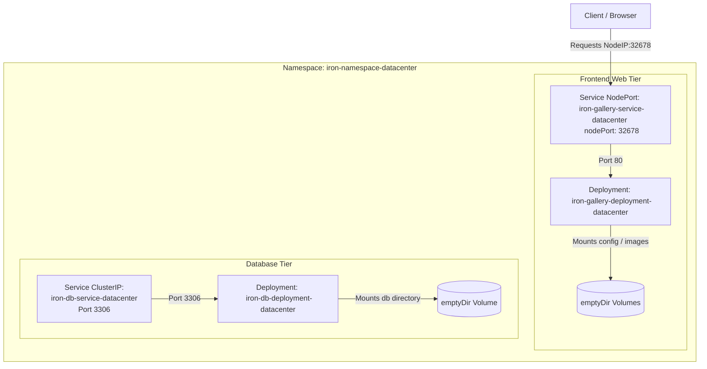

# Deploy Multi-Tier Application on Kubernetes

## Technical Overview

Deploying microservice-based architectures requires running multi-tier workloads that isolate different application layers. A classic example is a **Two-Tier Web Application**:
1.  **Frontend/Presentation Layer:** Serves static files and web user interfaces (e.g. Iron Gallery web app). It must be exposed externally to users.
2.  **Backend/Database Layer:** Stores dynamic application records (e.g. MariaDB database). It must be isolated internally within the cluster and accessible only to the frontend.

Deploying this architecture in Kubernetes involves using **Namespaces** for logical resource isolation, setting **Resource Limits** on containers to prevent memory or CPU starvation, and exposing different **Service Types** (`NodePort` vs `ClusterIP`) depending on visibility requirements.



---

## Namespace Isolation & Resource Limits Deep Dive

### 1. Kubernetes Namespaces
A **Namespace** provides a virtual cluster environment within a physical Kubernetes cluster. 
*   **Use Cases:** Namespaces are used to segment work across multiple teams, environments (development, staging, production), or applications.
*   **Scope:** Most Kubernetes resources (Pods, Deployments, Services, ConfigMaps, Secrets) exist within namespaces. Cluster-wide resources (Nodes, PersistentVolumes, Namespaces) do not.
*   **Networking:** Namespaces provide a logical boundary. By default, Pods in different namespaces can still communicate over the network via their fully qualified domain name (FQDN): `<service-name>.<namespace-name>.svc.cluster.local`.

### 2. Container Resource Limits
Kubernetes allows you to manage the computing resources consumed by containers using requests and limits:
*   **Requests (Minimum):** The amount of CPU or memory that the node's scheduler guarantees to the container. If a Pod requests 50m CPU, it will only be scheduled on a node with at least 50m CPU available.
*   **Limits (Maximum):** The absolute ceiling of resources the container is allowed to consume. Kubernetes uses Linux **cgroups** to enforce these limits.

#### CPU vs Memory Limit Behavior

| Resource | Unit | Over-Limit Behavior | Mechanism |
| :--- | :--- | :--- | :--- |
| **CPU** | millicores (`m`) <br> *(1000m = 1 vCPU)* | **Throttled:** The container is restricted from consuming more CPU cycles than its limit, resulting in slower execution but **no termination**. | CFS (Completely Fair Scheduler) shares |
| **Memory** | Bytes (`Mi` / `Gi`) | **Killed (OOMKilled):** If a container exceeds its memory limit, the kernel Out-Of-Memory (OOM) killer immediately terminates the process with **Exit Code 137**. | Linux `cgroups` memory controller |

---

## Infrastructure & Configuration Requirements

*   **Target Namespace:** `iron-namespace-datacenter`
*   **Jump Host User:** `thor`

### 1. Frontend: Iron Gallery
*   **Deployment Name:** `iron-gallery-deployment-datacenter`
*   **Labels / Selectors:** `run: iron-gallery`
*   **Replicas:** `1`
*   **Container Name:** `iron-gallery-container-datacenter`
*   **Image:** `kodekloud/irongallery:2.0`
*   **Resource Limits:**
    *   Memory: `100Mi`
    *   CPU: `50m`
*   **Volume Mounts:**
    *   Volume `config` (type `emptyDir`) mounted at `/usr/share/nginx/html/data`
    *   Volume `images` (type `emptyDir`) mounted at `/usr/share/nginx/html/uploads`
*   **Service Name:** `iron-gallery-service-datacenter`
    *   Type: `NodePort`
    *   Port / TargetPort: `80`
    *   NodePort: `32678`

### 2. Backend: MariaDB Database
*   **Deployment Name:** `iron-db-deployment-datacenter`
*   **Labels / Selectors:** `db: mariadb`
*   **Replicas:** `1`
*   **Container Name:** `iron-db-container-datacenter`
*   **Image:** `kodekloud/irondb:2.0`
*   **Environment Variables:**
    *   `MYSQL_DATABASE`: `database_web`
    *   `MYSQL_ROOT_PASSWORD`: `<complex_password>`
    *   `MYSQL_PASSWORD`: `<complex_password>`
    *   `MYSQL_USER`: `<custom_user>` (not root)
*   **Volume Mounts:**
    *   Volume `db` (type `emptyDir`) mounted at `/var/lib/mysql`
*   **Service Name:** `iron-db-service-datacenter`
    *   Type: `ClusterIP`
    *   Port / TargetPort: `3306`

---

## Step-by-Step Implementation

### Step 1: Connect to the Cluster Controller
Establish connection to the jump host:
```bash
ssh thor@jump_host_ip
```

---

### Step 2: Create the Target Namespace
Create the dedicated namespace for resource isolation:
```bash
kubectl create namespace iron-namespace-datacenter
```
*Expected Output:*
```text
namespace/iron-namespace-datacenter created
```

---

### Step 3: Create and Deploy the Database Tier
Create a file named `iron-db.yaml` defining the MariaDB database Deployment and its internal `ClusterIP` Service. The configurations explicitly specify the custom namespace:

```yaml
apiVersion: apps/v1
kind: Deployment
metadata:
  name: iron-db-deployment-datacenter
  namespace: iron-namespace-datacenter
  labels:
    db: mariadb
spec:
  replicas: 1
  selector:
    matchLabels:
      db: mariadb
  template:
    metadata:
      labels:
        db: mariadb
    spec:
      volumes:
      - name: db
        emptyDir: {}
      containers:
      - name: iron-db-container-datacenter
        image: kodekloud/irondb:2.0
        env:
        - name: MYSQL_DATABASE
          value: "database_web"
        - name: MYSQL_ROOT_PASSWORD
          value: "SecretRootPass123!"
        - name: MYSQL_PASSWORD
          value: "SecretUserPass123!"
        - name: MYSQL_USER
          value: "iron_db_user"
        volumeMounts:
        - name: db
          mountPath: /var/lib/mysql
---
apiVersion: v1
kind: Service
metadata:
  name: iron-db-service-datacenter
  namespace: iron-namespace-datacenter
spec:
  type: ClusterIP
  selector:
    db: mariadb
  ports:
  - port: 3306
    targetPort: 3306
    protocol: TCP
```

Deploy the database tier:
```bash
kubectl apply -f iron-db.yaml
```

---

### Step 4: Create and Deploy the Web Gallery Tier
Create a file named `iron-gallery.yaml` defining the web frontend Deployment with CPU/Memory limits, shared emptyDir scratch directories, and its externally accessible `NodePort` Service:

```yaml
apiVersion: apps/v1
kind: Deployment
metadata:
  name: iron-gallery-deployment-datacenter
  namespace: iron-namespace-datacenter
  labels:
    run: iron-gallery
spec:
  replicas: 1
  selector:
    matchLabels:
      run: iron-gallery
  template:
    metadata:
      labels:
        run: iron-gallery
    spec:
      volumes:
      - name: config
        emptyDir: {}
      - name: images
        emptyDir: {}
      containers:
      - name: iron-gallery-container-datacenter
        image: kodekloud/irongallery:2.0
        resources:
          limits:
            memory: 100Mi
            cpu: 50m
        volumeMounts:
        - name: config
          mountPath: /usr/share/nginx/html/data
        - name: images
          mountPath: /usr/share/nginx/html/uploads
---
apiVersion: v1
kind: Service
metadata:
  name: iron-gallery-service-datacenter
  namespace: iron-namespace-datacenter
spec:
  type: NodePort
  selector:
    run: iron-gallery
  ports:
  - port: 80
    targetPort: 80
    nodePort: 32678
    protocol: TCP
```

Deploy the web tier:
```bash
kubectl apply -f iron-gallery.yaml
```

---

## Post-Deployment Verification

### 1. Check Namespace Resource Status
Verify both deployments successfully scale and reach `Running` state:
```bash
kubectl get deployments -n iron-namespace-datacenter
```
*Expected Output:*
```text
NAME                                 READY   UP-TO-DATE   AVAILABLE   AGE
iron-db-deployment-datacenter        1/1     1            1           1m
iron-gallery-deployment-datacenter   1/1     1            1           45s
```

Check the active Pod status:
```bash
kubectl get pods -n iron-namespace-datacenter
```
*Expected Output:*
```text
NAME                                                  READY   STATUS    RESTARTS   AGE
iron-db-deployment-datacenter-5f8a9b0c-abcde          1/1     Running   0          1m
iron-gallery-deployment-datacenter-6d5c4b3a-fghij     1/1     Running   0          45s
```

---

### 2. Verify Services Configuration
Check that both services are created in the namespace with the correct ports:
```bash
kubectl get svc -n iron-namespace-datacenter
```
*Expected Output:*
```text
NAME                            TYPE        CLUSTER-IP      EXTERNAL-IP   PORT(S)        AGE
iron-db-service-datacenter      ClusterIP   10.96.140.231   <none>        3306/TCP       1m
iron-gallery-service-datacenter   NodePort    10.96.182.11    <none>        80:32678/TCP   45s
```

---

### 3. Verify Frontend Installation Access
Check accessibility of the web interface from outside the cluster:
```bash
curl -I http://<NODE_IP>:32678
```
*Expected Output showing successful access/redirect to installer page:*
```text
HTTP/1.1 200 OK
Server: nginx/...
Content-Type: text/html
...
```

The multi-tier web application stack is successfully deployed, isolated, and externally exposed!
