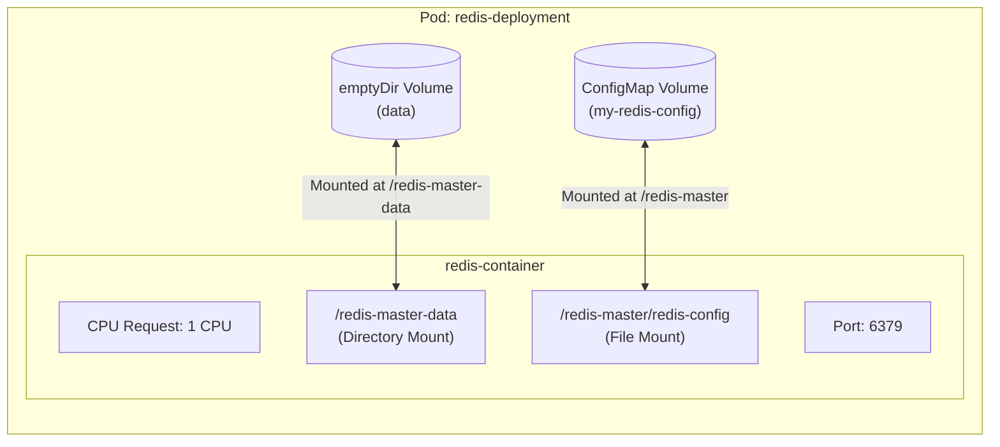

# Deploy Redis Deployment on Kubernetes

## Technical Overview

Deploying performance-critical databases like **Redis** in a containerized cluster requires configuring application files (such as `redis.conf`) and allocating hardware resources.

To manage configurations dynamically, Kubernetes utilizes **ConfigMaps**. Additionally, database pods require guaranteed system resources to run stably without being throttled or terminated during workload spikes. This is handled by setting **CPU requests** in the container specification.



---

## Kubernetes ConfigMaps & CPU Requests Deep Dive

### 1. Kubernetes ConfigMaps
A **ConfigMap** is a API object that stores configurations in key-value format. When a ConfigMap is mounted as a volume:
*   Kubernetes creates a file directory at the specified `mountPath`.
*   Each **key** in the ConfigMap data section is translated into a **file name**.
*   The **value** associated with that key is written inside the file as its content.

In this setup, a ConfigMap named `my-redis-config` holds a key named `redis-config` containing the value `maxmemory 2mb`. When mounted under `/redis-master`, a file is created at `/redis-master/redis-config` containing the string `maxmemory 2mb`, which the Redis database reads as its config file.

---

### 2. Container CPU Requests
A CPU request (`resources.requests.cpu`) is the guaranteed amount of CPU resources the cluster scheduler reserves for a container.
*   **Guaranteed Allocation:** If a container requests `1` CPU, the scheduler only assigns the Pod to a worker node that has at least 1 allocatable CPU available.
*   **Units:** CPU is measured in CPU units. `1` CPU is equivalent to 1 vCPU, 1 Core, or 1 Hyperthread depending on the node's system architecture. It can also be written in millicores (e.g. `1000m` is equal to `1` CPU).
*   **Limits vs Requests:** While CPU *limits* throttle container performance if exceeded, CPU *requests* are used primarily for scheduling decisions and guaranteeing base resources.

---

## Infrastructure & Configuration Requirements

*   **Target Cluster:** Nautilus Kubernetes Cluster
*   **Jump Host User:** `thor`
*   **Namespace:** `default`
*   **ConfigMap Details:**
    *   **Name:** `my-redis-config`
    *   **Data Key:** `redis-config`
    *   **Data Value:** `maxmemory 2mb`
*   **Deployment Details:**
    *   **Name:** `redis-deployment`
    *   **Replicas:** `1`
    *   **Container Name:** `redis-container`
    *   **Image:** `redis:alpine`
    *   **Container Port:** `6379`
    *   **CPU Request:** `1` (1000m)
*   **Volume Mounts:**
    1.  Volume name `data` (using `emptyDir` type) mounted at `/redis-master-data`
    2.  Volume name `redis-config` (using ConfigMap `my-redis-config`) mounted at `/redis-master`

---

## Step-by-Step Implementation

### Step 1: Connect to the Kubernetes Jump Host
SSH from your administrator command shell:
```bash
ssh thor@jump_host_ip
```

---

### Step 2: Create the ConfigMap
Create the ConfigMap using the `kubectl` CLI utility from literal key-value strings:
```bash
kubectl create configmap my-redis-config --from-literal=redis-config="maxmemory 2mb"
```
*Expected Output:*
```text
configmap/my-redis-config created
```

Verify that the ConfigMap was created and contains the correct configuration keys:
```bash
kubectl get configmap my-redis-config -o yaml
```
*Expected Output:*
```yaml
apiVersion: v1
data:
  redis-config: maxmemory 2mb
kind: ConfigMap
metadata:
  name: my-redis-config
...
```

---

### Step 3: Create the Deployment Manifest File
Create a YAML manifest file named `redis-deployment.yaml` declaring the Deployment structure, volume mappings, and resources:

```yaml
apiVersion: apps/v1
kind: Deployment
metadata:
  name: redis-deployment
  labels:
    app: redis
spec:
  replicas: 1
  selector:
    matchLabels:
      app: redis
  template:
    metadata:
      labels:
        app: redis
    spec:
      volumes:
      - name: data
        emptyDir: {}
      - name: redis-config
        configMap:
          name: my-redis-config
      containers:
      - name: redis-container
        image: redis:alpine
        ports:
        - containerPort: 6379
        resources:
          requests:
            cpu: "1"
        volumeMounts:
        - name: data
          mountPath: /redis-master-data
        - name: redis-config
          mountPath: /redis-master
```

---

### Step 4: Deploy the Deployment Spec
Apply the YAML file to spin up the Redis Pod:
```bash
kubectl apply -f redis-deployment.yaml
```
*Expected Output:*
```text
deployment.apps/redis-deployment created
```

Wait until the Pod reaches `Running` status:
```bash
kubectl get pods -w
```
*Expected Output:*
```text
NAME                                READY   STATUS    RESTARTS   AGE
redis-deployment-7f8a9b0c-abcde     1/1     Running   0          12s
```

---

## Post-Deployment Verification

### 1. Verify ConfigMap File Mounting
Log into the container and confirm the ConfigMap data key has been mapped as a decrypted configuration file inside the filesystem:
```bash
kubectl exec -it deployment/redis-deployment -- cat /redis-master/redis-config
```
*Expected Output:*
```text
maxmemory 2mb
```

---

### 2. Verify CPU Requests Allocation
Confirm the CPU scheduling request was correctly set in the Pod's resource requirements:
```bash
kubectl get pod -l app=redis -o jsonpath='{.items[0].spec.containers[*].resources}'
```
*Expected Output:*
```json
{"requests":{"cpu":"1"}}
```

---

### 3. Verify Local DB Memory Configuration
Connect to the database server using `redis-cli` and inspect the configured maximum memory size to ensure Redis parsed the mounted config file:
```bash
kubectl exec -it deployment/redis-deployment -- redis-cli config get maxmemory
```
*Expected Output:*
```text
1) "maxmemory"
2) "2097152"
```
*(Note: 2097152 bytes is equivalent to exactly 2MB).*

The Redis Deployment is successfully deployed, configured, and resource-guaranteed!
