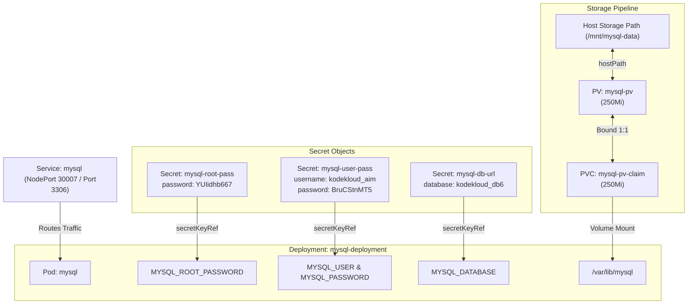

# Deploy MySQL on Kubernetes with PV, PVC, and Secrets

## Technical Overview

Deploying a stateful database management system like **MySQL** on Kubernetes requires bringing together multiple core API primitives:
1.  **Persistent Storage (PV & PVC):** Ensures database data stored in `/var/lib/mysql` persists across container restarts, node maintenance, and Pod relocations.
2.  **Secret Management (Secrets & secretKeyRef):** Keeps database credentials, root passwords, and database names out of plain-text manifests and environment definitions by sourcing them directly from Kubernetes Secrets.
3.  **Network Exposure (Service & NodePort):** Provides a stable cluster endpoint and external access port (`30007`) for application clients and database administration tools.



---

## Secrets, Persistent Storage & Database Injection Deep Dive

### 1. Database Configuration via Kubernetes Secrets
When initializing a official MySQL container, the container startup script inspects specific environment variables to create databases and user accounts:
*   `MYSQL_ROOT_PASSWORD`: Sets the superuser root password.
*   `MYSQL_DATABASE`: Creates a default database upon startup.
*   **`MYSQL_USER` & `MYSQL_PASSWORD`**: Creates a non-root application user and grants them full administrative privileges over `MYSQL_DATABASE`.

Instead of writing plain-text credentials into the Pod spec, the values are referenced from Kubernetes Secrets using `secretKeyRef`:

```yaml
env:
- name: MYSQL_ROOT_PASSWORD
  valueFrom:
    secretKeyRef:
      name: mysql-root-pass
      key: password
```

### 2. Persistent Storage Binding
MySQL writes all table schemas, indexes, and binary logs to `/var/lib/mysql`. 
*   A **`PersistentVolume` (PV)** named `mysql-pv` is defined with `250Mi` capacity.
*   A **`PersistentVolumeClaim` (PVC)** named `mysql-pv-claim` requests `250Mi` storage.
*   The Kubernetes storage controller binds `mysql-pv-claim` to `mysql-pv`. The deployment spec mounts `mysql-pv-claim` to `/var/lib/mysql`, ensuring database durability.

---

## Infrastructure & Configuration Requirements

*   **Target Cluster:** Nautilus Kubernetes Cluster
*   **Jump Host User:** `thor`
*   **Namespace:** `default`

### 1. Secrets Configuration
*   **Secret 1:** `mysql-root-pass`
    *   Key: `password` = `YUIidhb667`
*   **Secret 2:** `mysql-user-pass`
    *   Key: `username` = `kodekloud_aim`
    *   Key: `password` = `BruCStnMT5`
*   **Secret 3:** `mysql-db-url`
    *   Key: `database` = `kodekloud_db6`

### 2. Storage Configuration
*   **PersistentVolume:** `mysql-pv`
    *   Capacity: `250Mi`
    *   Access Mode: `ReadWriteOnce`
    *   Storage Class: `manual`
    *   Host Path: `/mnt/mysql-data`
*   **PersistentVolumeClaim:** `mysql-pv-claim`
    *   Request Capacity: `250Mi`
    *   Access Mode: `ReadWriteOnce`
    *   Storage Class: `manual`

### 3. Deployment Configuration
*   **Deployment Name:** `mysql-deployment`
*   **Replicas:** `1`
*   **Image:** `mysql:5.7` (or `mysql:8.0`)
*   **Volume Mount:** `mysql-pv-claim` mounted at `/var/lib/mysql`
*   **Environment Variables:**
    *   `MYSQL_ROOT_PASSWORD` $\rightarrow$ `mysql-root-pass` / `password`
    *   `MYSQL_DATABASE` $\rightarrow$ `mysql-db-url` / `database`
    *   `MYSQL_USER` $\rightarrow$ `mysql-user-pass` / `username`
    *   `MYSQL_PASSWORD` $\rightarrow$ `mysql-user-pass` / `password`

### 4. Service Configuration
*   **Service Name:** `mysql`
*   **Service Type:** `NodePort`
*   **Port / TargetPort:** `3306`
*   **NodePort:** `30007`

---

## Step-by-Step Implementation

### Step 1: Connect to the Kubernetes Jump Host
Establish connection to the control host:
```bash
ssh thor@jump_host_ip
```

---

### Step 2: Create the Required Secrets
Create the three secrets using `kubectl create secret generic`:

```bash
# 1. Root password secret
kubectl create secret generic mysql-root-pass --from-literal=password=YUIidhb667

# 2. User credentials secret
kubectl create secret generic mysql-user-pass \
  --from-literal=username=kodekloud_aim \
  --from-literal=password=BruCStnMT5

# 3. Database name secret
kubectl create secret generic mysql-db-url --from-literal=database=kodekloud_db6
```

Verify that all three secrets were created successfully:
```bash
kubectl get secrets
```

---

### Step 3: Create the PV and PVC Manifest File
Create a file named `mysql-storage.yaml` defining the PersistentVolume and PersistentVolumeClaim:

```yaml
apiVersion: v1
kind: PersistentVolume
metadata:
  name: mysql-pv
  labels:
    type: local
spec:
  storageClassName: manual
  capacity:
    storage: 250Mi
  accessModes:
    - ReadWriteOnce
  hostPath:
    path: "/mnt/mysql-data"
---
apiVersion: v1
kind: PersistentVolumeClaim
metadata:
  name: mysql-pv-claim
spec:
  storageClassName: manual
  accessModes:
    - ReadWriteOnce
  resources:
    requests:
      storage: 250Mi
```

Apply the storage configuration:
```bash
kubectl apply -f mysql-storage.yaml
```

Verify that the PVC successfully binds to `mysql-pv`:
```bash
kubectl get pv,pvc
```
*Expected Output showing Bound status:*
```text
NAME                        CAPACITY   ACCESS MODES   RECLAIM POLICY   STATUS   CLAIM                    STORAGECLASS   AGE
persistentvolume/mysql-pv   250Mi      RWO            Retain           Bound    default/mysql-pv-claim   manual         10s

NAME                                   STATUS   VOLUME     CAPACITY   ACCESS MODES   STORAGECLASS   AGE
persistentvolumeclaim/mysql-pv-claim   Bound    mysql-pv   250Mi      RWO            manual         10s
```

---

### Step 4: Create Deployment and Service Manifest File
Create a file named `mysql-app.yaml` defining the MySQL Deployment and NodePort Service:

```yaml
apiVersion: apps/v1
kind: Deployment
metadata:
  name: mysql-deployment
  labels:
    app: mysql
spec:
  replicas: 1
  selector:
    matchLabels:
      app: mysql
  template:
    metadata:
      labels:
        app: mysql
    spec:
      volumes:
      - name: mysql-persistent-storage
        persistentVolumeClaim:
          claimName: mysql-pv-claim
      containers:
      - name: mysql
        image: mysql:5.7
        ports:
        - containerPort: 3306
        env:
        - name: MYSQL_ROOT_PASSWORD
          valueFrom:
            secretKeyRef:
              name: mysql-root-pass
              key: password
        - name: MYSQL_DATABASE
          valueFrom:
            secretKeyRef:
              name: mysql-db-url
              key: database
        - name: MYSQL_USER
          valueFrom:
            secretKeyRef:
              name: mysql-user-pass
              key: username
        - name: MYSQL_PASSWORD
          valueFrom:
            secretKeyRef:
              name: mysql-user-pass
              key: password
        volumeMounts:
        - name: mysql-persistent-storage
          mountPath: /var/lib/mysql
---
apiVersion: v1
kind: Service
metadata:
  name: mysql
spec:
  type: NodePort
  selector:
    app: mysql
  ports:
  - port: 3306
    targetPort: 3306
    nodePort: 30007
    protocol: TCP
```

Apply the Deployment and Service manifest:
```bash
kubectl apply -f mysql-app.yaml
```
*Expected Output:*
```text
deployment.apps/mysql-deployment created
service/mysql created
```

---

## Post-Deployment Verification

### 1. Verify Pod and Service Status
Check that the MySQL Pod reaches the `Running` state:
```bash
kubectl get pods -l app=mysql
```
*Expected Output:*
```text
NAME                                READY   STATUS    RESTARTS   AGE
mysql-deployment-5f8a9b0c-abcde     1/1     Running   0          30s
```

Verify the NodePort Service configuration:
```bash
kubectl get svc mysql
```
*Expected Output:*
```text
NAME    TYPE       CLUSTER-IP      EXTERNAL-IP   PORT(S)          AGE
mysql   NodePort   10.96.180.120   <none>        3306:30007/TCP   35s
```

---

### 2. Verify Secrets and Environment Variable Mapping
Exec into the MySQL Pod and print the environment variables to verify secret resolution:
```bash
POD_NAME=$(kubectl get pods -l app=mysql -o jsonpath='{.items[0].metadata.name}')
kubectl exec -it $POD_NAME -- env | grep MYSQL
```
*Expected Output:*
```text
MYSQL_ROOT_PASSWORD=YUIidhb667
MYSQL_DATABASE=kodekloud_db6
MYSQL_USER=kodekloud_aim
MYSQL_PASSWORD=BruCStnMT5
```

---

### 3. Verify Database Initialization
Connect directly to MySQL inside the container using the application user credentials:
```bash
kubectl exec -it $POD_NAME -- mysql -u kodekloud_aim -pBruCStnMT5 -e "SHOW DATABASES;"
```
*Expected Output:*
```text
+--------------------+
| Database           |
+--------------------+
| information_schema |
| kodekloud_db6      |
+--------------------+
```

The MySQL database deployment is fully provisioned, secured with secrets, backed by persistent storage, and reachable via NodePort `30007`!
