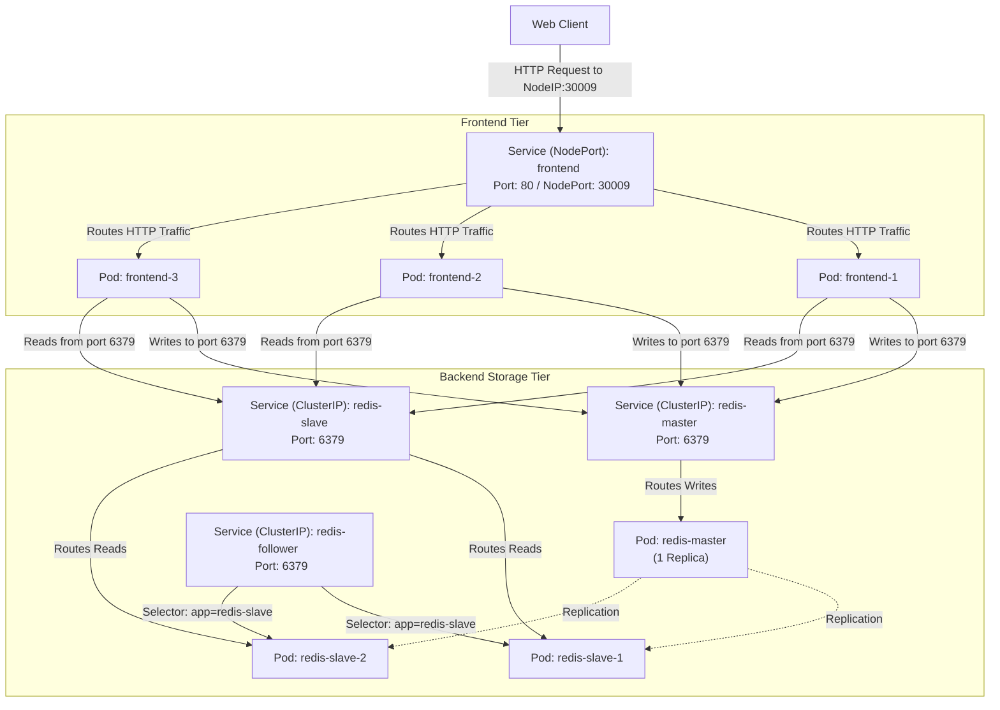

# Deploy Guestbook Application on Kubernetes

## Technical Overview

Deploying a multi-tier web application on Kubernetes requires orchestrating frontend and backend services to ensure seamless communication, scalability, and resource limits. A classic example is the **Redis Guestbook Application**:
1.  **Web Frontend Tier:** A PHP application that serves the web UI to users, accepts guestbook entries, and retrieves records. It is exposed to external users via a `NodePort` Service.
2.  **Redis Database Tier (Backend):** A replicated storage system consisting of:
    *   A **Redis Master** instance for handling write operations.
    *   A **Redis Slave** cluster (replicated follower instances) for handling read operations, ensuring high read availability.

The communication between the frontend tier and backend tier is dynamically resolved via Kubernetes DNS services.



---

## Service Discovery & Resource Allocation Deep Dive

### 1. DNS-based Service Discovery
In the Guestbook application, the frontend needs to connect to the Redis database without knowing the static IP addresses of the backend pods.
*   **DNS Resolution:** Kubernetes provides a built-in CoreDNS service. When a Kubernetes Service is created (e.g., `redis-master`), a DNS record is registered as `redis-master.default.svc.cluster.local`.
*   **Environment Variable Configuration:** The environment variable `GET_HOSTS_FROM` is set to `dns`. This directs the frontend container's connection client to lookup hostnames `redis-master` and `redis-slave` via the cluster DNS resolver, rather than relying on legacy environment variables.

### 2. Resource Allocation (Requests vs Limits)
Defining CPU and memory requirements ensures that containers have guaranteed resources to run and prevents rogue containers from exhausting host memory.
*   **Resource Requests (`resources.requests`):** Specifies the minimum resources a container requires to start. The Kubernetes scheduler uses this value to determine which node has enough capacity to host the Pod.
*   **Units:**
    *   **CPU:** Measured in millicores (e.g., `100m` is $0.1$ of a CPU core).
    *   **Memory:** Measured in Megabytes/Mebibytes (e.g., `100Mi` is $100 \times 2^{20}$ bytes).

---

## Infrastructure & Configuration Requirements

*   **Target Cluster:** Nautilus Kubernetes Cluster
*   **Jump Host User:** `thor`
*   **Namespace:** `default`

### 1. Back-End Tier Requirements
| Object Name | Type | Replicas | Container Name | Image | Port | Resources (Requests) | Env Variables |
| :--- | :--- | :--- | :--- | :--- | :--- | :--- | :--- |
| **redis-master** | Deployment | 1 | `master-redis-xfusion` | `redis` | `6379` | CPU: `100m`, Memory: `100Mi` | N/A |
| **redis-master** | Service | N/A | N/A | N/A | `6379` | N/A | N/A |
| **redis-slave** | Deployment | 2 | `slave-redis-xfusion` | `gcr.io/google_samples/gb-redisslave:v3` | `6379` | CPU: `100m`, Memory: `100Mi` | `GET_HOSTS_FROM` = `dns` |
| **redis-slave** | Service | N/A | N/A | N/A | `6379` | N/A | N/A |
| **redis-follower** | Service | N/A | N/A | N/A | `6379` | N/A | Selector: `app` = `redis-slave` |

### 2. Front-End Tier Requirements
| Object Name | Type | Replicas | Container Name | Image | Port / NodePort | Resources (Requests) | Env Variables |
| :--- | :--- | :--- | :--- | :--- | :--- | :--- | :--- |
| **frontend** | Deployment | 3 | `php-redis-xfusion` | `gcr.io/google-samples/gb-frontend@sha256:a908df8486ff66f2c4daa0d3d8a2fa09846a1fc8efd65649c0109695c7c5cbff` | `80` | CPU: `100m`, Memory: `100Mi` | `GET_HOSTS_FROM` = `dns` |
| **frontend** | Service | N/A | N/A | N/A | Port: `80` <br> NodePort: `30009` | N/A | N/A |

---

## Step-by-Step Implementation

### Step 1: Connect to the Kubernetes Jump Host
Establish an SSH connection to the cluster control host:
```bash
ssh thor@jump_host_ip
```

---

### Step 2: Create the Redis Master Manifest
Create a file named `redis-master.yaml` to define the Redis Master Deployment and Service:

```yaml
apiVersion: apps/v1
kind: Deployment
metadata:
  name: redis-master
  labels:
    app: redis
    role: master
    tier: backend
spec:
  replicas: 1
  selector:
    matchLabels:
      app: redis
      role: master
      tier: backend
  template:
    metadata:
      labels:
        app: redis
        role: master
        tier: backend
    spec:
      containers:
      - name: master-redis-xfusion
        image: redis
        resources:
          requests:
            cpu: 100m
            memory: 100Mi
        ports:
        - containerPort: 6379
---
apiVersion: v1
kind: Service
metadata:
  name: redis-master
  labels:
    app: redis
    role: master
    tier: backend
spec:
  ports:
  - port: 6379
    targetPort: 6379
  selector:
    app: redis
    role: master
    tier: backend
```

Apply the manifest file:
```bash
kubectl apply -f redis-master.yaml
```

---

### Step 3: Create the Redis Slave & Follower Manifest
Create a file named `redis-slave.yaml` defining the Redis Slave Deployment, `redis-slave` Service, and `redis-follower` Service:

```yaml
apiVersion: apps/v1
kind: Deployment
metadata:
  name: redis-slave
  labels:
    app: redis-slave
    role: slave
    tier: backend
spec:
  replicas: 2
  selector:
    matchLabels:
      app: redis-slave
      role: slave
      tier: backend
  template:
    metadata:
      labels:
        app: redis-slave
        role: slave
        tier: backend
    spec:
      containers:
      - name: slave-redis-xfusion
        image: gcr.io/google_samples/gb-redisslave:v3
        resources:
          requests:
            cpu: 100m
            memory: 100Mi
        env:
        - name: GET_HOSTS_FROM
          value: dns
        ports:
        - containerPort: 6379
---
apiVersion: v1
kind: Service
metadata:
  name: redis-slave
  labels:
    app: redis-slave
    role: slave
    tier: backend
spec:
  ports:
  - port: 6379
  selector:
    app: redis-slave
    role: slave
    tier: backend
---
apiVersion: v1
kind: Service
metadata:
  name: redis-follower
  labels:
    app: redis-slave
    role: slave
    tier: backend
spec:
  ports:
  - port: 6379
    targetPort: 6379
  selector:
    app: redis-slave
```

Apply the slave manifest file:
```bash
kubectl apply -f redis-slave.yaml
```

---

### Step 4: Create the Frontend Tier Manifest
Create a file named `frontend.yaml` to define the Frontend Deployment and its NodePort Service:

```yaml
apiVersion: apps/v1
kind: Deployment
metadata:
  name: frontend
  labels:
    app: guestbook
    tier: frontend
spec:
  replicas: 3
  selector:
    matchLabels:
      app: guestbook
      tier: frontend
  template:
    metadata:
      labels:
        app: guestbook
        tier: frontend
    spec:
      containers:
      - name: php-redis-xfusion
        image: gcr.io/google-samples/gb-frontend@sha256:a908df8486ff66f2c4daa0d3d8a2fa09846a1fc8efd65649c0109695c7c5cbff
        resources:
          requests:
            cpu: 100m
            memory: 100Mi
        env:
        - name: GET_HOSTS_FROM
          value: dns
        ports:
        - containerPort: 80
---
apiVersion: v1
kind: Service
metadata:
  name: frontend
  labels:
    app: guestbook
    tier: frontend
spec:
  type: NodePort
  ports:
  - port: 80
    targetPort: 80
    nodePort: 30009
    protocol: TCP
  selector:
    app: guestbook
    tier: frontend
```

Apply the frontend manifest file:
```bash
kubectl apply -f frontend.yaml
```

---

## Post-Deployment Verification

### 1. Verify Pod Execution and Scaling
Ensure that all pods have reached the `Running` state and the replica counts are matching:
```bash
kubectl get pods
```
*Expected Output:*
```text
NAME                            READY   STATUS    RESTARTS   AGE
frontend-6bdf9c7fdb-abcde      1/1     Running   0          45s
frontend-6bdf9c7fdb-fghij      1/1     Running   0          45s
frontend-6bdf9c7fdb-klmno      1/1     Running   0          45s
redis-master-5b8d4c9d74-xyz12   1/1     Running   0          2m
redis-slave-7c5b6b8d4e-123ab    1/1     Running   0          1m
redis-slave-7c5b6b8d4e-cdef5    1/1     Running   0          1m
```

---

### 2. Verify Services Port Bindings
Check that the services are registered with the correct IP addresses, selector mappings, and ports:
```bash
kubectl get svc
```
*Expected Output:*
```text
NAME             TYPE        CLUSTER-IP      EXTERNAL-IP   PORT(S)        AGE
kubernetes       ClusterIP   10.96.0.1       <none>        443/TCP        2d
frontend         NodePort    10.96.155.80    <none>        80:30009/TCP   45s
redis-master     ClusterIP   10.96.221.14    <none>        6379/TCP       2m
redis-slave      ClusterIP   10.96.102.73    <none>        6379/TCP       1m
redis-follower   ClusterIP   10.96.90.118    <none>        6379/TCP       1m
```

---

### 3. Verify Redis Follower Selector Mapping
Verify that `redis-follower` endpoint references the correct targets:
```bash
kubectl get endpoints redis-follower
```
*Expected Output showing two endpoints corresponding to the redis-slave pods:*
```text
NAME             ENDPOINTS                         AGE
redis-follower   10.244.1.4:6379,10.244.2.6:6379   1m
```

---

### 4. Verify Frontend Access and Storage Synchronization
Verify connectivity to the guestbook frontend and verify that data written to the frontend persists correctly in Redis:
```bash
# Perform a curl request to check the frontend landing page
curl -I http://<NODE_IP>:30009
```
*Expected Output:*
```text
HTTP/1.1 200 OK
Date: ...
Server: Apache/...
Content-Type: text/html; charset=UTF-8
...
```

The multi-tier Guestbook Application has been successfully deployed and verified on Kubernetes!
