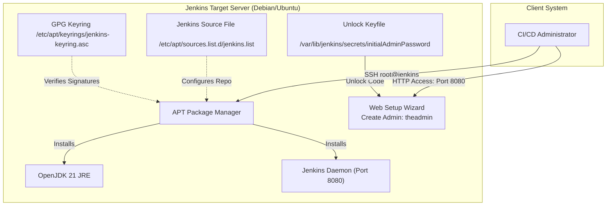

# Set Up Jenkins Server

## Technical Overview

Deploying a continuous integration and continuous deployment (CI/CD) server like **Jenkins** requires setting up a Java runtime environment (JRE) and configuring official package repositories to ensure clean lifecycle management.

Jenkins operates as a standalone Java application hosting its own embedded servlet container (Jetty). In a standard Linux infrastructure, installing Jenkins involves:
1.  **Java Environment Provisioning:** Installing a supported Java Runtime Environment (JRE).
2.  **Package Repository Configuration:** Adding the official Jenkins Debian repository and registering its GPG key to verify package signatures.
3.  **Daemon Integration:** Managing Jenkins as a background service via system init scripts (`service` or `systemctl`).
4.  **Initial Setup Wizard:** Unlocking the application using a generated file-based secret, installing baseline plugins, and creating the master admin user account.



---

## Debian Repositories & Java Service Architecture Deep Dive

### 1. Secure Package Management with APT GPG Keys
Debian-based distributions use **GPG (GNU Privacy Guard)** keys to sign package metadata. This guarantees that packages installed using `apt` have not been tampered with.
*   **Keyring Registry:** GPG keys are downloaded and saved into a secure keyring directory (such as `/etc/apt/keyrings/`).
*   **Sources List Configuration:** The repository definition `/etc/apt/sources.list.d/jenkins.list` is configured with a `signed-by` option pointing directly to this keyring. When `apt update` runs, the package manager checks the downloaded package metadata against this local key.

### 2. Servlet Containers & JRE Prerequisites
Jenkins is written in Java and runs inside a servlet container.
*   **Version Compatibility:** Modern versions of Jenkins require **Java 17 or Java 21**. Running Jenkins on unsupported versions of Java will cause compilation errors or application failure upon startup.
*   **Dependency Management:** The `openjdk-21-jre` package installs the core Java Virtual Machine (JVM). Additionally, graphic libraries (e.g., `fontconfig`) are installed to support PDF rendering, graph generation, and user interface elements.

---

## Infrastructure & Configuration Requirements

*   **Target Server Hostname:** `jenkins`
*   **User Credentials:** `root` (Password: `S3curePass`)
*   **Installation Utility:** `apt` (Debian-based package manager)
*   **Service Manager:** `service` CLI utility

### Jenkins Admin User Specification
*   **Username:** `theadmin`
*   **Password:** `Adm!n321`
*   **Full Name:** `Rose`
*   **E-mail Address:** `rose@jenkins.stratos.xfusioncorp.com`

---

## Step-by-Step Installation

### Step 1: Connect to the Jenkins Server
Establish an SSH connection to the destination server using the target host and credentials:
```bash
ssh root@jenkins
# Enter password: S3curePass
```

---

### Step 2: Install Java Runtime Environment (JRE)
Update the package registry index and install the OpenJDK runtime dependency along with system font helpers:
```bash
sudo apt update
sudo apt install -y fontconfig openjdk-21-jre
```

Verify that the JVM has been successfully added to the executable search path:
```bash
java -version
```
*Expected Output:*
```text
openjdk version "21.0.x" ...
OpenJDK Runtime Environment ...
OpenJDK 64-Bit Server VM ...
```

---

### Step 3: Add the Official Jenkins Repository
Download and save the Jenkins repository GPG key into the system keyrings directory:
```bash
sudo wget -O /etc/apt/keyrings/jenkins-keyring.asc https://pkg.jenkins.io/debian-stable/jenkins.io-2026.key
```

Add the Jenkins package repository source file pointing to the keyring:
```bash
echo "deb [signed-by=/etc/apt/keyrings/jenkins-keyring.asc] https://pkg.jenkins.io/debian-stable binary/" | sudo tee /etc/apt/sources.list.d/jenkins.list > /dev/null
```

---

### Step 4: Install Jenkins Package
Update the package source cache to discover the new Jenkins repository index, then install the package:
```bash
sudo apt update
sudo apt install -y jenkins
```

---

### Step 5: Start the Jenkins Daemon Service
Start the Jenkins background service using the system init CLI utility:
```bash
# Check initial status
service jenkins status

# Start the background daemon
service jenkins start
```

Confirm that the service is running and listening on default port `8080`:
```bash
service jenkins status
```
*Expected Output:*
```text
● jenkins.service - LSB: Start Jenkins at boot time
     Loaded: loaded (/etc/init.d/jenkins; generated)
     Active: active (running) since Wed 2026-07-22 20:25:00 UTC; 10s ago
     ...
```

---

## Initial Setup Wizard Walkthrough

### Step 1: Retrieve the Initial Admin Password
To unlock the Jenkins administrative interface, read the generated unique password hash from the local filesystem:
```bash
cat /var/lib/jenkins/secrets/initialAdminPassword
```
*Expected Output:*
```text
a1b2c3d4e5f6g7h8i9j0k1l2m3n4o5p6
```

Copy the output hash, paste it into the **Administrator password** field on the Jenkins landing page (`http://<server-ip>:8080`), and click **Continue**.

---

### Step 2: Install Suggested Plugins
On the customize page, click the **Install suggested plugins** option. This installs basic plugins for source control (Git), pipelines, credentials management, and node configurations.

---

### Step 3: Create the Admin Account
In the **Create First Admin User** screen, fill out the form using the exact configurations required:
*   **Username:** `theadmin`
*   **Password:** `Adm!n321`
*   **Confirm password:** `Adm!n321`
*   **Full name:** `Rose`
*   **E-mail address:** `rose@jenkins.stratos.xfusioncorp.com`

Click **Save and Continue**.

---

### Step 4: Complete Instance Configuration
1.  Verify that the **Jenkins URL** is auto-detected correctly (e.g., `http://jenkins:8080/` or the server's IP address).
2.  Click **Save and Finish**.
3.  Click **Start using Jenkins** to log into the main Jenkins dashboard.

---

## Troubleshooting & Verification

### 1. Verify Service Daemon
If a service timeout occurs during start, check the status or restart the service:
```bash
service jenkins restart
```

### 2. Inspect Jenkins Log Output
If Jenkins fails to boot, inspect the standard output log stream:
```bash
cat /var/log/jenkins/jenkins.log
```

The Jenkins CI/CD Server is now fully installed, configured, and ready to host automation jobs!
