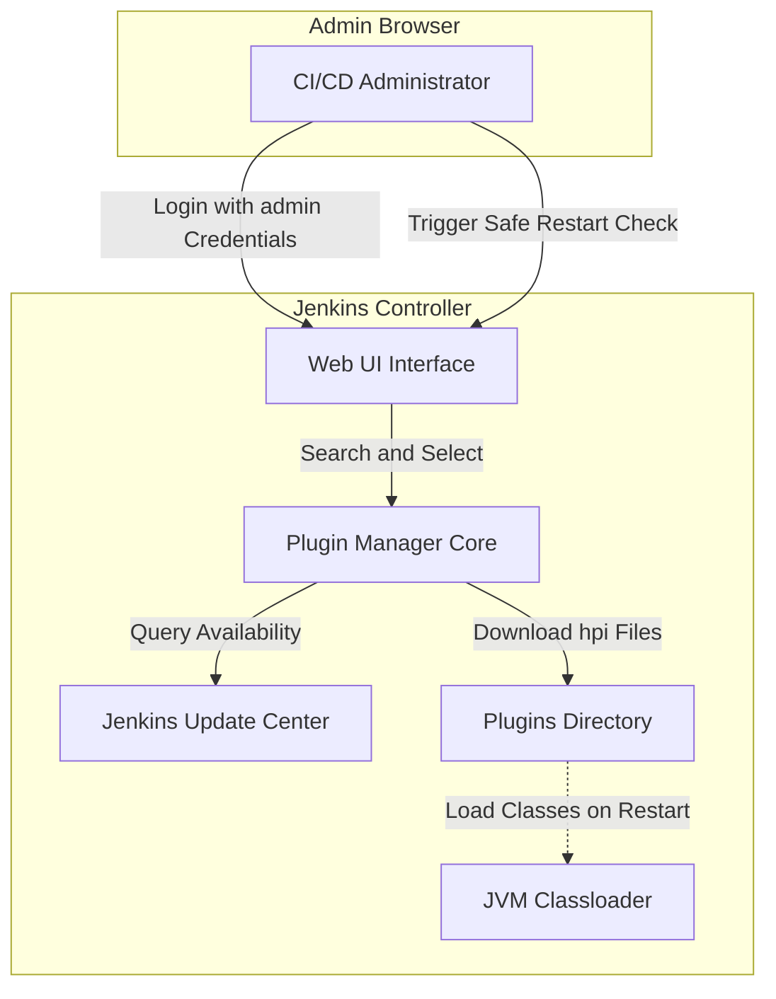

# Install Jenkins Plugins

## Technical Overview

Jenkins is a highly extensible automation server that relies on a modular plugin architecture to support diverse version control systems, build frameworks, and deployment environments. 

Managing plugins inside Jenkins involves:
1.  **Plugin Repository Sync:** Jenkins queries the configured update center (by default, the official update site) to fetch the index of all available plugins.
2.  **Dependency Resolution:** When a plugin is selected for installation (e.g., GitLab), Jenkins analyzes its manifest file to discover and schedule the download of all required transient dependencies.
3.  **Installation and Lifecycle Management:** Plugins are downloaded as `.hpi` (or `.jpi`) files into the `plugins/` directory of the Jenkins home directory (`/var/lib/jenkins/plugins`).
4.  **Graceful Restart:** To safely load and register the new classes into the JVM's classloader, the Jenkins server is restarted. Checking the safe-restart option ensures that Jenkins waits for active build jobs to finish executing before initiating the reboot.

---

## Plugin Dependency and JVM Classloader Deep Dive

### 1. Dynamic Plugin Loading & Dependencies
Each Jenkins plugin runs inside its own isolated classloader to prevent library conflicts (e.g., two different plugins requiring different versions of the same library).
*   **Transient Resolution:** If you select the `GitLab` plugin, Jenkins reads the plugin's metadata and automatically installs dependency libraries such as `credentials`, `git`, `bootstrap5-api`, etc.
*   **HPI/JPI Packages:** When download completes, a `.hpi` file is extracted. Jenkins expands this archive to expose the plugin's classes and frontend resources.

### 2. The Necessity of Safe Restarts
While some plugins can be dynamically loaded at runtime (dynamic loading), core plugins or those altering index structures require restarting the underlying Java servlet container.
*   **Safe Restart Flow:** Selecting "Restart Jenkins when installation is complete..." triggers a transition state. Jenkins stops accepting new build executor requests and waits until active pipelines reach a stable checkpoint. Once executors are idle, the servlet context reboots, loading the new bytecode into the classloader hierarchy.

---

## Infrastructure & Configuration Requirements

*   **Target Instance:** Stratos DC Jenkins Server
*   **Access Protocol:** Web Browser (HTTP) on port `8080`
*   **Target Plugins to Install:**
    *   **Git** (ID: `git`)
    *   **GitLab** (ID: `gitlab-plugin`)

### Login Credentials
*   **Username:** `admin`
*   **Password:** `Adm!n321`

---

## Step-by-Step Walkthrough

### Step 1: Log in to the Jenkins Console
Access the Jenkins dashboard landing page via your browser. Submit the administrative credentials:
*   **Username:** `admin`
*   **Password:** `Adm!n321`

---

### Step 2: Open "Manage Jenkins"
Once successfully logged in, navigate to the side panel and click on **Manage Jenkins** (represented by the gear icon):

---

### Step 3: Open the Plugin Manager
On the Manage Jenkins landing page, scroll down to the **System Configuration** section and click on **Plugins**:

---

### Step 4: Search and Select Git and GitLab
1.  In the Plugins interface, click on the **Available plugins** tab in the left-hand navigation pane.
2.  In the search bar, type `git`.
3.  From the search results, select the checkboxes for:
    *   **Git**
    *   **GitLab**
4.  Click the **Install** button at the top right of the plugin list.

---

### Step 5: Install Plugins with Restart
Jenkins will direct you to the **Download progress** page where it begins downloading the plugins and their dependencies.
1.  Check the box at the bottom: **"Restart Jenkins when installation is complete and no jobs are running"**.
2.  Wait for the download stages to complete. Jenkins will automatically initiate a safe reboot.

---

### Step 6: Verify Plugin Installation
After Jenkins completes its restart cycle, log back into the interface:
1.  Navigate back to **Manage Jenkins** -> **Plugins**.
2.  Click on the **Installed plugins** tab.
3.  Type `git` in the search bar.
4.  Confirm that **Git plugin**, **Git client plugin**, and **GitLab Plugin** are listed and enabled with a blue toggled switch.

The requested Git and GitLab integration plugins have been successfully installed and verified on the Jenkins server!
