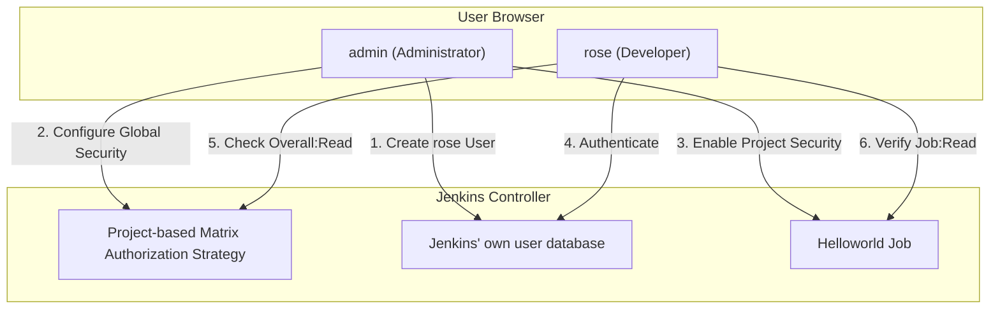

# Configure Jenkins User Access

## Technical Overview

Securing a **Jenkins** automation server requires setting up structured user credentials and granular authorization permissions. This prevents unauthorized access to pipelines, system configurations, and build nodes.

Jenkins manages user security using two primary components:
1.  **Security Realm (Authentication):** Controls *who* can access Jenkins. Typically uses Jenkins' own user database or LDAP/Active Directory.
2.  **Authorization Strategy (Permissions):** Controls *what* authenticated users can do. 

By default, Jenkins provides broad, all-or-nothing authorization strategies. Installing the **Matrix Authorization Strategy** plugin introduces fine-grained, table-based permission mapping:
*   **Matrix-based security:** Allows assigning global permissions (e.g., Read, Administer, Build) to specific users and groups.
*   **Project-based Matrix Authorization Strategy:** Inherits global permissions but adds the ability to define distinct, project-specific (per-job) permission matrices. This is essential for isolating project workspaces between different teams.

---

## Authorization Strategies & User Directories Deep Dive

### 1. Jenkins Internal User Database
When Jenkins is configured to use its own user database, it creates a directory structure under the Jenkins home folder:
*   **Location:** `/var/lib/jenkins/users/`
*   **User Folders:** Every user has a folder (e.g., `/var/lib/jenkins/users/rose_123456789/`).
*   **Config XML:** Each user folder contains a `config.xml` file which houses the user's encrypted password (using bcrypt hashing), email addresses, and personal settings.

### 2. Global vs. Project-Based Matrix Authorization
The **Matrix Authorization Strategy** plugin exposes two distinct models:
*   **Matrix-based security (Global):** A user granted `Job -> Read` here can see and read *all* jobs in the Jenkins instance.
*   **Project-based Matrix Authorization Strategy:** Global permissions are treated as baseline defaults. For individual jobs, checking the **"Enable project-based security"** box lets you explicitly define which users have access to that specific project, bypassing or extending global policies.

---

## Infrastructure & Configuration Requirements

*   **Target Instance:** Stratos DC Jenkins Server
*   **Access Protocol:** Web Browser (HTTP) on port `8080`

### Admin Login Credentials
*   **Username:** `admin`
*   **Password:** `Adm!n321`

### New User Specifications
*   **Username:** `rose`
*   **Password:** `TmPcZjtRQx`
*   **Full Name:** `Rose`

### Security Policy
*   **Authorization Strategy:** Project-based Matrix Authorization Strategy
*   **Global Permissions (rose):** `Overall -> Read` (Only)
*   **Global Permissions (Anonymous):** None (No access)
*   **Job Permissions (rose - Helloworld job):** `Job -> Read` (Only)

---

## Step-by-Step Walkthrough

### Step 1: Log in to the Jenkins Console
Navigate to the Jenkins UI in your browser and log in with the administrative credentials:
*   **Username:** `admin`
*   **Password:** `Adm!n321`

Upon successful login, you will land on the admin dashboard, where you can see the existing job `Helloworld`:

---

### Step 2: Navigate to User Settings
1.  From the left sidebar, click on **Manage Jenkins**.
2.  Scroll down to the **Security** section and click on **Users**:

---

### Step 3: Create the Rose User
1.  On the Users page, click the **+ Create User** button in the top right:

2.  Fill in the form with the specified developer credentials:
    *   **Username:** `rose`
    *   **Password:** `TmPcZjtRQx`
    *   **Confirm password:** `TmPcZjtRQx`
    *   **Full name:** `Rose`
3.  Click the blue **Create User** button at the bottom:

4.  Verify that the user `rose` has been successfully added to the user registry list:

---

### Step 4: Install the Matrix Authorization Strategy Plugin
1.  Go back to **Manage Jenkins** and click on **Plugins** under *System Configuration* section:

2.  Click on the **Available plugins** tab on the left.
3.  In the search bar, type `Matrix Authorization`.
4.  Check the box next to **Matrix Authorization Strategy**.
5.  Click the **Install** button.
6.  Once installation is complete, check the option: **"Restart Jenkins when installation is complete and no jobs are running"**:

7.  Wait for Jenkins to initiate its shutdown and restart cycle. Do not close or refresh the page until the login screen reappears:

---

### Step 5: Configure Global Security Strategy
1.  Log back into the dashboard as `admin` (`Adm!n321`).
2.  Navigate to **Manage Jenkins** -> **Security**:

3.  Scroll down to the **Authorization** section.
4.  Change the strategy option from the default selection to **Project-based Matrix Authorization Strategy** (or **Matrix-based security** depending on the installed version representation).
5.  Click **Add user** to add the user entry for `rose`.
6.  For the `rose` user row, check **Overall -> Read** permission. Make sure all other checkboxes in the row remain unchecked:

7.  Verify that:
    *   `admin` user retains the **Overall -> Administer** permission checked (giving them implied access to everything).
    *   `rose` user has **Overall -> Read** checked.
    *   `Anonymous` has all permissions unchecked.
8.  Click the **Save** button:

---

### Step 6: Configure Project-Level Permissions
1.  Go back to the main dashboard.
2.  Click on the existing job **Helloworld**.
3.  Click on **Configure** in the left-hand navigation pane.
4.  In the configuration page, scroll down and check the box **Enable project-based security**.
5.  Click **Add user** and enter `rose`.
6.  In the permissions grid for `rose`, check the **Job -> Read** box. Keep all other checkboxes (such as Build, SCM, workspace, etc.) unchecked.
7.  Click **Save**.

---

### Step 7: Verify Access permissions
1.  Click the user profile icon at the top right and select **Log out**.
2.  Log in as user `rose` with password `TmPcZjtRQx`:

3.  Confirm that the dashboard loads. The `Helloworld` job is listed, but the sidebar options are restricted (no administrative gear icons or configuration logs are shown):

4.  Click on the `Helloworld` job. Verify that `rose` can only view the status and changes. They cannot trigger new builds ("Build Now" is missing) or adjust configurations ("Configure" is missing):

5.  Log out and log back in as `admin`. Access the `Helloworld` job to verify that the administrator has full action privileges, including triggering manual builds:

The project authorization policy is now successfully configured!
