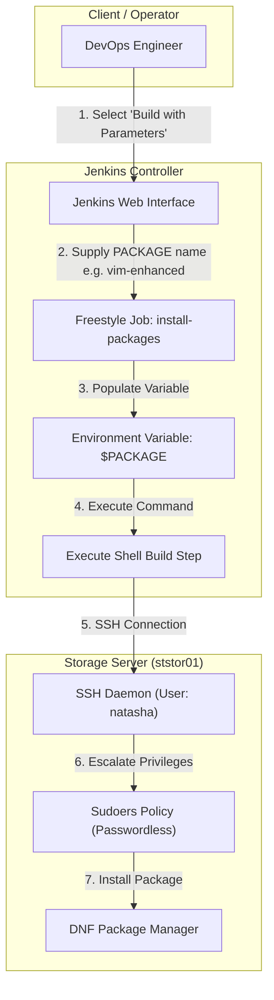

# Configure Jenkins Job for Package Installation

## Technical Overview

Automating package installations across target infrastructure nodes is a core capability of Continuous Integration and Continuous Deployment (CI/CD) pipelines. **Jenkins** enables infrastructure engineers to execute remote maintenance and deployment tasks securely via parameterized **Freestyle Projects**.

By configuring parameterized jobs, users can specify dynamic variables (such as package names or application versions) at runtime without editing the job's underlying build script configuration.

This implementation involves:
1.  **Parameterized Job Setup:** Exposing a `PACKAGE` string parameter in the Jenkins user interface.
2.  **Non-Interactive Remote Execution:** Using standard SSH (`ssh -o StrictHostKeyChecking=no`) to open an automated remote shell session on the Storage Server (`ststor01`).
3.  **Privileged Execution:** Running system package manager tools (`sudo dnf install -y $PACKAGE`) on the target host non-interactively.



---

## Parameterization & Remote Execution Deep Dive

### 1. Parameterized Build Mechanisms in Jenkins
When the **"This project is parameterized"** option is enabled in a Jenkins Freestyle project:
*   Jenkins converts all configured build parameters into standard process environment variables during execution.
*   A parameter named `PACKAGE` becomes available inside the build container/shell execution context as `$PACKAGE`.
*   This decouples execution logic from variable values, making jobs reusable across different software packages and server target fleets.

### 2. Passwordless & Non-Interactive SSH Operations
Remote execution requires non-interactive shell commands:
*   **Disabling Host Key Prompt (`StrictHostKeyChecking=no`):** Prevents the SSH client from hanging indefinitely waiting for an interactive user confirmation when encountering a new host fingerprint.
*   **Remote Command Wrapper (`ssh user@host "command"`):** Passes the remote command string directly to the target server's SSH daemon for execution, returning standard output and error streams back to Jenkins.
*   **Automatic Sudo Access:** The remote user (`natasha`) must have non-interactive passwordless `sudo` privileges configured in `/etc/sudoers` on `ststor01` (`natasha ALL=(ALL) NOPASSWD: ALL`).

---

## Infrastructure & Configuration Requirements

*   **Jenkins Controller Access:** Web Browser (HTTP) on port `8080`
*   **Admin Credentials:** `admin` / `Adm!n321`

### Target Node Specifications
*   **Storage Server Hostname:** `ststor01`
*   **SSH Remote User:** `natasha`
*   **Target Operating System:** Red Hat Enterprise Linux / CentOS Stream / Fedora (DNF-based)

### Jenkins Job Specifications
*   **Job Type:** Freestyle Project
*   **Job Name:** `install-packages`
*   **Parameter Type:** String Parameter
*   **Parameter Name:** `PACKAGE`
*   **Parameter Description:** `package to install`
*   **Build Step Type:** Execute shell
*   **Execution Command:** `ssh -o StrictHostKeyChecking=no natasha@ststor01 "sudo dnf install -y $PACKAGE"`

---

## Step-by-Step Walkthrough

### Step 1: Log in to the Jenkins Console
1. Open your web browser and navigate to the Jenkins login page.
2. Sign in using the administrative credentials:
   * **Username:** `admin`
   * **Password:** `Adm!n321`


---

### Step 2: Create the `install-packages` Freestyle Job
1. From the Jenkins dashboard sidebar, click **New Item**.
2. Enter the item name: `install-packages`.
3. Select **Freestyle project** as the item type.
4. Click **OK** to proceed to the configuration page.


---

### Step 3: Configure Build Parameters
1. Under the **General** section, check the box for **This project is parameterized**.
2. Click **Add Parameter** and select **String Parameter** from the dropdown menu.
3. Configure the parameter fields as follows:
   * **Name:** `PACKAGE`
   * **Default Value:** *(Leave empty or set default)*
   * **Description:** `package to install`


---

### Step 4: Configure Remote Shell Execution Build Step
1. Scroll down to the **Build Steps** section.
2. Click **Add build step** and select **Execute shell**.
3. In the **Command** text area, enter the remote SSH package installation command:
   ```bash
   ssh -o StrictHostKeyChecking=no natasha@ststor01 "sudo dnf install -y $PACKAGE"
   ```
4. Click **Save** to persist the job configuration.


---

### Step 5: Execute Parameterized Job Build
1. From the left sidebar of the `install-packages` project page, click **Build with Parameters**.
2. Under the **PACKAGE** field, enter the target package name to install (e.g., `vim-enhanced`).
3. Click the green **Build** button.


---

### Step 6: Monitor Execution Status
1. Observe the **Build History** panel on the left sidebar.
2. Build `#1` will start executing:


3. Once the remote installation command completes, a green checkmark will appear indicating a successful build (`SUCCESS`):


---

### Step 7: Inspect Console Output & Verify Installation
1. Click on build `#1` and select **Console Output** from the left menu.
2. Verify that:
   * The process launched `/bin/sh` executing the SSH command.
   * SSH connected to host `ststor01` as user `natasha`.
   * DNF downloaded and installed `vim-enhanced` along with its dependencies (`gpm-libs`, `vim-common`, `vim-filesystem`).
   * The command finished with status `Finished: SUCCESS`.


The Jenkins package installation job is now fully configured and verified!
