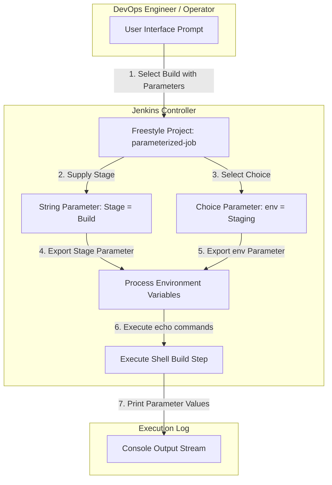

# Configure Jenkins Parameterized Job

## Technical Overview

Continuous Integration pipelines frequently require dynamic inputs—such as target deployment environments, release tags, or feature flags—without modifying the job's underlying script configuration. **Jenkins** supports this through **Parameterized Builds**, allowing users to prompt operators for custom inputs at runtime.

When a build is parameterized:
1.  **Input Collection:** Jenkins prompts the user with customized input UI controls (text boxes, drop-down menus, checkboxes) before scheduling the build.
2.  **Environment Variable Injection:** Jenkins injects each parameter key-value pair as an environment variable into the job's execution runtime process context.
3.  **Shell Execution:** Shell build steps can dereference these parameters directly (e.g., `$Stage`, `$env`) to dynamically route execution logic.



---

## Parameterized Build Fundamentals Deep Dive

### 1. Parameter Types in Jenkins
Jenkins provides various parameter types to handle different categories of inputs:
*   **String Parameter:** A single-line text input field. Ideal for arbitrary text strings, branch names, or version tags. Can include an optional default value.
*   **Choice Parameter:** A drop-down selection menu defined by listing choices one per line. Ensures operators only choose from a predefined, safe list of valid values (e.g., `Development`, `Staging`, `Production`).
*   **Boolean Parameter:** A checkbox returning `true` or `false`.
*   **Credentials Parameter:** Securely passes managed secrets or tokens into build execution.

### 2. Environment Variable Resolution
When Jenkins launches the build subprocess (`/bin/sh -xe`), parameter values are exported into the shell environment:
*   In Unix/Linux environments, parameter names are accessed using dollar-sign variable expansion (`$Stage`, `$env` or `${Stage}`, `${env}`).
*   Case sensitivity is maintained based on the exact parameter name specified in the job configuration.

---

## Infrastructure & Configuration Requirements

*   **Jenkins Controller Access:** Web Browser (HTTP) on port `8080`
*   **Admin Credentials:** `admin` / `Adm!n321`

### Jenkins Job Specifications
*   **Job Type:** Freestyle Project
*   **Job Name:** `parameterized-job`

#### Parameter 1: String Parameter
*   **Name:** `Stage`
*   **Default Value:** `Build`

#### Parameter 2: Choice Parameter
*   **Name:** `env`
*   **Choices:**
    *   `Development`
    *   `Staging`
    *   `Production`

#### Build Step Configuration
*   **Type:** Execute shell
*   **Shell Script Command:**
    ```bash
    echo "stage" $Stage
    echo "env" $env
    ```

#### Verification Execution Requirements
*   **Selected Choice for `env`:** `Staging`

---

## Step-by-Step Walkthrough

### Step 1: Log in to the Jenkins Console
1. Open your web browser and navigate to the Jenkins login page.
2. Sign in using the administrative credentials:
   * **Username:** `admin`
   * **Password:** `Adm!n321`


---

### Step 2: Create the `parameterized-job` Freestyle Project
1. From the left sidebar, click **New Item** (or click **Create a job**).
2. Enter the item name: `parameterized-job`.
3. Select **Freestyle project**.
4. Click **OK**.


---

### Step 3: Configure Job Parameters
1. Under the **General** tab, check the box for **This project is parameterized**.
2. Click **Add Parameter** and choose **String Parameter**:
   * **Name:** `Stage`
   * **Default Value:** `Build`
3. Click **Add Parameter** again and choose **Choice Parameter**:
   * **Name:** `env`
   * **Choices:** Enter the following options, each on a new line:
     ```text
     Development
     Staging
     Production
     ```


---

### Step 4: Configure Execute Shell Build Step
1. Scroll down to the **Build Steps** section.
2. Click **Add build step** and select **Execute shell**.
3. In the **Command** field, enter the shell commands to print the parameter variables:
   ```bash
   echo "stage" $Stage
   echo "env" $env
   ```
4. Click **Save** to persist the configuration.


---

### Step 5: Execute Job with Parameters
1. From the sidebar of the `parameterized-job` project page, click **Build with Parameters**.
2. Verify that **Stage** contains the default value `Build`.
3. From the **env** drop-down menu, select `Staging`.
4. Click the green **Build** button.


---

### Step 6: Monitor Execution Status
1. Observe the **Build History** panel on the left sidebar.
2. Build `#1` will execute and complete successfully, marked with a green checkmark icon (`SUCCESS`):


---

### Step 7: Inspect Console Output & Verify Parameters
1. Click on build `#1` and select **Console Output**.
2. Verify the execution log:
   * The process executed the generated `/bin/sh` script.
   * `+ echo stage Build` printed `stage Build`.
   * `+ echo env Staging` printed `env Staging`.
   * The build finished with status `Finished: SUCCESS`.


The Jenkins parameterized job has been successfully configured and verified!
