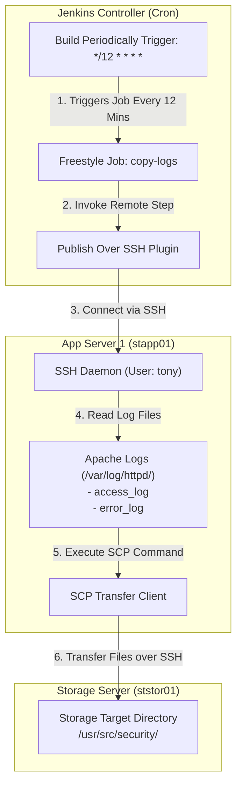

# Schedule Jenkins Job to Copy Apache Logs Periodically

## Technical Overview

Log collection and periodic archiving are crucial components of automated security operations and infrastructure observability. In a multi-tier enterprise architecture, web servers continuously generate access and error logs that must be routinely copied to central storage nodes for auditing and analysis.

**Jenkins** provides native cron-style scheduling capabilities via **Build Periodically** triggers, allowing infrastructure engineers to automate recurring operational jobs without manual intervention.

This task implements:
1.  **Periodic Cron Trigger:** Scheduling job execution every 12 minutes (`*/12 * * * *`).
2.  **SSH Server Agent Integration:** Configuring the **Publish Over SSH** plugin to establish secure remote management sessions on App Server 1 (`stapp01`).
3.  **Cross-Server Log Transfer:** Executing non-interactive Secure Copy (`scp`) commands to transfer Apache logs (`access_log` and `error_log`) from `/var/log/httpd/` on `stapp01` to `/usr/src/security/` on the Storage Server (`ststor01`).



---

## Cron Scheduling & Remote Transfer Deep Dive

### 1. Cron Schedule Syntax in Jenkins
Jenkins uses a standard 5-field cron syntax (`MINUTE HOUR DOM MONTH DOW`) with enhanced syntax helpers:
*   `*/12 * * * *`: Evaluates to "execute every 12 minutes of every hour, every day of the month, every month, every day of the week".
*   Jenkins parses cron expressions against system local time and automatically schedules future builds into the execution queue.

### 2. Remote Orchestration via Publish Over SSH
The **Publish Over SSH** plugin enables Jenkins to interact with remote servers without installing dedicated Jenkins build agents:
*   **Global SSH Registry:** Remote target servers are defined in **Manage Jenkins** -> **System** under *Publish Over SSH* (specifying hostname, SSH port, username, and authentication passphrases or keys).
*   **Remote Build Action:** The job delegates execution steps to the configured SSH target, running remote commands natively on the destination host.

---

## Infrastructure & Configuration Requirements

*   **Jenkins Controller Access:** Web Browser (HTTP) on port `8080`
*   **Admin Credentials:** `admin` / `Adm!n321`

### Server Credentials & Hosts
*   **App Server 1 Hostname:** `stapp01`
*   **App Server 1 SSH User:** `tony`
*   **Storage Server Hostname:** `ststor01`
*   **Storage Server SSH User:** `natasha`

### File Transfer Specifications
*   **Source Log Files on `stapp01`:** `/var/log/httpd/access_log`, `/var/log/httpd/error_log`
*   **Target Destination Directory on `ststor01`:** `/usr/src/security/`

### Jenkins Job Specifications
*   **Job Name:** `copy-logs`
*   **Job Type:** Freestyle Project
*   **Build Trigger:** Build Periodically (`*/12 * * * *`)
*   **Required Plugin:** `Publish Over SSH`
*   **Execution Command:**
    ```bash
    scp -o StrictHostKeyChecking=no /var/log/httpd/access_log /var/log/httpd/error_log natasha@ststor01:/usr/src/security/
    ```

---

## Step-by-Step Walkthrough

### Step 0: Configure Passwordless SSH Authentication on App Server 1 (`stapp01`)
Before configuring the Jenkins job, establish non-interactive passwordless SSH authentication from `stapp01` to `ststor01` so that the automated `scp` command can execute without password prompts:

1. **Connect to App Server 1 (`stapp01`) via SSH:**
   ```bash
   ssh tony@stapp01
   # Enter password for tony (e.g. Ir0nMan)
   ```

2. **Generate an SSH Key Pair for `tony` (if not already generated):**
   ```bash
   ssh-keygen -t rsa -N "" -f ~/.ssh/id_rsa
   ```

3. **Copy the Public Key to `ststor01` (`natasha` user):**
   ```bash
   ssh-copy-id natasha@ststor01
   # Enter password for natasha (e.g. Am3r!ca)
   ```

4. **Verify Non-Interactive Remote Directory Access & Test SCP:**
   ```bash
   # Test passwordless SSH connectivity
   ssh -o StrictHostKeyChecking=no natasha@ststor01 "mkdir -p /usr/src/security/"

   # Test manual SCP transfer from stapp01 to ststor01
   scp -o StrictHostKeyChecking=no /var/log/httpd/access_log /var/log/httpd/error_log natasha@ststor01:/usr/src/security/
   ```

---

### Step 1: Log in to the Jenkins Console
1. Open your web browser and navigate to the Jenkins login page.
2. Sign in using the administrative credentials:
   * **Username:** `admin`
   * **Password:** `Adm!n321`


---

### Step 2: Access the Dashboard
Upon signing in, verify access to the Jenkins welcome landing page:


---

### Step 3: Create the `copy-logs` Freestyle Project
1. Click **New Item** on the left menu (or **Create a job**).
2. Enter `copy-logs` as the item name.
3. Select **Freestyle project**.
4. Click **OK**.


---

### Step 4: Configure Periodic Build Schedule
1. In the job configuration page, navigate to the **Triggers** tab.
2. Check the box for **Build periodically**.
3. In the **Schedule** text area, enter the cron expression:
   ```text
   */12 * * * *
   ```


---

### Step 5: Install the Publish Over SSH Plugin
1. Open a new tab or navigate to **Manage Jenkins** -> **Plugins**.
2. Go to the **Available plugins** tab and search for `Publish Over SSH`.
3. Check the box next to **Publish Over SSH** and click **Install**.


4. On the installation progress page, check **Restart Jenkins when installation is complete and no jobs are running**.
5. Wait for Jenkins to reboot and refresh the login screen.


---

### Step 6: Access Global System Configuration
1. Log back in as `admin`.
2. Go to **Manage Jenkins** -> **System** (under *System Configuration*).


---

### Step 7: Configure SSH Server Node for `stapp01`
1. Scroll down to the **Publish over SSH** section.
2. Under **SSH Servers**, click **Add** and configure the remote server details:
   * **Name:** `stapp01`
   * **Hostname:** `stapp01`
   * **Username:** `tony`
   * **Remote Directory:** *(Leave blank or set root)*
3. Click **Advanced...**, check **Use password authentication, or use a different key**, and enter `tony`'s password.
4. Click **Save**.


---

### Step 8: Configure Remote SCP Command in Job Build Steps
1. Return to the `copy-logs` job configuration page (`/job/copy-logs/configure`).
2. Go to the **Build Steps** tab.
3. Click **Add build step** and choose **Send files or execute commands over SSH**.
4. Under **SSH Publishers**, select `stapp01` from the **SSH Server Name** dropdown.
5. Under **Exec command**, enter the SCP command to copy Apache access and error logs to the storage server:
   ```bash
   scp -o StrictHostKeyChecking=no /var/log/httpd/access_log /var/log/httpd/error_log natasha@ststor01:/usr/src/security/
   ```
6. Click **Save**.


---

### Step 9: Execute Build & Verify Log Copy Operation
1. From the left sidebar of the `copy-logs` project page, click **Build Now** to trigger an immediate test build.
2. Check the **Build History** panel. Build `#12` and `#13` will execute and complete successfully (marked with green checkmark icons):


3. Verify that the build status displays a green checkmark indicating successful execution of the SCP transfer command across the nodes:


The `copy-logs` job is now fully scheduled to run every 12 minutes and successfully transfers the Apache logs!
