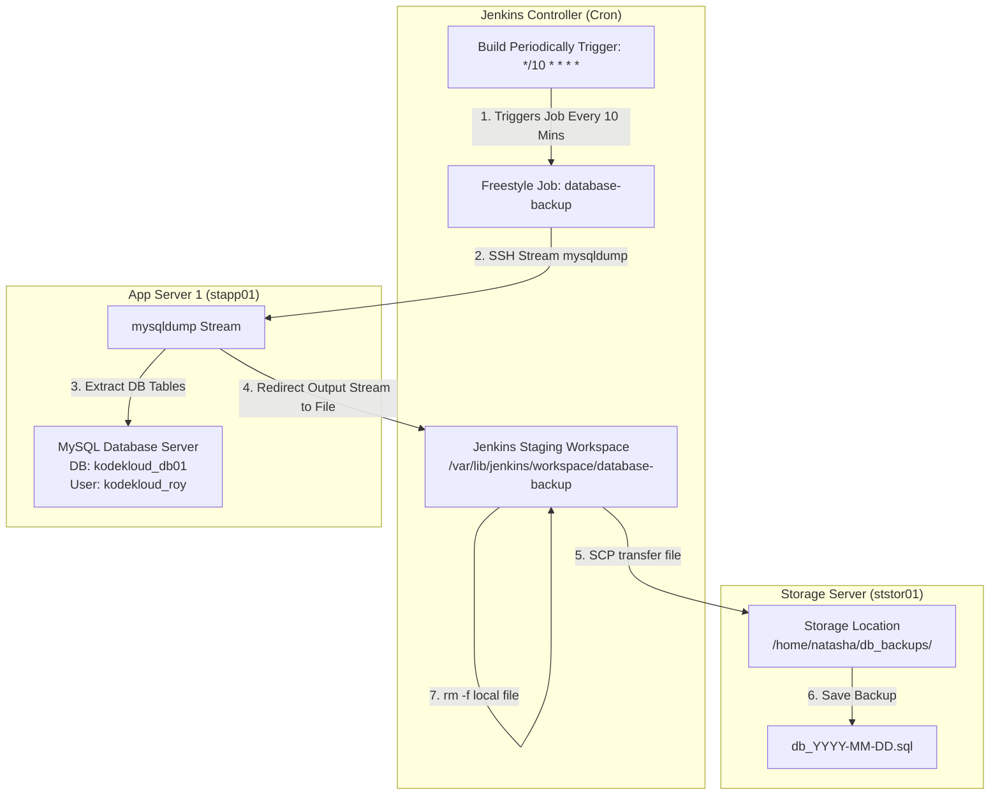

# Configure Jenkins Job for Database Backup

## Technical Overview

Database backups are a vital disaster-recovery requirement for production systems. In containerized or multi-tier infrastructure environments, database instances often run on dedicated application nodes or database servers, while long-term backups must be archived on centralized storage nodes.

This challenge configures an automated, periodic database backup pipeline using **Jenkins**:
1.  **Periodic Trigger:** Scheduling the build to run every 10 minutes (`*/10 * * * *`).
2.  **Remote Database Extraction:** Invoking `mysqldump` over an SSH connection to stream a database dump of `kodekloud_db01` directly from App Server 1 (`stapp01`).
3.  **Dynamic Filename Generation:** Formatting the SQL dump using current date resolution (`db_$(date +%F).sql` e.g. `db_2026-07-28.sql`).
4.  **Remote Storage Transfer:** Copying the backup file via `scp` to Storage Server (`ststor01`) under `/home/natasha/db_backups/`.
5.  **Workspace Cleanup:** Removing the local staging SQL file from the Jenkins workspace to prevent disk space exhaustion.



---

## Database Backup Automation Deep Dive

### 1. Non-Interactive `mysqldump` over SSH
`mysqldump` creates a logical backup of a MySQL/MariaDB database by emitting SQL statements required to rebuild tables and insert data:
*   Passing `-u kodekloud_roy -pasdfgdsd` directly in the command avoids interactive password prompts during automated batch runs.
*   Wrapping `mysqldump` inside an `ssh` invocation streams the SQL stdout output over the SSH tunnel into a local file on the Jenkins workspace:
    ```bash
    ssh -o StrictHostKeyChecking=no stapp01 "mysqldump -u kodekloud_roy -pasdfgdsd kodekloud_db01" > "db_$(date +%F).sql"
    ```

### 2. ISO Date Formatting (`date +%F`)
The Linux command `date +%F` outputs the current date in standard ISO-8601 format (`YYYY-MM-DD`). Constructing the filename as `db_$(date +%F).sql` guarantees predictable, chronological naming for daily backup archives (e.g., `db_2026-07-28.sql`).

---

## Infrastructure & Configuration Requirements

*   **Jenkins Controller Access:** Web Browser (HTTP) on port `8080`
*   **Admin Credentials:** `admin` / `Adm!n321`

### Remote Host Credentials
*   **App Server 1 Hostname:** `stapp01`
*   **App Server SSH User:** `tony`
*   **Database Name:** `kodekloud_db01`
*   **Database User:** `kodekloud_roy`
*   **Database Password:** `asdfgdsd`
*   **Storage Server Hostname:** `ststor01`
*   **Storage Server SSH User:** `natasha`
*   **Storage Destination Directory:** `/home/natasha/db_backups/`

### Jenkins Job Specifications
*   **Job Name:** `database-backup`
*   **Job Type:** Freestyle Project
*   **Build Trigger:** Build Periodically (`*/10 * * * *`)
*   **Build Step Type:** Execute shell

#### Execute Shell Script Configuration
```bash
#!/bin/bash
# Define the backup filename using the current date
DUMP_FILE="db_$(date +%F).sql"

# Stream the database dump from App Server (stapp01) to Jenkins workspace
ssh -o StrictHostKeyChecking=no stapp01 "mysqldump -u kodekloud_roy -pasdfgdsd kodekloud_db01" > "${DUMP_FILE}"

# Securely copy the dump from Jenkins workspace to Storage Server (ststor01)
scp -o StrictHostKeyChecking=no "${DUMP_FILE}" ststor01:/home/natasha/db_backups/

# Clean up the local workspace staging file
rm -f "${DUMP_FILE}"
```

---

## Step-by-Step Walkthrough

### Step 0: Pre-configure SSH Keys and Destination Directories
Before running the Jenkins build, verify passwordless SSH keys and directory structure across the servers:

1. **Verify or create destination directory on `ststor01`:**
   ```bash
   ssh natasha@ststor01 "mkdir -p /home/natasha/db_backups/"
   ```

2. **Verify Passwordless SSH key authentication from Jenkins controller to `stapp01` and `ststor01`:**
   ```bash
   ssh -o StrictHostKeyChecking=no stapp01 "hostname"
   ssh -o StrictHostKeyChecking=no ststor01 "hostname"
   ```

---

### Step 1: Log in to the Jenkins Console
1. Open your web browser and navigate to the Jenkins login page.
2. Sign in using the administrative credentials:
   * **Username:** `admin`
   * **Password:** `Adm!n321`


---

### Step 2: Access the Dashboard
Upon signing in, verify access to the Jenkins welcome landing page:


---

### Step 3: Create the `database-backup` Freestyle Project
1. Click **New Item** on the left menu (or **Create a job**).
2. Enter `database-backup` as the item name.
3. Select **Freestyle project**.
4. Click **OK**.


---

### Step 4: Configure Periodic Cron Schedule
1. In the job configuration page, navigate to the **Triggers** tab.
2. Check the box for **Build periodically**.
3. In the **Schedule** text field, enter the exact schedule format:
   ```text
   */10 * * * *
   ```


---

### Step 5: Configure Execute Shell Build Step
1. Scroll down to the **Build Steps** section.
2. Click **Add build step** and choose **Execute shell**.
3. In the **Command** text area, paste the bash script:
   ```bash
   #!/bin/bash
   # Define the backup filename using the current date
   DUMP_FILE="db_$(date +%F).sql"

   # Stream the database dump from App Server (stapp01) to Jenkins workspace
   ssh -o StrictHostKeyChecking=no stapp01 "mysqldump -u kodekloud_roy -pasdfgdsd kodekloud_db01" > "${DUMP_FILE}"

   # Securely copy the dump from Jenkins workspace to Storage Server (ststor01)
   scp -o StrictHostKeyChecking=no "${DUMP_FILE}" ststor01:/home/natasha/db_backups/

   # Clean up the local workspace staging file
   rm -f "${DUMP_FILE}"
   ```
4. Click **Save**.


---

### Step 6: Verify Console Output
1. Click **Build Now** to trigger an immediate build.
2. Select the latest build number from **Build History** and click **Console Output**.
3. Confirm that the shell script executed cleanly and returned `Finished: SUCCESS`:


---

### Step 7: Verify Backup File Existence on Storage Server
1. Open a terminal session and SSH into the Storage Server (`ststor01`):
   ```bash
   ssh natasha@ststor01
   cd /home/natasha/db_backups/
   ls -la
   ```
2. Confirm the presence of the backup file matching the current date format (`db_2026-07-28.sql`):


The Jenkins database backup pipeline is now fully operational and configured to run automatically every 10 minutes!
