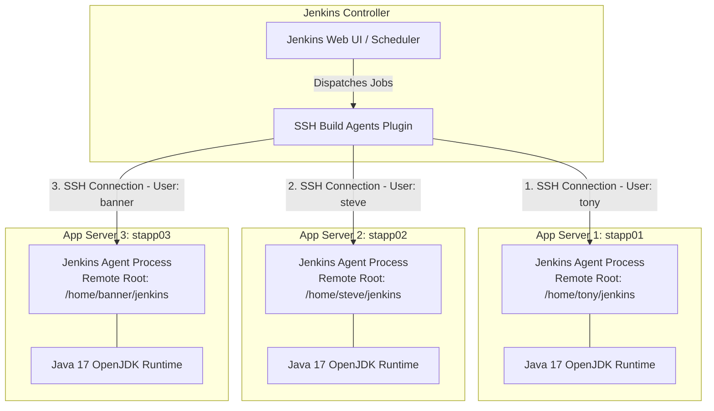

# Add Jenkins SSH Build Agent Nodes

## Technical Overview

As software projects grow in complexity and scale, executing all continuous integration builds on a single Jenkins controller node creates CPU, memory, and disk bottlenecks. To achieve horizontal scalability and workload isolation, Jenkins supports a **Distributed Build Architecture** using **Agent Nodes** (formerly known as Slaves).

In this architecture:
1.  **Jenkins Controller (Master):** Handles the web UI, parses job configurations, schedules builds, and dispatches build tasks to remote agent nodes.
2.  **SSH Build Agents:** Remote Linux machines attached to the controller via SSH. The controller launches a Java remoting process (`slave.jar` / `agent.jar`) on the agent over an SSH channel.
3.  **Java 17 Runtime Prerequisite:** Modern Jenkins controllers and agent remoting protocols require **Java 17 OpenJDK** installed on every target agent server to initialize the agent JVM runtime.
4.  **Label-Based Scheduling:** Labels assigned to each node (`stapp01`, `stapp02`, `stapp03`) allow pipeline jobs to target specific application environments or infrastructure types.



---

## Distributed Agent Architecture Deep Dive

### 1. SSH Agent Launch Protocol
When a node configured with the **Launch agents via SSH** method is initialized:
*   The Jenkins controller connects to the remote host over TCP port `22` using SSH credentials.
*   The controller automatically uploads or verifies the `remoting.jar` binary inside the node's **Remote root directory**.
*   The controller executes `java -jar remoting.jar` on the remote host, establishing a bidirectional channel between controller and agent.

### 2. Java 17 Dependency
Jenkins version `2.357+` requires Java 17 for both controller and agent remoting processes. If Java 17 is missing on the remote agent node, the SSH connection attempt will fail with `java: command not found` or Java version mismatch errors.

### 3. Remote Working Directory Isolation
Each agent node defines an isolated workspace root:
*   `App_server_1`: `/home/tony/jenkins`
*   `App_server_2`: `/home/steve/jenkins`
*   `App_server_3`: `/home/banner/jenkins`

All build checkouts, temporary artifacts, and workspace files for jobs assigned to a specific node are scoped within its designated root directory.

---

## Infrastructure & Configuration Requirements

*   **Jenkins Controller Access:** Web Browser (HTTP) on port `8080`
*   **Admin Credentials:** `admin` / `Adm!n321`
*   **Required Plugin:** `SSH Build Agents`

### Agent Node Specifications Matrix

| Node Name | Hostname / IP | Label | Remote Root Directory | SSH Username | SSH Password |
| :--- | :--- | :--- | :--- | :--- | :--- |
| `App_server_1` | `stapp01` | `stapp01` | `/home/tony/jenkins` | `tony` | `Ir0nMan` |
| `App_server_2` | `stapp02` | `stapp02` | `/home/steve/jenkins` | `steve` | `Am3r!ca` |
| `App_server_3` | `stapp03` | `stapp03` | `/home/banner/jenkins` | `banner` | `BigBanner` |

---

## Step-by-Step Walkthrough

### Step 0: Install Java 17 OpenJDK on Each Application Server
Before adding the nodes in Jenkins UI, install **Java 17 OpenJDK** on `stapp01`, `stapp02`, and `stapp03` so the Jenkins agent remoting process can execute successfully:

1. **Install Java 17 on App Server 1 (`stapp01`):**
   ```bash
   ssh tony@stapp01
   sudo dnf install -y java-17-openjdk-devel
   java -version
   ```

2. **Install Java 17 on App Server 2 (`stapp02`):**
   ```bash
   ssh steve@stapp02
   sudo dnf install -y java-17-openjdk-devel
   java -version
   ```

3. **Install Java 17 on App Server 3 (`stapp03`):**
   ```bash
   ssh banner@stapp03
   sudo dnf install -y java-17-openjdk-devel
   java -version
   ```

---

### Step 1: Log in to the Jenkins Console
1. Open your browser and navigate to the Jenkins login interface.
2. Sign in using the administrative credentials:
   * **Username:** `admin`
   * **Password:** `Adm!n321`


---

### Step 2: Access the Dashboard
Upon successful authentication, verify access to the main landing page:


---

### Step 3: Open Manage Jenkins
From the left navigation sidebar, click **Manage Jenkins**:


---

### Step 4: Install the SSH Build Agents Plugin
1. Under *System Configuration*, click **Plugins**.
2. Go to the **Available plugins** tab and search for `ssh build agents`.
3. Select **SSH Build Agents** and click **Install**.


---

### Step 5: Complete Installation and Restart Jenkins
1. On the plugin installation progress page, check **Restart Jenkins when installation is complete and no jobs are running**.
2. Wait for Jenkins to reboot and refresh the login session.


---

### Step 6: Navigate to Nodes Management
1. Log back in as `admin`.
2. Go to **Manage Jenkins** -> **Nodes** (under *System Configuration*).


---

### Step 7: Nodes Overview Landing Page
View the Nodes overview list showing the default `Built-In Node`. Click **+ New Node**:


---

### Step 8: Configure `App_server_1` Node Settings
1. Click **+ New Node**.
2. Enter Node name: `App_server_1`.
3. Select **Permanent Agent** and click **Create**.
4. Configure node properties:
   * **Number of executors:** `1`
   * **Remote root directory:** `/home/tony/jenkins`
   * **Labels:** `stapp01`
   * **Usage:** `Use this node as much as possible`


---

### Step 9: Select Launch Method via SSH
1. In the **Launch method** dropdown, select **Launch agents via SSH**.
2. Set **Host:** `stapp01`.
3. Next to **Credentials**, click **+ Add** and select **Jenkins**.


---

### Step 10: Add SSH User Credentials for `tony`
1. In the **Add Credentials** modal, choose **Username with password**.
2. Enter credential parameters:
   * **Username:** `tony`
   * **Password:** `Ir0nMan`
3. Click **Create**.


---

### Step 11: Set Host Key Verification Strategy and Save
1. In the **Credentials** dropdown, select `tony/******`.
2. Set **Host Key Verification Strategy:** `Non verifying Verification Strategy`.
3. Set **Availability:** `Keep this agent online as much as possible`.
4. Click **Save**.


---

### Step 12: Node Listing Updated
`App_server_1` is added to the Nodes list and starts launching the agent connection:


---

### Step 13: Launch Agent Connection Process
Click on `App_server_1` to monitor the SSH launch sequence and JVM initialization:


---

### Step 14: `App_server_1` Online and Synchronized
Verify that `App_server_1` establishes the remoting connection and displays online status (`In sync`):


---

### Step 15: Configure `App_server_2` and `App_server_3` & Verify All Nodes Online
Repeat Steps 8–11 for the remaining two servers:

#### For `App_server_2`:
* **Node Name:** `App_server_2`
* **Remote root directory:** `/home/steve/jenkins`
* **Labels:** `stapp02`
* **Host:** `stapp02`
* **Credentials:** Username `steve` / Password `Am3r!ca`

#### For `App_server_3`:
* **Node Name:** `App_server_3`
* **Remote root directory:** `/home/banner/jenkins`
* **Labels:** `stapp03`
* **Host:** `stapp03`
* **Credentials:** Username `banner` / Password `BigBanner`

Confirm that all three agent nodes (`App_server_1`, `App_server_2`, `App_server_3`) are connected, synchronized, and online:


All three App Server SSH agent nodes are now successfully added, verified online, and ready for distributed job execution!
