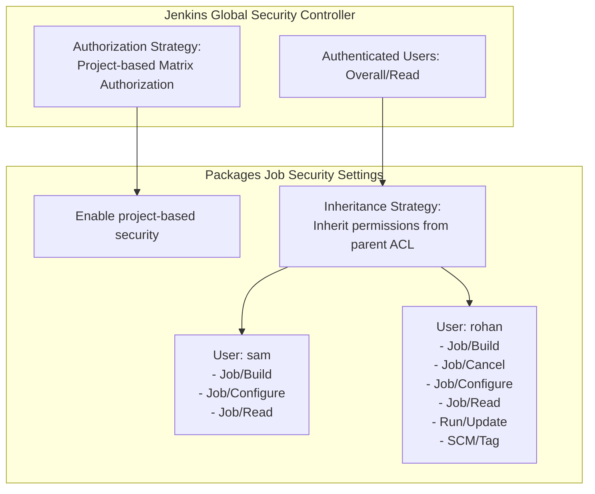

# Configure Job-Level Authorization Strategy in Jenkins

## Technical Overview

Enterprise CI/CD infrastructure requires fine-grained **Role-Based Access Control (RBAC)** to ensure that developers, operators, and automated systems only possess access rights necessary for their responsibilities (**Principle of Least Privilege**).

While global security strategies control system-wide features, Jenkins supports item-level entitlement management via the **Matrix Authorization Strategy Plugin**. This allows administrators to override or extend global ACLs on individual jobs.

This challenge configures per-job security for an existing job named `Packages`:
1.  **Global Authorization Enablement:** Setting the global strategy to **Project-based Matrix Authorization Strategy**.
2.  **Inheritance Strategy:** Selecting **Inherit permissions from parent ACL** so top-level security controls remain active while applying custom per-job rules.
3.  **Targeted User Entitlements:**
    *   **User `sam`:** Granted `Job/Build`, `Job/Configure`, and `Job/Read` permissions.
    *   **User `rohan`:** Granted `Job/Build`, `Job/Cancel`, `Job/Configure`, `Job/Read`, `Run/Update`, and `SCM/Tag` permissions.



---

## Authorization & Security Deep Dive

### 1. Project-Based Matrix Authorization
Unlike basic security models where all authenticated users share global permissions, the **Project-based Matrix Authorization Strategy** exposes an Access Control List (ACL) configuration table on individual job configuration pages.

### 2. Inheritance Strategies
When enabling job-level security, Jenkins provides three inheritance strategies:
*   **Inherit permissions from parent ACL (Recommended):** Merges global/folder-level read permissions with the explicit job-level ACL entries.
*   **Do not inherit permissions:** Completely isolates the job, ignoring parent permissions except for explicit Administer overrides.
*   **Block permissions inherited from parent ACL:** Explicitly revokes specific inherited permissions.

### 3. Permission Scopes Breakdown
*   **`Job/Build`:** Allows triggering build runs.
*   **`Job/Cancel`:** Allows stopping active or queued build runs.
*   **`Job/Configure`:** Allows modifying job configuration parameters and build steps.
*   **`Job/Read`:** Allows viewing the job and its build history.
*   **`Run/Update`:** Allows editing build descriptions and build display names.
*   **`SCM/Tag`:** Allows creating SCM tags from successful build runs.

---

## Infrastructure & Configuration Requirements

*   **Jenkins Controller Access:** Web Browser (HTTP) on port `8080`
*   **Admin Credentials:** `admin` / `Adm!n321`
*   **Target Job Name:** `Packages`
*   **Required Plugin:** `Matrix Authorization Strategy`

### User Accounts & Permissions Matrix

| User Account | Password | Scope | Granted Permissions |
| :--- | :--- | :--- | :--- |
| `sam` | `sam@pass12345` | **Job** | `Build`, `Configure`, `Read` |
| `rohan` | `rohan@pass12345` | **Job**, **Run**, **SCM** | `Job/Build`, `Job/Cancel`, `Job/Configure`, `Job/Read`, `Run/Update`, `SCM/Tag` |

---

## Step-by-Step Walkthrough

### Step 1: Log in as Jenkins Administrator
1. Open your browser and navigate to the Jenkins login page.
2. Sign in as administrative user:
   * **Username:** `admin`
   * **Password:** `Adm!n321`


---

### Step 2: Verify Existing `Packages` Job
From the main dashboard, confirm that the `Packages` Freestyle job exists:


---

### Step 3: Access Manage Jenkins Overview
From the left menu, click **Manage Jenkins**:


---

### Step 4: Install Matrix Authorization Strategy Plugin
1. Go to **Plugins** under *System Configuration*.
2. Open the **Available plugins** tab and search for `Matrix Authorization Strategy`.
3. Check **Matrix Authorization Strategy** and click **Install**.


---

### Step 5: Complete Download & Restart Jenkins
1. On the download progress page, check **Restart Jenkins when installation is complete and no jobs are running**.
2. Allow Jenkins to complete the plugin installation and restart.


---

### Step 6: Access Global Security Settings
1. Log back in as `admin`.
2. Go to **Manage Jenkins** -> **Security**.


---

### Step 7: Configure Global Authorization Strategy
1. Scroll down to the **Authorization** section.
2. Select **Project-based Matrix Authorization Strategy**.
3. Ensure **Authenticated Users** are granted **Overall/Read** permission so signed-in users can view the system.
4. Click **Save**.


---

### Step 8: Open `Packages` Job Configuration
1. Return to the main dashboard and click on the `Packages` job.
2. From the left menu, click **Configure**.


---

### Step 9: Enable Project-Based Security & Select Inheritance
1. Under the **General** section, check **Enable project-based security**.
2. Under **Inheritance Strategy**, select:
   ```text
   Inherit permissions from parent ACL
   ```


---

### Step 10: Configure User `sam` Permissions
1. Click **Add user** and enter `sam`.
2. Expand the permissions matrix for `sam` and select:
   * **Job:** `Build`, `Configure`, `Read`
3. Verify that the permission summary displays `sam Job: Build, Configure, Read`.


---

### Step 11: Configure User `rohan` Permissions
1. Click **Add user** and enter `rohan`.
2. Expand the permissions matrix for `rohan` and select:
   * **Job:** `Build`, `Cancel`, `Configure`, `Read`
   * **Run:** `Update`
   * **SCM:** `Tag`
3. Verify that the summary displays `rohan Job: Build, Cancel, Configure, Read · Run: Update · SCM: Tag`.
4. Click **Save**.


---

### Step 12: Verify User `sam` Login & Access
1. Log out of `admin` and sign in as `sam`:
   * **Username:** `sam`
   * **Password:** `sam@pass12345`


2. Navigate to the `Packages` job page. Confirm that `sam` can see **Build Now**, **Configure**, and job details according to his assigned permissions:


---

### Step 13: Verify User `rohan` Login & Access
1. Log out of `sam` and sign in as `rohan`:
   * **Username:** `rohan`
   * **Password:** `rohan@pass12345`


2. Navigate to the `Packages` job page. Confirm that `rohan` has full access to Build, Cancel, Configure, Update, and Tag actions:


The job-level authorization rules for `Packages` have been successfully configured and verified!
