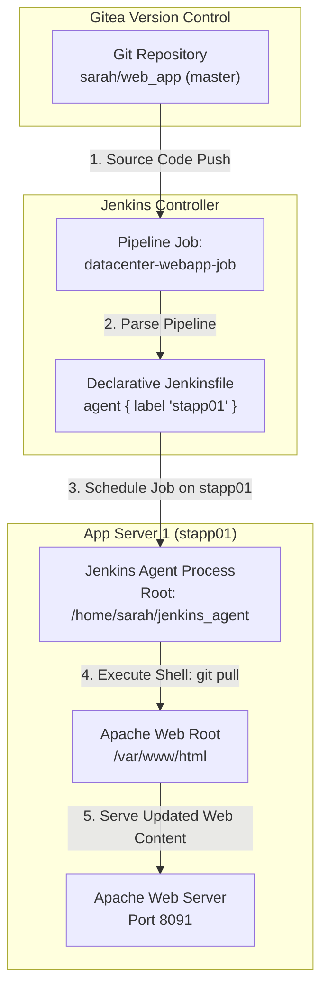

# Jenkins Deploy Pipeline

## Technical Overview

Modern Continuous Integration and Continuous Deployment (CI/CD) pipelines automate software delivery from source control to production web servers. By leveraging **Jenkins Pipelines** as code, infrastructure teams can define build, test, and deployment workflows within declarative Groovy scripts.

In this challenge, we configure a Jenkins Declarative Pipeline job named `datacenter-webapp-job` to automate the deployment of a static web application hosted in a **Gitea** Git repository onto an Apache HTTP web server running on **App Server 1** (`stapp01`).

Key tasks accomplished:
1. **Agent Node Configuration:** Configuring an SSH Build Agent Node (`App Server 1`) with label `stapp01` and remote root directory `/home/sarah/jenkins_agent`.
2. **Pipeline Job Creation:** Creating a Jenkins **Pipeline** project named `datacenter-webapp-job`.
3. **Declarative Pipeline Scripting:** Writing a Groovy pipeline script that restricts execution to nodes labeled `stapp01` and defines a single stage named `Deploy` to pull updates directly into the web root directory (`/var/www/html`).
4. **Automated Verification:** Triggering the pipeline, monitoring console outputs, updating source files in Git, and verifying dynamic updates on the web application.



---

## Pipeline Architecture & Deployment Strategy

### 1. Declarative Jenkins Pipeline
Unlike classic Freestyle jobs, Jenkins Pipelines use a domain-specific language (DSL) written in Groovy to define execution steps:
*   `pipeline { ... }`: The root block enclosing the pipeline definition.
*   `agent { label 'stapp01' }`: Directs the Jenkins controller to schedule and execute stages exclusively on agent nodes tagged with the `stapp01` label.
*   `stages { stage('Deploy') { ... } }`: Defines explicit build phases. The `Deploy` stage executes shell commands directly within the agent environment.

### 2. Live Document-Root Pull Deployment
The deployment mechanism navigates to `/var/www/html` on `stapp01` and executes `git pull origin master`:
*   **Zero-Downtime Update:** Pulls updated assets directly into the web root served by Apache HTTP Server.
*   **Fast-Forward Merge:** Synchronizes local web root commits with the remote `sarah/web_app` repository branch.

---

## Infrastructure & Configuration Requirements

*   **Jenkins Controller Access:** Web Browser (HTTP) on port `8080`
*   **Admin Credentials:** `admin` / `Adm!n321`
*   **Target Application Server:** `App Server 1` (`stapp01`)
*   **Git Repository:** `http://gitea:3000/sarah/web_app`
*   **Required Plugins:** `Pipeline`, `SSH Build Agents`

### Agent Node & Pipeline Matrix

| Setting | Value |
| :--- | :--- |
| **Node Name** | `App Server 1` |
| **Node Label** | `stapp01` |
| **Remote Root Directory** | `/home/sarah/jenkins_agent` |
| **Launch Method** | Launch agents via SSH |
| **Host** | `stapp01` |
| **SSH Credentials** | `sarah` |
| **Pipeline Job Name** | `datacenter-webapp-job` |
| **Pipeline Stage Name** | `Deploy` |
| **Web Server Document Root** | `/var/www/html` |

---

## Step-by-Step Walkthrough

### Step 1: Log in to Jenkins
1. Open your browser and navigate to the Jenkins interface.
2. Sign in with administrative credentials:
   * **Username:** `admin`
   * **Password:** `Adm!n321`


---

### Step 2: Verify Required Plugins
Navigate to **Manage Jenkins** -> **Plugins** -> **Available plugins** and verify that both `Pipeline` and `SSH Build Agents` plugins are installed and available.


---

### Step 3: Configure `App Server 1` SSH Build Agent Node
1. Navigate to **Manage Jenkins** -> **Nodes**.
2. Select or edit node `App Server 1` configuration:
   * **Remote root directory:** `/home/sarah/jenkins_agent`
   * **Labels:** `stapp01`
   * **Launch method:** `Launch agents via SSH`
   * **Host:** `stapp01`
   * **Credentials:** Select SSH credentials for `sarah`
   * **Host Key Verification Strategy:** `Non verifying Verification Strategy`
3. Click **Save**.


---

### Step 4: Verify Node Status
Confirm on the **Nodes** overview page that `App Server 1` is online and connected with label `stapp01`.


---

### Step 5: Create New Pipeline Job
1. Click **New Item** from the left dashboard menu.
2. Enter item name: `datacenter-webapp-job`
3. Select **Pipeline** as the item type.
4. Click **OK**.


---

### Step 6: Configure Pipeline Script
In the job configuration page under the **Pipeline** section, set **Definition** to `Pipeline script` and input the following Groovy code:

```groovy
pipeline {
    agent { label 'stapp01' }

    stages {
        stage('Deploy') {
            steps {
                sh '''
                cd /var/www/html
                git pull origin master
                '''
            }
        }
    }
}
```

Click **Save**.


---

### Step 7: Build Scheduling & Execution Handling
If the agent node is not tagged with `stapp01` or is offline, Jenkins will queue the build with the message:
`Still waiting to schedule task: There are no nodes with the label 'stapp01'`


Once `App Server 1` is properly online with label `stapp01`, click **Build Now**.

---

### Step 8: Verify Build Console Output
Open **Console Output** for Build #3 to verify successful execution:
* The build runs on `App Server 1` inside workspace `/home/sarah/jenkins_agent/workspace/datacenter-webapp-job`.
* Executes `cd /var/www/html && git pull origin master`.
* Pulls updates from `http://gitea:3000/sarah/web_app`.
* Status completes with `Finished: SUCCESS`.


---

### Step 9: Verify Initial Deployed Web Page
Navigate to the web server URL (port 8091). Verify the initial output served from `/var/www/html/index.html`:
`Welcome to xFusionCorp Industries!`


---

### Step 10: Inspect Source Repository in Gitea
Access the Gitea repository at `http://gitea:3000/sarah/web_app` and open `index.html`.


---

### Step 11: Update Source Code & Re-Trigger Deployment
1. In Gitea, edit `index.html` to append additional text:
   ```html
   Welcome to xFusionCorp Industries!
   This verify the deployment job is running successfully.
   ```
2. Commit changes to the `master` branch.


3. Trigger **Build Now** on `datacenter-webapp-job` in Jenkins.

---

### Step 12: Confirm Updated Web Application
Refresh the web application URL on port 8091. Confirm the live web page reflects the latest commit:
`Welcome to xFusionCorp Industries! This verify the deployment job is running successfully.`


---

## Complete Declarative Jenkinsfile

```groovy
pipeline {
    agent { 
        label 'stapp01' 
    }

    stages {
        stage('Deploy') {
            steps {
                sh '''
                cd /var/www/html
                git pull origin master
                '''
            }
        }
    }
}
```

---

## Verification & Validation Checklist

- [x] SSH Build Agent `App Server 1` configured with label `stapp01` and remote root `/home/sarah/jenkins_agent`.
- [x] Pipeline project `datacenter-webapp-job` created in Jenkins.
- [x] Declarative pipeline script defined with `agent { label 'stapp01' }` and stage `'Deploy'`.
- [x] Deployment commands execute `git pull origin master` inside `/var/www/html`.
- [x] Jenkins build finishes with status `SUCCESS`.
- [x] Web server running on `stapp01` correctly serves updated contents from `/var/www/html/index.html`.
