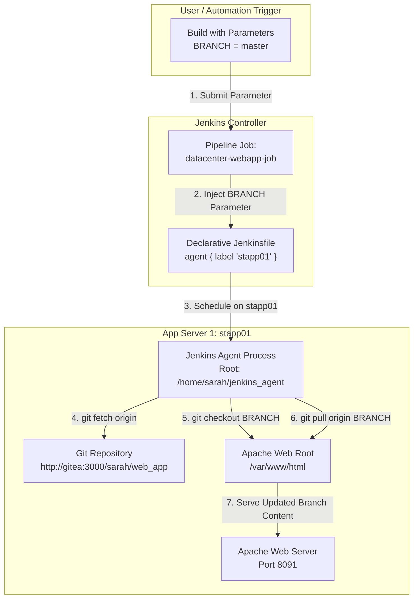

# Jenkins Deploy Pipeline (Parameterized)

## Technical Overview

Continuous Delivery workflows often require deploying code from different branches (such as `master`, `main`, `staging`, or feature branches) dynamically without hardcoding branch names into build configurations. **Parameterized Jenkins Pipelines** enable developers and DevOps engineers to pass runtime variables—such as target environment, release tags, or Git branch names—directly into declarative pipeline scripts.

In this challenge, we configure a parameterized Jenkins Declarative Pipeline job named `datacenter-webapp-job` to deploy a static web application to **App Server 1** (`stapp01`). The pipeline accepts a user-defined string parameter named `BRANCH`, fetches the remote repository updates, checks out the specified branch, and updates the web server document root (`/var/www/html`).

Key tasks accomplished:
1. **Agent Node Configuration:** Setting up an SSH Build Agent Node (`App Server 1`) with label `stapp01` and remote root directory `/home/sarah/jenkins_agent`.
2. **Parameterized Job Setup:** Creating a Jenkins **Pipeline** project named `datacenter-webapp-job` and configuring a String Parameter `BRANCH` with description `Branch to deploy`.
3. **Declarative Pipeline Scripting:** Writing a Groovy script that targets agent `stapp01` and runs shell commands (`git fetch`, `git checkout ${BRANCH}`, `git pull origin ${BRANCH}`) inside `/var/www/html`.
4. **Build Execution & Verification:** Executing a **Build with Parameters** run specifying `BRANCH = master`, inspecting console execution logs, and verifying clean deployment completion.



---

## Pipeline Architecture & Parameterized Build Deep Dive

### 1. Runtime Job Parameterization
By checking **This project is parameterized** in the job configuration, Jenkins injects environment variables into the build process at runtime:
*   **Parameter Type:** String Parameter
*   **Parameter Name:** `BRANCH`
*   **Description:** `Branch to deploy`
*   **Environment Injection:** Inside shell build steps (`sh`), the parameter is accessed via environment variable syntax: `${BRANCH}` or `$BRANCH`.

### 2. Multi-Branch Git Execution Strategy
To safely switch and pull branches inside an existing document root, the pipeline uses a three-step Git strategy:
1.  `git fetch origin`: Synchronizes all remote branch refs from Gitea without modifying local files.
2.  `git checkout ${BRANCH}`: Switches the local web root working tree to the branch specified in the `BRANCH` parameter.
3.  `git pull origin ${BRANCH}`: Pulls the latest commits from the tracking branch on origin into `/var/www/html`.

```groovy
pipeline {
    agent { label 'stapp01' }

    stages {
        stage('Deploy') {
            steps {
                sh '''
                cd /var/www/html
                git fetch origin
                git checkout ${BRANCH}
                git pull origin ${BRANCH}
                '''
            }
        }
    }
}
```

---

## Infrastructure & Configuration Requirements

*   **Jenkins Controller Access:** Web Browser (HTTP) on port `8080`
*   **Admin Credentials:** `admin` / `Adm!n321`
*   **Target Application Server:** `App Server 1` (`stapp01`)
*   **Git Repository:** `http://gitea:3000/sarah/web_app`
*   **Required Plugins:** `Pipeline`, `SSH Build Agents`

### Agent Node & Parameterized Job Matrix

| Setting | Value |
| :--- | :--- |
| **Node Name** | `App Server 1` |
| **Node Label** | `stapp01` |
| **Remote Root Directory** | `/home/sarah/jenkins_agent` |
| **Launch Method** | Launch agents via SSH |
| **Host** | `stapp01` |
| **SSH Credentials** | `sarah` |
| **Pipeline Job Name** | `datacenter-webapp-job` |
| **Parameter Type** | String Parameter |
| **Parameter Name** | `BRANCH` |
| **Parameter Description** | `Branch to deploy` |
| **Pipeline Stage Name** | `Deploy` |
| **Web Server Document Root** | `/var/www/html` |

---

## Step-by-Step Walkthrough

### Step 1: Log in to Jenkins
1. Open your web browser and navigate to the Jenkins login page.
2. Log in using administrative credentials:
   * **Username:** `admin`
   * **Password:** `Adm!n321`


---

### Step 2: Verify Installed Plugins
Navigate to **Manage Jenkins** -> **Plugins** -> **Installed plugins** and verify that both `Pipeline` and `SSH Build Agents` plugins are installed and enabled.


---

### Step 3: Configure `App Server 1` Agent Node
1. Go to **Manage Jenkins** -> **Nodes**.
2. Configure or edit `App Server 1`:
   * **Remote root directory:** `/home/sarah/jenkins_agent`
   * **Labels:** `stapp01`
   * **Launch method:** `Launch agents via SSH`
   * **Host:** `stapp01`
   * **Credentials:** `sarah`
   * **Host Key Verification Strategy:** `Non verifying Verification Strategy`
3. Click **Save**.


---

### Step 4: Verify Agent Connection Status
On the **Nodes** overview page, confirm that `App Server 1` is online and actively connected to the controller with label `stapp01`.


---

### Step 5: Create Pipeline Job `datacenter-webapp-job`
1. Click **New Item** on the Jenkins home dashboard.
2. Enter item name: `datacenter-webapp-job`
3. Select **Pipeline** as the project type.
4. Click **OK**.


---

### Step 6: Configure String Parameter `BRANCH`
In the project configuration under the **General** section:
1. Check the box **This project is parameterized**.
2. Click **Add Parameter** -> **String Parameter**.
3. Configure the parameter fields:
   * **Name:** `BRANCH`
   * **Default Value:** Leave empty or set default branch (e.g., `master`)
   * **Description:** `Branch to deploy`


---

### Step 7: Configure Parameterized Pipeline Script
Scroll down to the **Pipeline** section, set **Definition** to `Pipeline script`, and paste the following Groovy pipeline script:

```groovy
pipeline {
    agent { label 'stapp01' }

    stages {
        stage('Deploy') {
            steps {
                sh '''
                cd /var/www/html
                git fetch origin
                git checkout ${BRANCH}
                git pull origin ${BRANCH}
                '''
            }
        }
    }
}
```

Click **Save**.


---

### Step 8: Trigger Build with Parameters
1. On the job dashboard for `datacenter-webapp-job`, click **Build with Parameters** in the left sidebar.
2. Enter `master` in the **BRANCH** parameter input field.
3. Click **Build**.


---

### Step 9: Verify Console Output Log
Open **Console Output** for Build #1 to confirm successful execution:
* The job is scheduled on agent `App Server 1` in workspace `/home/sarah/jenkins_agent/workspace/datacenter-webapp-job`.
* Executes `cd /var/www/html`.
* Executes `git fetch origin`.
* Executes `git checkout master` (`Switched to branch 'master'`).
* Executes `git pull origin master` (`From http://gitea:3000/sarah/web_app`).
* Job completes with status `Finished: SUCCESS`.


---

## Complete Declarative Jenkinsfile

```groovy
pipeline {
    agent { 
        label 'stapp01' 
    }

    stages {
        stage('Deploy') {
            steps {
                sh '''
                cd /var/www/html
                git fetch origin
                git checkout ${BRANCH}
                git pull origin ${BRANCH}
                '''
            }
        }
    }
}
```

---

## Verification & Validation Checklist

- [x] SSH Agent Node `App Server 1` active with label `stapp01` and remote root `/home/sarah/jenkins_agent`.
- [x] Pipeline project `datacenter-webapp-job` created in Jenkins.
- [x] Job parameterization configured with String Parameter `BRANCH` and description `Branch to deploy`.
- [x] Declarative Pipeline script configured with `agent { label 'stapp01' }` and shell steps referencing `${BRANCH}`.
- [x] **Build with Parameters** executed specifying `BRANCH = master`.
- [x] Git fetch, checkout, and pull commands executed successfully in `/var/www/html`.
- [x] Build finished with status `Finished: SUCCESS`.
